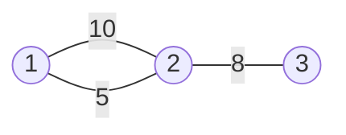

<!--more-->

## Descripiton

Z小镇是一个景色宜人的地方，吸引来自各地的观光客来此旅游观光。

Z小镇附近共有N(1<N≤500)个景点（编号为1,2,3,…,N），这些景点被M（0<M≤5000）条道路连接着，所有道路都是双向的，两个景点之间可能有多条道路。也许是为了保护该地的旅游资源，Z小镇有个奇怪的规定，就是对于一条给定的公路Ri，任何在该公路上行驶的车辆速度必须为Vi。

频繁的改变速度使得游客们很不舒服，因此大家从一个景点前往另一个景点的时候，都希望选择行使过程中最大速度和最小速度的比尽可能小的路线，也就是所谓最舒适的路线。

 ## Input

第一行包含两个正整数，N和M。

接下来的M行每行包含三个正整数：x，y和v（1≤x,y≤N，0 最后一行包含两个正整数s，t，表示想知道从景点s到景点t最大最小速度比最小的路径。s和t不可能相同。

## Output

第一行包含两个正整数，N和M。

接下来的M行每行包含三个正整数：x，y和v（1≤x,y≤N，0 最后一行包含两个正整数s，t，表示想知道从景点s到景点t最大最小速度比最小的路径。s和t不可能相同。

## Samples

|  #   |                      Input                       |    Output    |
| :--: | :----------------------------------------------: | :----------: |
|  1   |       $4\;2\\\\1\;2\;1\\\\3\;4\;2\\\\1\;4$       | $IMPOSSIBLE$ |
|  2   | $3\;3\\\\1\;2\;10\\\\1\;2\;5\\\\2\;3\;8\\\\1\;3$ |    $5/4$     |
|  3   |       $3\;2\\\\1\;2\;2\\\\2\;3\;4\\\\1\;3$       |     $2$      |

> **Sample 2图示：**





## Hint

N(1<N≤500)

M（0<M≤5000）

Vi在int范围内

## 分析

最小生成树+枚举：
{:.success}

把边权升序排序，然后选取任意一条边作为起点，考虑比它大的边加入集合，直到 $s$ 和 $t$ 联通。此时的比值为
$$
\frac{maxV}{minV}=\frac{g[j].val}{g[i].val}
$$
然后将这些比值求一个最小值就可以了，几点优化：

1. **判断图是否联通，在 $i=1​$ 时判断**
2. **如果将比 $i$ 大的边全部加入集合仍然不能使得 $s$ 和 $t$ 联通，则退出循环（再做无意义）**
3. **当 $s$ 和  $t$  联通后，当前循环也可以退出**

## Codes

```cpp
#pragma GCC optimize(3)
#include <cstdio>
#include <iostream>
#include <cstring>
#include <algorithm>
#include <utility>
#include <cmath>
#define maxn 501
#define maxm 5001
#define rint register int
using namespace std;
struct node{
	int u,v;
	double val;
	bool operator <(const node &obj)const{
		return val<obj.val;
	}
}g[maxm]; int f[maxn]; int n,m;
inline int gcd(int a,int b){
	if(b==0) return a;
	else return gcd(b,a%b);
}
int Sfind(int x){
	if(f[x]==x) return x;
	else return f[x]=Sfind(f[x]);
}
#define Sunion(u1,u2) (f[Sfind(u1)]=Sfind(u2))
inline bool judge(int x,int y){
	for(rint i=0;i<=n;i++) f[i]=i;
	for(rint i=1;i<=m;i++)
		if(Sfind(g[i].u)!=Sfind(g[i].v))
			Sunion(g[i].u,g[i].v);
	return Sfind(x)==Sfind(y); 
}
void Advanced_kruskal(int u1,int u2){
	sort(g+1,g+m+1);
	double minE=9999999.0,maxE=0.0;
	double ratio=minE;
	double tarMin,tarMax; bool sign;
	for(rint i=1;i<=m;i++){
		minE=g[i].val;
		sign=false;
		for(rint k=0;k<=n;k++) f[k]=k;
		for(rint j=i;j<=m;j++){
			if(Sfind(g[j].u)!=Sfind(g[j].v))
				Sunion(g[j].u,g[j].v);
			if(Sfind(u1)==Sfind(u2)){
				sign=true;
				maxE=g[j].val;
				if(maxE/minE<ratio){
					tarMin=minE; tarMax=maxE;
					ratio=maxE/minE;
				}
				break;
			}
		}
		if(ratio==1.0) break;
		if(!sign) break;
	}
	int tarminE=tarMin;
	int tarmaxE=tarMax;
	if(tarmaxE%tarminE==0) cout<<tarmaxE/tarminE;
	else {
		int Egcd=gcd(tarminE,tarmaxE);
		tarminE/=Egcd;tarmaxE/=Egcd;
		cout<<tarmaxE<<'/'<<tarminE;
	}
}
inline void makeEdge(){
	for(rint i=1;i<=m;i++){
		cin>>g[i].u>>g[i].v;
		scanf("%lf",&g[i].val);
	}
}
int main(){
	#ifndef ONLINE_JUDGE
	freopen("way.in","r",stdin);
	freopen("way.out","w",stdout);
	#endif
	cin>>n>>m;
	makeEdge(); int x,y;
	cin>>x>>y;
	if(!judge(x,y)) cout<<"IMPOSSIBLE";
	else Advanced_kruskal(x,y);	
	return 0;
}
```

