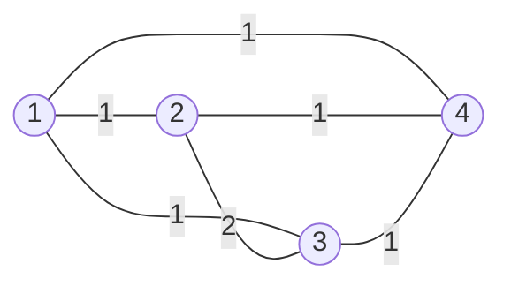

<!--more-->

## Description

现在给出了一个简单无向加权图。你不满足于求出这个图的最小生成树，而希望知道这个图中有多少个不同的最小生成树。（如果两颗最小生成树中至少有一条边不同，则这两个最小生成树就是不同的）。由于不同的最小生成树可能很多，所以你只需要输出方案数对31011的模就可以了。

## Input

第一行包含两个数，n和m，其中1<=n<=100; 1<=m<=1000; 表示该无向图的节点数和边数。每个节点用1~n的整数编号。　　

接下来的m行，每行包含两个整数：a, b, c，表示节点a, b之间的边的权值为c，其中1<=c<=1,000,000,000。数据保证不会出现自回边和重边。　　

注意：具有相同权值的边不会超过10条。

## Output

输出不同的最小生成树有多少个。你只需要输出数量对31011的模就可以了。

##  Sample Input

```text
4 6
1 2 1
1 3 1
1 4 1
2 3 2
2 4 1
3 4 1
```

## Sample Output

```text
8
```

> Sample Input 图示：



## 分析

对边集按边权排序过后，我们可以使用 $kruskal$ 算法求解最小生成树，因为 $kruksal$ 算法是按照边的权值生成树的，所以：

在边权和相同的最小生成树中，某权值的边的数量是一定的

我们可以用 $dfs$ 去搜索满足最小生成树的边的集合的情况，利用乘法原理得到方案数

代码中：

1. d数组用于存放相同边的信息（起始位置，终止位置，构成的生成树数量），d数组是在g数组（边集数组排序之后，在 $kruskal$ 算法过程中求得，所以不会出现漏记或重复
2. 每次dfs求解答案之后，把当前范围内的边（从 $d[i].st$ 位置到 $d[i].ed$ 位置的边）都连接防止下一次dfs出错
3. 不能对并查集数组 $f$ 使用路径压缩，例如 $return\;f[x]=Sfind(f[x])$

## Codes

```cpp
#include <iostream>
#include <cstdio>
#include <cstring>
#include <algorithm>
#include <cmath>
#define maxn 1001
#define maxm 1001
#define _mod 31011
using namespace std;
struct node{
	int u,v,val;
	bool operator <(const node &obj)const{
		return val<obj.val;
	}
}g[maxm]; int n,m;
struct SuperNode{
	int st,ed,tree;
}d[maxm]; int f[maxn],stats;
int Sfind(int x){
	if(f[x]==x) return x;
	else return Sfind(f[x]);
    // else return f[x]=Sfind(f[x])
}
#define Sunion(u1,u2) (f[Sfind(u1)]=Sfind(u2))
int dfs(int id,int pos,int k){
	if(pos==d[id].ed+1){
		if(k==d[id].tree) return 1;
		return 0;
	} int ans=0;
	int fu=Sfind(g[pos].u);
	int fv=Sfind(g[pos].v);
	if(fu!=fv){
		f[fu]=fv;
		ans+=dfs(id,pos+1,k+1);
		f[fu]=fu; f[fv]=fv;
	}
	ans+=dfs(id,pos+1,k);
	return ans;
}
inline bool kruskal(){
	int SumTree=0;
	for(int i=1;i<=n;i++) f[i]=i;
	for(int i=1;i<=m;i++){
		if(g[i].val!=g[i-1].val){
			stats++; d[stats].st=i;
			d[stats-1].ed=i-1;
		}
		if(Sfind(g[i].u)!=Sfind(g[i].v)){
			SumTree++; Sunion(g[i].u,g[i].v);
			d[stats].tree++;
		}
	}
	d[stats].ed=m;
	if(SumTree!=(n-1)) return false;
	return true;
}
inline int res(){
	for(int i=1;i<=n;i++)f[i]=i;
	int ans=1,tmp=0;
	for(int i=1;i<=stats;i++){
		tmp=dfs(i,d[i].st,0);
		ans=(ans*tmp)%_mod;
		for(int j=d[i].st;j<=d[i].ed;j++)
			if(Sfind(g[j].u)!=Sfind(g[j].v))
				Sunion(g[j].u,g[j].v);
	}
	return ans;
}
int main(){
	#ifndef ONLINE_JUDGE
	freopen("cnt.in","r",stdin);
	freopen("cnt.out","w",stdout);
	#endif
	cin>>n>>m;
	for(int i=1;i<=m;i++)
		cin>>g[i].u>>g[i].v>>g[i].val;
	sort(g+1,g+m+1);
	if(!kruskal()) cout<<0;
	else cout<<res();
	return 0;
}
```

