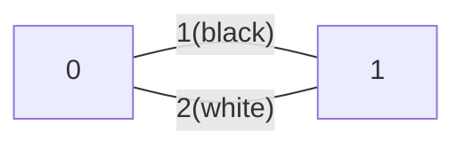

<!--more-->

## Description

给你一个无向带权连通图，每条边是黑色或白色。让你求一棵最小权的恰好有need条白色边的生成树。题目保证有解。

## Input

第一行V,E,need分别表示点数，边数和需要的白色边数。接下来E行每行s,t,c,col表示这边的端点(点从0开始标号)，边权，颜色(0白色1黑色)。

## Output

一行表示所求生成树的边权和。

## Sample Input

```text
2 2 1
0 1 1 1
0 1 2 0
```

> 图示：



## Sample Output

```text
2
```

## 分析

这道题要用到二分法，对 $Kruskal$ 算法进行变形，首先我们在对边集排序时，要让值相等的情况下白色边在前（为了选边做准备），然后为了影响 $Kruskal$ 的选边过程，对所有的白色边加上一个权值，这个权值可正可负，这是因为将编边集数组排序时：

1. **附加权为正时，表示当前的白色边过多，我们让权值较大的白色边再大一点，就可以被$Kruskal$ 算法排除在最小生成树外面，达到少选的目的**
2. **附加权为负时，表示当前的白色边过少，让所有白色边权值变小、前移就可以多选白色边**

发现这样做实际上只影响了白色边和黑色边的顺序，没有影响白色边之间的相对顺序，因此 $Kruskal$ 选出来的边就还会是满足需要的条件下的最小生成树

要二分的就是附加权的权值，二分直到最小生成树中刚好有 $need$ 条白色边，每次让 $Kruskal$ 返回一个值 $cnt​$ ，表示选了多少条白色边，然后：

|        $cnt\geq need$        |          $cnt<need$          |
| :--------------------------: | :--------------------------: |
| 说明白色边较多，需要调小权值 | 说明白色变较少，需要调大权值 |

二分完，此时的目标权值和为 $Sum-need\times add$，$add$ 是二分的权值，每次二分完后记得恢复原来的边权

## Codes

```cpp
#include <cstdio>
#include <iostream>
#include <cstring>
#include <algorithm>
#include <vector>
#define maxV 50001
#define maxE 100001
using namespace std;
struct node{
	int u,v,val;
	int c;
	bool operator <(const node &obj)const{
		if(val==obj.val) return c<obj.c;
		else return val<obj.val;
	}
}g[maxE]; int f[maxV],V,E,need;
inline int Sfind(int x){
	if(f[x]==x) return x;
	else return f[x]=Sfind(f[x]);
}
#define Sunion(u1,u2) (f[Sfind(u1)]=Sfind(u2))
pair<int,int> kruskal(){
	sort(g+1,g+E+1);
	int cnt=0,ans=0;
	for(int i=0;i<=V;i++) f[i]=i;
	for(int i=1;i<=E;i++){
		if(Sfind(g[i].u)!=Sfind(g[i].v)){
			Sunion(g[i].u,g[i].v);
			ans+=g[i].val;
			if(g[i].c==0) cnt++;
		}
	}
	return make_pair(cnt,ans);
}
int main(){
	#ifndef ONLINE_JUDGE
	freopen("testin.txt","r",stdin);
	freopen("testout.txt","w",stdout);
	#endif
	cin>>V>>E>>need; int l,r=0;
	for(int i=1;i<=E;i++){
		cin>>g[i].u>>g[i].v>>g[i].val>>g[i].c;
		g[i].u++; g[i].v++;
		r=max(r,g[i].val);
	}
	l=r*-1; int mid; pair<int,int> res;
	int ret=1;
	while(l<=r){
		mid=(l+r)>>1;
		for(int i=1;i<=E;i++)
			if(g[i].c==0) g[i].val+=mid;
		res=kruskal();
		if(res.first>=need)
			ret=res.second-need*mid,
			l=mid+1;
		else r=mid-1;
		for(int i=1;i<=E;i++)
			if(g[i].c==0) g[i].val-=mid;
	}
	cout<<ret;
	return 0;
}
```

