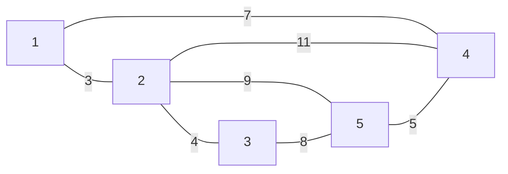

<!--more-->

## Description

约翰叔叔希望能够廉价连接他的供水系统，但是他不希望他的竞争对手知道他选择的路线。一般这样的问题需要选择最便宜的方式，所以他决定避免这种情况而采用第二便宜的方式。 现在有W(3 <= W <= 2000)个供水站，其中最多有P(P <=20,000)< span=”“>条管道，每一条管道连接了两个水站，并且不存在一条管道连接同一个水站，两个水站之间最多只有一条管道。每条管道有一定的费用。请寻找第二便宜的连接方式，使所有的水站相连。 假设最便宜的方案有且只有一种，并且至少有两种可行的连接方案。所有的费用都不超过16位有符号整数。水站用1到W的自然数表示

## Input

第一行：两个数W和P 第2～P+1行：每行描述了一条管道，有3个用空格分开的整数，前两个数表示管道连接的两个端点。第3个数是管道的费用

## Output

仅一行，第二便宜的管道铺设费用

## Sample Input

```text
5 7 
1 2 3 
2 3 4 
1 4 7 
2 4 11 
2 5 9 
5 4 5 
3 5 8
```

> **输入数据图示：**



## Sample Output

```text
20
```

## 分析

一道次小生成树的题目，在知道 $Kruskal$ 算法求解最小生成树之后，容易想到一种暴力解法：

**利用 $Kruskal$ 求出最小生成树之后，在原图中依次删除树边，再次构建最小生成树，取新的生成树的最小和权就是次小生成树**
{:.info}

这种方法不但可以求次小生成树，也可以求严格次小生成树，但是明显会超时（在[P4180 【模板】严格次小生成树(BJWC2010)](https://www.luogu.org/problemnew/show/P4180)中只能得到50分）

**从书上摘取的优化算法：**

预处理出 $Max[i][j]​$ 表示当前求出的最小生成树中，点 $i​$ 和点 $j​$ 的唯一路径上的最长边的权值，求解时间：$O(n^2)​$，然后，上述算法的换边操作改写为：对于不在树中的边，考虑加入这条边 $(u,v)​$，替换权值为 $Max(u,v)​$ 的树边，此时的权值和为：$Ans=Ans+G[u][v]-Max[u][v]​$
{:.success}
在所有的$Ans$ 中取最小值，就是次小生成树的权值，时间复杂度：$O(n^2+m)$
{:.success}

**下面说 $Max​$ 数组的求法：**

按照边的权值对边集数组排序后，每次加入的边权递增，所以有 $Max[u][v]=G[E[i].u][E[i].v]​$

但是我们不仅要更新 $Max[u][v]​$ 的值，由于 $Kruskal​$ 求解最小生成树是一个逐渐联通的过程，定义变长数组$V[i]​$ 表示与 $i​$ 联通的点，初始时 $V[i].push\_\ back(i),i\in [1,n]​$，表示最开始的时候，每个点是独立联通的

每次加入一条边，将 $E[i]$ 的 $u$ 端点的联通点集加入到 $v$ 的联通点集中去，更新 $Max$ 时，对于任意的 $p_1\;p_2,\;p_1\;\in V[u]，\;p_2\in V[v]$ 都有 $Max[p_1][p_2]=Max[p_2][p_1]=E[i].value$

这个不难理解，因为$p_1\;p_2​$ 已经联通，那么他们的唯一路径上的最大边权就是他们的联通点集的新加入的边权，为什么这个新加入的边是最长的呢？因为我们是按照边权递增来排序的

## Codes

```cpp
#include <cstdio>
#include <cstring>
#include <iostream>
#include <algorithm>
#include <vector>
#define maxn 2001
#define maxm 20001
using namespace std;
int maax[maxn][maxn];
int f[maxn],n,m; bool mst[maxm];
vector<int> E[maxn];
struct node{
	int u,v,val;
	bool operator <(const node &obj)const{
		return val<obj.val;
	}
}g[maxm];
inline int Sfind(int x){
	if(f[x]==x) return x;
	else return f[x]=Sfind(f[x]);
}
#define Sunion(u1,u2) (f[Sfind(u1)]=Sfind(u2))
inline int kruskal(){
	#define u g[i].u
	#define v g[i].v
	sort(g+1,g+m+1); int sumT=0,k=0;
	for(int i=1;i<=n;i++)
		f[i]=i,
		E[i].push_back(i);
	int FU,FV;
	for(int i=1;i<=m;i++){
		if(k==n-1) break;
		FU=Sfind(u);FV=Sfind(v);
		if(FU!=FV){
			mst[i]=true; k++;
			sumT+=g[i].val; f[FU]=FV;
			int lenu=E[FU].size(),lenv=E[FV].size();
			for(int r=0;r<lenu;r++)
				for(int h=0;h<lenv;h++)
					maax[E[FU][r]][E[FV][h]]=maax[E[FV][h]][E[FU][r]]=g[i].val;
			for(int r=0;r<lenu;r++)
				E[FV].push_back(E[FU][r]);	
		}
	} int tar=99999999;
	for(int i=1;i<=m;i++)
		if(!mst[i])
			tar=min(tar,sumT+g[i].val-maax[u][v]);
	return tar;
    #undef u
    #undef v
}
int main(){
	#ifndef ONLINE_JUDGE
	freopen("testin.txt","r",stdin);
	freopen("testout.txt","w",stdout);
	#endif
	cin>>n>>m;
	for(int i=1;i<=m;i++)
		cin>>g[i].u>>g[i].v>>g[i].val;
	cout<<kruskal();
	return 0;
}
```

