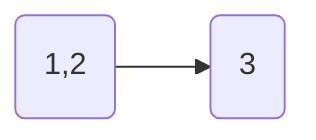
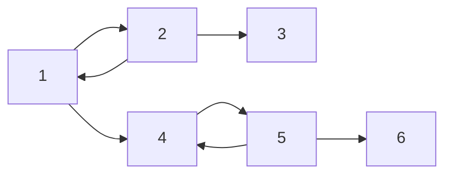
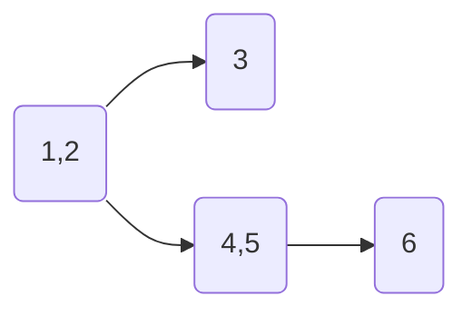

<!--more-->

## Description

每一头牛的愿望就是变成一头最受欢迎的牛。现在有N头牛，给你M对整数(A,B)，表示牛A认为牛B受欢迎。这种关系是具有传递性的，如果A认为B受欢迎，B认为C受欢迎，那么牛A也认为牛C受欢迎。你的任务是求出有多少头牛被所有的牛认为是受欢迎的。

## Input

第一行两个数N,M。

接下来M行，每行两个数A,B，意思是A认为B是受欢迎的（给出的信息有可能重复，即有可能出现多个A,B） 

## Output

一个数，即有多少头牛被所有的牛认为是受欢迎的。 

## Sample Input

```text
3 3
1 2
2 1
2 3
```

> 　**输入样例图示：**


## Sample Output

```text
1
```

## 分析

用 $Tarjan$ 缩点方法解决这个题，因为在奶牛相互喜欢有向图网络中，每一个强连通分量里面的奶牛是最受欢迎的（上图中的 $(1,\;2)​$ 号奶牛）

求出所有的强连通分量后，原图将变成一个有向无环的 $DAG$ 图，也就是：



发现 $3$ 号奶牛是最受欢迎的，且 $3$ 号奶牛在这个图里的入度为 $1$ ，所以统计缩点后，入度为 $1$ 的点的强连通分量中的点个数，就是答案要求的数量

**需要注意的是，如果缩点后的图存在 $\geq 2$ 个入度仅为 $1$ 的点，那么将不会有奶牛满足要求，例如：**



缩点后为：



$3$ 、 $6$、$\left( 4,\;5 \right)$ 都是入度仅为 $1$ 的点，那么答案将为 $0$

**实际编程时由于前向星的关系，统计出度更方便，将原图反过来存就能达到统计出度的目的**

## Codes

```cpp
#include <cstdio>
#include <cstring>
#include <iostream>
#include <algorithm>
#include <vector>
#include <stack>
#define maxn 10001
#define maxm 50001
using namespace std;
struct node{
	int neext,tto;
	#define nxt(x) g[x].neext
	#define to(x) g[x].tto
}g[maxm]; int head[maxm],tot;
int f[maxn],low[maxn],dfn[maxn];
int cp[maxn],cpt[maxn],dt,n,m;
int indeg[maxn];
stack<int> stk;
inline int Sfind(int x){
	if(f[x]==x) return x;
	else return f[x]=Sfind(f[x]);
}
inline void Einsert(int a,int b){
	nxt(++tot)=head[a];
	to(tot)=b; head[a]=tot;
}
void tarjan(int u){
	#define v (to(i))
	low[u]=dfn[u]=++dt;
	stk.push(u);
	for(int i=head[u];i;i=nxt(i)){
		if(!dfn[v]){
			tarjan(v);
			low[u]=min(low[u],low[v]);
		}
		else{
			if(!cp[v]) low[u]=min(low[u],dfn[v]);
		}
	}
	if(low[u]==dfn[u]){
		cp[u]=++cp[0];
		while(stk.top()!=u){
			cpt[cp[0]]++;
			cp[stk.top()]=cp[0];
			stk.pop();
		}
		stk.pop();
		cpt[cp[0]]++;
	}
	#undef v
}
int ans,indeg0s;
int main(){
	#ifndef ONLINE_JUDGE
	freopen("testin.txt","r",stdin);
	freopen("testout.txt","w",stdout);
	#endif
	cin>>n>>m; int U,V;
	for(int i=1;i<=m;i++){
		cin>>U>>V;
		Einsert(V,U);
	}
	for(int i=1;i<=n;i++)
		if(!dfn[i])
			tarjan(i);
	for(int i=1;i<=n;i++)
		for(int j=head[i];j;j=nxt(j))
			if(cp[i]!=cp[to(j)])
				indeg[cp[to(j)]]++;
	for(int i=1;i<=cp[0];i++)
		if(!indeg[i])
			ans=cpt[i], indeg0s++;
	if(indeg0s==1) cout<<ans;
	else cout<<0;
	return 0;
}
```

