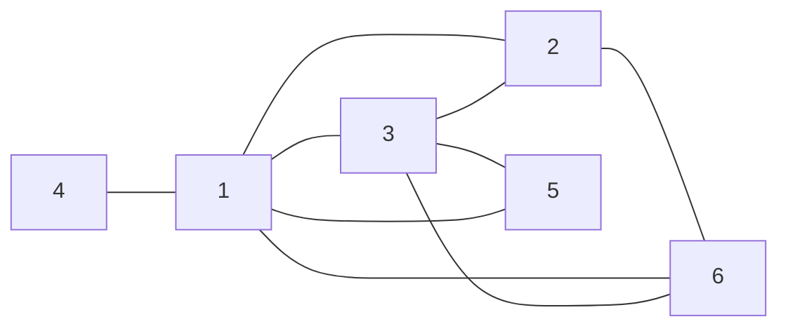
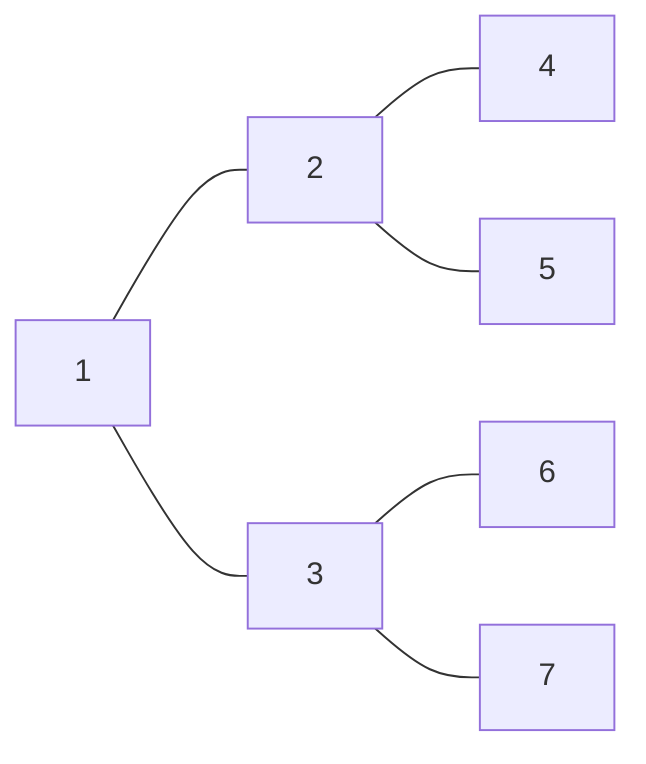

<!--more-->

## Description

煤矿工地可以看成是由隧道连接挖煤点组成的无向图。为安全起见，希望在工地发生事故时所有挖煤点的工人都能有一条出路逃到救援出口处。于是矿主决定在某些挖煤点设立救援出口，使得无论哪一个挖煤点坍塌之后，其他挖煤点的工人都有一条道路通向救援出口。请写一个程序，用来计算至少需要设置几个救援出口，以及不同最少救援出口的设置方案总数。

## Input

输入文件有若干组数据，每组数据的第一行是一个正整数 N（N≤500），表示工地的隧道数，接下来的 N 行每行是用空格隔开的两个整数 S 和 T，表示挖S 与挖煤点 T 由隧道直接连接。输入数据以 0 结尾。

## Output

输入文件中有多少组数据，输出文件 output.txt 中就有多少行。每行对应一组　　输入数据的 结果。其中第 i 行以 Case i: 开始（注意大小写，Case 与 i 之间有空格，i 与:之间无空格，: 之后有空格），其后是用空格隔开的两个正整数，第一个正整数表示对于第 i 组输入数据至少需 要设置几个救援出口，第二个正整数表示对于第 i 组输入数据不同最少救援出口的设置方案总 数。输入数据保证答案小于 2^64。输出格式参照以下输入输出样例。

## Sample Input

```text
9
1 3
4 1
3 5
1 2
2 6
1 5
6 3
1 6
3 2
6
1 2
1 3
2 4
2 5
3 6
3 7
0
```

> **输入样例图示1：**



>  **输入样例图示2：**



## Sample Output

```text
Case 1: 2 4
Case 2: 4 1
```

## 分析

一道求解点双联通图的题目，用 $Tarjan$ 算法解决

**给出的原图具体来说有三种情况：**

1. 是一个点双联通图，没有割点，从所有点中任意选取2个点作为出口
2. 只有一个割点，那么从其余的点中选取任意一个点来建立出口
3. 割点数 $\geq2$ ，此时不需要再建立出口，割点能作为出口使用

需要用到组合公式

## Codes

```cpp
#include <cstdio>
#include <cstring>
#include <iostream>
#include <algorithm>
#include <vector>
#include <stack>
#define clean(x) (memset(x,0,sizeof(x))) 
#define maxm 100005
using namespace std;
typedef long long ll;
struct node{
	int neext,tto;
	#define nxt(x) g[x].neext
	#define to(x) g[x].tto
}g[maxm*2]; int head[maxm],tot;
int dfn[maxm],low[maxm];
int root,dt; vector<int> vdcc[maxm];
int vdccs; bool cp[maxm];
stack<int> S; int m,n;
inline void Einsert(int a,int b){
	nxt(++tot)=head[a];
	to(tot)=b; head[a]=tot;
}
void tarjan(int u){
	#define v (to(i))
	low[u]=dfn[u]=++dt; int shead;
	S.push(u); int chi=0;
	for(int i=head[u];i;i=nxt(i)){
		if(!dfn[v]){
			chi++;tarjan(v);
			low[u]=min(low[u],low[v]);
			if((u!=root && dfn[u]<=low[v])||(u==root && chi>1))
				cp[u]=true;
			if(dfn[u]<=low[v]){
				vdccs++; vdcc[vdccs].clear();
				do{
					shead=S.top();S.pop();
					vdcc[vdccs].push_back(shead);
				}while(shead!=v);
				vdcc[vdccs].push_back(u);
			}
		}
		else low[u]=min(low[u],dfn[v]);
	}
	#undef v
}
inline void Res(){
	clean(dfn);clean(low);clean(cp);
	while(!S.empty()) S.pop();
	dt=vdccs=0;
	for(int i=1;i<=n;i++){
		if(!dfn[i]){
			root=i;
			tarjan(i);
		}
	}
	ll res=0,num=1; int Vlen,cnum;
	for(int i=1;i<=vdccs;i++){
		Vlen=vdcc[i].size();
		cnum=0;
		for(int j=0;j<Vlen;j++)
			if(cp[vdcc[i][j]]) cnum++;
		if(cnum==0) res+=2, num=num*(Vlen-1)*Vlen/2;
		else if(cnum==1) res++,num=num*(Vlen-1);
	}
	cout<<res<<' '<<num;
}
int main(){
	#ifndef ONLINE_JUDGE
	freopen("testin.txt","r",stdin);
	freopen("testout.txt","w",stdout);
	#endif
	cin>>m; int U,V,ss=0;
	while(m){
		n=0; ss++;
		for(int i=1;i<=m;i++){
			cin>>U>>V;
			Einsert(U,V);
			Einsert(V,U);
			n=max(n,max(U,V));
		}
		printf("Case %d: ",ss); 
		Res();
		clean(g);clean(head);tot=0;
		putchar('\n');
		cin>>m;
	}
	return 0;
}
```

