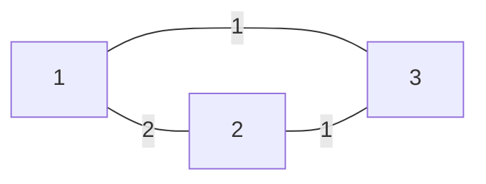

<!--more-->

## Description

在顺利攻破 Lord lsp 的防线之后，lqr 一行人来到了 Lord lsp 的城堡下方。Lord lsp 黑化之后虽然拥有了强大的超能力，能够用意念力制造建筑物，但是智商水平却没怎么增加。现在 lqr 已经搞清楚黑暗城堡有 N 个房间，M 条可以制造的双向通道，以及每条通道的长度。

lqr 深知 Lord lsp 的想法， 为了避免每次都要琢磨两个房间之间的最短路径，Lord lsp一定会把城堡修建成树形的； 但是，为了尽量提高自己的移动效率，Lord lsp 一定会使得城堡满足下面的条件：设 Di 为如果所有的通道都被修建， 第 i 号房间与第 1 号房间的最短路径长度；而 Si 为实际修建的树形城堡中第 i 号房间与第1 号房间的路径长度，对于所有满足 1≤i≤N 的整数 i，有 Si = Di。为了打败 Lord lsp，lqr 想知道有多少种不同的城堡修建方案。于是 lqr 向 applepi 提出了这个问题。由于 applepi 还要忙着出模拟赛，所以这个任务就交给你了。当然，你只需要输出答案对 2^31 – 1 取模之后的结果就行了。

## Input

第一行有两个整数 N 和 M。

之后 M 行，每行三个整数 X，Y 和 L，表示可以修建 X 和 Y 之间的一条长度为 L 的通道。

## Output

输出一个整数，表示答案对 2^31 – 1 取模之后的结果。

## Sample Input

```text
3 3
1 2 2
1 3 1
2 3 1
```

> **输入样例图示：**



## Sample Output

```text
2
```

## 分析

首先就是对原图跑一个最短路径（这里用的是 $Dijkstkra$ + 堆优化），然后暴力统计

根据题目要求，**若 $father[y]=x$，且 $z=val(edge(x,y))$，就应该有 $dist[y]=dist[x]+z$（$y$ 的层次比 $x$ 深）**，先把所有节点按照 $Dist$ 值排序

**依次考虑把每个节点 $p\in G$ 加入树形城堡有多少种方法，那么只要存在节点 $x$ ，使得 $x$ 和 $p$ 满足上述式子，那么 $p$ 与任意 $x$ 相连都可以，在 $p$ 点这一步就有 $cnt$ 种选择，其中 $cnt$ 表示满足条件的 $x$ 个数**

由于树的层次关系，只需考虑 $p​$ 与层次浅于 $p​$ 的点相连，也就是 $Dist​$ 值小于 $p​$ 的点即可

第一个点（$Dist$ 值最小的）无需考虑，乘法原理，将每一步得出的 $cnt$ 乘起来就是结果（过程中取模）

## Codes

```cpp
#include <cstdio>
#include <iostream>
#include <cstring>
#include <vector>
#include <algorithm> 
#include <queue>
#define maxm 500001
#define maxn 100001
#define Smaxn 1001
#define oo 1999999999
#define oo2 127
#define MOD 2147483647
using namespace std;
typedef pair<int,int> pr;
struct node{
	int tto,nxxt,vval;
	#define to(x) g[x].tto
	#define nxt(x) g[x].nxxt
	#define val(x) g[x].vval
}g[maxm*2]; int fir[maxm*2];
int dist[maxn],tot,n,m;
bool vis[maxn]; int r[Smaxn][Smaxn];
inline void Einsert(int x,int y,int _val){
	if(x==y) return;
	nxt(++tot)=fir[x];
	fir[x]=tot;
	to(tot)=y;
	val(tot)=_val;
}
void dijkstkra(){
	for(int i=1;i<=n;i++) dist[i]=oo;
	dist[1]=0; vis[1]=true;
	priority_queue<pr> q;
	pr head(0,0); int _next,_val,_begin;
	q.push(make_pair(0,1));
	while(!q.empty()){
		head=q.top(); q.pop();
		if(dist[head.second]!=-head.first) continue;
		vis[head.second]=true;
		_begin=fir[head.second];
		while(_begin!=0){
			if(dist[to(_begin)]>dist[head.second]+val(_begin))
				if(!vis[to(_begin)])
					dist[to(_begin)]=dist[head.second]+val(_begin),
					q.push(make_pair(-dist[to(_begin)],to(_begin)));
			_begin=nxt(_begin);
		}
	}
}
bool MyCmp(int a,int b){
	return dist[a]<dist[b];
}
int id[maxn];
int main(){
	#ifndef ONLINE_JUDGE
	freopen("testin.txt","r",stdin);
	freopen("testout.txt","w",stdout);
	#endif
	scanf("%d%d",&n,&m); int a,b,c;
	memset(r,oo2,sizeof(r));
	for(int i=1;i<=m;i++){
		scanf("%d%d%d",&a,&b,&c);
		Einsert(a,b,c);
		Einsert(b,a,c);
		r[a][b]=r[b][a]=min(r[a][b],c);
	}
	dijkstkra();
	for(int i=1;i<=n;i++) id[i]=i;
	sort(id+1,id+n+1,MyCmp);
	int cnt=0; long long ans=1;
	for(int i=2;i<=n;i++){
		cnt=0;
		for(int j=1;j<=i-1;j++)
			if(dist[id[j]]+r[id[i]][id[j]]==dist[id[i]])
				cnt++;
		ans=(ans*cnt)%MOD;
	}
	cout<<ans;
	return 0;
}
```

