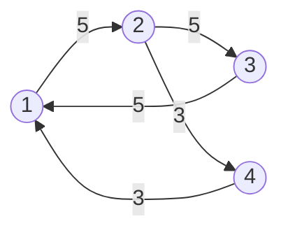
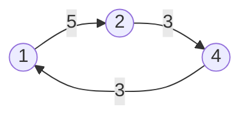

<!--more-->

## Description

对于一张有向图，要你求图中最小圈的平均值是多少，即若一个圈经过k个节点，那么一个圈的平均值为圈上k条边权之和除以k，求其中的最小值。

## Input

第一行2个正整数，分别为n，m，表示有n个定点，m条边以下m行，每行3个整，分别代表一条边的起点，终点，权值。输入数据保证该图是连通的且存在圈。

## Output

一行一个数，表示最小圈的值，保留8位小数

## Sample Input #1

```text
4 5
1 2 5
2 3 5
3 1 5
2 4 3
4 1 3
```

## Sample Output #1

```text
3.66666667
```

## Sample Input #2

```text
2 2
1 2 -2.9
2 1 -3.1
```

## Sample Output #2

```text
-3.00000000
```

> **Sample Input #1 图示：**



> **最小圈如图，平均值为：3.66666667**



## 分析

题目中的最小圈的权值可正可负，而最短路的 $SPFA$ 算法只能在图中判断负环，**于是可以二分这个最小圈的平均权值 $mid$，用 $SPFA$ 在原图中找负环来 $Check$**

**如果当前图中的所有边权减去这个权值后存在了负环，说明原图中的最小圈的平均权值小于我们当前的答案，那么 $mid$ 需要往小猜，如果新图中不存在负环，则最小圈的权值大于当前答案，$mid$ 也就应该增大了**

因为图中给的边权是 double 类型，所以要用到实数型二分

## Codes

```cpp
#include <cstdio>
#include <iostream>
#include <algorithm>
#include <cstring>
#define cls(Arr,Dst) memset(Arr,Dst,sizeof(Arr))
#define maxm 10001
#define maxn 3001
#define INF 1e-10
#define oo 2147483647
using namespace std;
struct node{
	int u,v;
	double vl;
	#define to(x) g[x].u
	#define nxt(x) g[x].v
	#define val(x) g[x].vl
}g[maxm]; int tot,head[maxm],n,m;
double d[maxn]; bool vis[maxn];
void Einsert(int x,int y,double _v){
	nxt(++tot)=head[x];
	head[x]=tot; to(tot)=y;
	val(tot)=_v;
}
bool spfa(int v0,double del){
	#define vt to(i)
	vis[v0]=true;
	for(int i=head[v0];i;i=nxt(i)){
		if(d[vt]>d[v0]+val(i)-del){
			if(vis[vt]) return true;
			else{
				d[vt]=d[v0]+val(i)-del;
				if(spfa(vt,del)) return true;
			}
		}
	}
	return vis[v0]=false;
	#undef vt
}
inline bool judge(double aver){
	cls(d,0);cls(vis,0);
	for(int i=1;i<=n;i++)
		if(spfa(i,aver)) return true;
	return false;
}
int main(){
	#ifndef ONLINE_JUDGE
	freopen("testin.txt","r",stdin);
	freopen("testout.txt","w",stdout);
	#endif
	cin>>n>>m; int x,y; double z;
	double l,r=oo;
	for(int i=1;i<=m;i++){
		scanf("%d%d%lf",&x,&y,&z);;
		Einsert(x,y,z);
	}
	l=-r; double mid;
	while(r-l>INF){
		mid=(l+r)/2.0;
		if(judge(mid)) r=mid;
		else l=mid;
	}
	printf("%.8lf",r);
	return 0;
}
```


