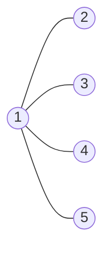

<!--more-->

## Description

一位冷血的杀手潜入Na-wiat，并假装成平民。警察希望能在NNN个人里面，查出谁是杀手。警察能够对每一个人进行查证，假如查证的对象是平民，他会告诉警察，他认识的人，谁是杀手，谁是平民。假如查证的对象是杀手，杀手将会把警察干掉。现在警察掌握了每一个人认识谁。每一个人都有可能是杀手，可看作他们是杀手的概率是相同的。

问：根据最优的情况，保证警察自身安全并知道谁是杀手的概率最大是多少？

## Input

第一行有两个整数 N,M。 接下来有 M 行，每行两个整数 x,y，表示 x 认识 y（y 不一定认识 x ,例如President同志） 。 

注：原文敏感内容已替换

## Output

仅包含一行一个实数，保留小数点后面 6 位，表示最大概率。

## Sample Input

```text
5 4 
1 2 
1 3 
1 4 
1 5 
```

## Sample Output

```text
0.800000
```

> **Sample Input 图示：**



## 分析

警察必须知道所有 n 个人的信息才能找到杀手，而假设警察知道所有人的信息至少需要询问x个人的话，那么这x 个人中有杀手的可能性就是：$\frac{x}{N}$

所以警察不会被杀手干掉的可能性就是：$1-\frac{x}{N}$

首先需要求出原图的强连通分量，然后把每个 SCC 缩点变为 DAG 图，接着统计入度为 0 的点，这里要注意：**如果入度为 0 的点只有一个，那么 ans 就是 1 ，如果有超过 1 个入度为 0 的点，则当其中有一个点（其实是强连通分量）只包含一个结点时警察就不用去问了**

这是为什么呢？因为我们聪明的警察也会用排除法啊

## Codes

```cpp
#include <cstdio>
#include <cstring>
#include <iostream>
#include <algorithm>
#include <vector>
#include <stack>
#define maxn 100001
#define maxm 300001
using namespace std;
struct node{
	int neext,tto;
	#define nxt(x) g[x].neext
	#define to(x) g[x].tto
}g[maxm]; int head[maxm],tot;
int f[maxn],low[maxn],dfn[maxn];
int cp[maxn],cpt[maxn],dt,n,m;
int indeg[maxn];
stack<int> stk;
inline int Sfind(int x){
	if(f[x]==x) return x;
	else return f[x]=Sfind(f[x]);
}
inline void Einsert(int a,int b){
	nxt(++tot)=head[a];
	to(tot)=b; head[a]=tot;
}
void tarjan(int u){
	#define v (to(i))
	low[u]=dfn[u]=++dt;
	stk.push(u);
	for(int i=head[u];i;i=nxt(i)){
		if(!dfn[v]){
			tarjan(v);
			low[u]=min(low[u],low[v]);
		}
		else{
			if(!cp[v]) low[u]=min(low[u],dfn[v]);
		}
	}
	if(low[u]==dfn[u]){
		cp[u]=++cp[0];
		while(stk.top()!=u){
			cpt[cp[0]]++;
			cp[stk.top()]=cp[0];
			stk.pop();
		}
		stk.pop();
		cpt[cp[0]]++;
	}
	#undef v
}
int ans,indeg0s;
int main(){
	#ifndef ONLINE_JUDGE
	freopen("kill.in","r",stdin);
	freopen("kill.out","w",stdout);
	#endif
	cin>>n>>m; int U,V;
	for(int i=1;i<=m;i++){
		cin>>U>>V;
		Einsert(U,V);
	}
	for(int i=1;i<=n;i++)
		if(!dfn[i])
			tarjan(i);
	for(int i=1;i<=n;i++)
		for(int j=head[i];j;j=nxt(j))
			if(cp[i]!=cp[to(j)])
				indeg[cp[to(j)]]++;
	for(int i=1;i<=cp[0];i++)
		if(!indeg[i])
			ans=cpt[i], indeg0s++;
	if(indeg0s>1){
		for(int i=1;i<=cp[0];i++){
			if(indeg[i]==0 && cpt[i]==1) {indeg0s--;break;}
		}
	}
	printf("%.6lf",1-(double)indeg0s/(double)n);
	return 0;
}
```


