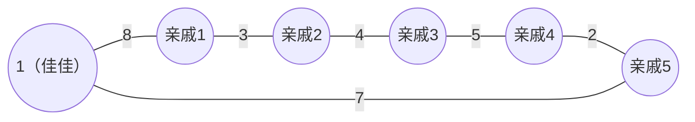

<!--more-->

## Description

重庆城里有n个车站，m条双向公路连接其中的某些站。每两个车站最多用一条公路直接相连，从任何一个车站出发都可以经过一条或多条公路到达其它车站，但不同的路径需要花费的时间可能不同。在一条路径上花费的时间等于路径上所有公路需要的时间和。

佳佳的家在车站1，他有五个亲戚，分别住在车站a、b、c、d、e。过年了，他需要从自己的家出发，拜访每个亲戚（顺序任意），给他们送去节日的祝福。怎样走，才需要最少的时间？

## Input

第一行：n（n<=50,000），m（m<=100,000），为车站数目和公路的数目。

第二行：a、b、c、d、e，为五个亲戚所在车站编号（1< a、b、c、d、e <= n）

接下来m行，每行三个整数x、y、t（ 1 <= x、y <= n，1 <= t <= 100），为公路连接的两个车站编号和时间。 

## Output

仅一行，包含一个整数T，为最少的总时间

## Sample Input

```text
6 6
2 3 4 5 6
1 2 8
2 3 3
3 4 4
4 5 5
5 6 2
1 6 7
```

## Sample Output

```text
21
```

> **Sample Input 图示：**



## Hint

n<=50,000，m<=100,000

## 分析

这道题是求最短路径的一个拓展，我们先求出以佳佳为起点，到达所有点的单源最短路径，再根据给出的 5 个亲戚，求出以这 5 个亲戚为起点到所有点的最短路径（注意要用不同的 dist 数组存，也就是要开 6 个dist 数组存储最短路）

佳佳访问 5 个亲戚的顺序是一个 5 选 5 的全排列，一共有 120 种不同的访问顺序，**如果按照当前已经确定的顺序 order 来访问，则在 order 下佳佳能取得的最短路径就是在访问到某个亲戚家（把佳佳自己看做第 0 个亲戚）要往下一个亲戚家走的时候，选择以当前亲戚家为起点，求出的到目标亲戚家的最短路径加上即可，写成式子：**
$$
对于\;order\{a_0， a_1，a_2，a_3，a_4，a_5 \}\;(a_0\;是佳佳的家)\\\\
Ans=\sum^4_{k=0}dist[a_k][a_{k+1}]
$$
由于这里的枚举 order 数组，算出所有排列下的 Ans ，取最小值即可

## Codes

```cpp
#include<cstdio>
#include<algorithm>
#include<queue>
#include<iostream>
using namespace std;
const int maxn=50005;
const int maxm=100005;
const int INF=150000000;
int n,m,np=0,last[maxn],rela[6],dist[6][maxn];
struct edge{int to,w,pre;}E[maxm*2];
struct data{
	int d,id;
	bool operator <(const data &obj)const{
		return d>obj.d;
	}
};
char c;
inline void addedge(int u,int v,int w)
{
	E[++np]=(edge){v,w,last[u]};
	last[u]=np;
}
 
int done[maxn];
inline void Dijkstra(int s,int *dis)
{
	priority_queue<data>pq;
	for(int i=1;i<=n;i++) dis[i]=INF,done[i]=0;
	pq.push((data){0,s});
	dis[s]=0;
	while(!pq.empty())
	{
		data t=pq.top();pq.pop();
		int i=t.id;
		if(done[i]) continue;
		done[i]=1;
		for(int p=last[i];p;p=E[p].pre)
		{
			int j=E[p].to,w=E[p].w;
			if(dis[j]>dis[i]+w)
			{
				dis[j]=dis[i]+w;
				pq.push((data){dis[j],j});
			}
		}
	}
}
int order[6];int ans=INF;
inline void calc()
{
	int cnt=0;
	for(int i=0;i<5;i++)
	{
		int x=order[i],y=rela[order[i+1]];
		cnt+=dist[x][y];
	}
	ans=min(ans,cnt);
}
inline void res(){
	for(int i=1;i<=120;i++){
		calc();
		next_permutation(order+1,order+1+5);
        // next_permutation 当前数组的下一个全排列 
	}
}
int main(){
	#ifndef ONLINE_JUDGE
	freopen("testin.txt","r",stdin);
	freopen("testout.txt","w",stdout);
	#endif
	cin>>n>>m;
	for(int i=1;i<=5;i++) cin>>rela[i];
	register int u,v,w;
	for(int i=1;i<=m;i++){
		cin>>u>>v>>w;
		addedge(u,v,w);addedge(v,u,w);
	}
	rela[0]=1;
	for(int i=0;i<=5;i++) Dijkstra(rela[i],dist[i]); 
	order[0]=0; for(int i=1;i<=5;i++) order[i]=i;
	res(); cout<<ans;
	return 0;
}
```


