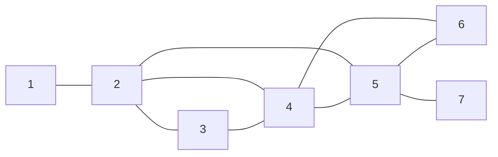
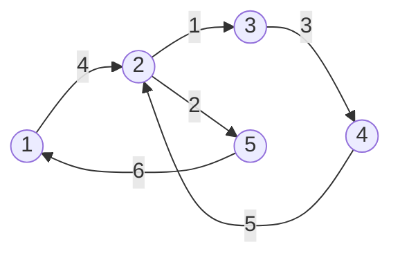

<!--more-->

# T1：欧拉路径

## Description

18世纪著名的数学问题之一：在哥尼斯堡的一个公园里，有7座桥将河中两个岛及河两岸连接起来(如图a)。问是否可能从这四块陆地中任一块出发，恰好通过每座桥一次，再回到起点？　　　

欧拉于1736年研究并解决了此问题。欧拉把每一块陆地考虑成一个点，连接两块陆地的桥以边表示，画出图b的图论模型，由此问题变成：能否从无向图的一个结点出发走出一条路径，每条边恰好经过一次，最后回到出发点。这样的路线称为欧拉回路，也可以称为一笔画。

你的任务与欧拉一样：给出n个顶点（编号为1..n），m条边的无向图。请寻找一条欧拉路径。

## Input

第1行为整数n，接下来的 m 行，每行两个整数：i,j(1<=i,j<=n)，表示一条无向边。 

## Output

如果不存在欧拉路径，则输出NIE。否则输出应当包含 m+1 个整数，依次表示欧拉路径经过的顶点号。如果把欧拉路径经过的结点序列看成是一个n进制的数，那么当存在多组解的情况下，输出n进制表示法中最小的一个（也就是输出第一个数较小的，如果还有多解，输出第二个数较小的，…，实质就是字典序）。 

## Sample Input

```text
7 9
1 2
2 3
3 4
4 2
4 5
2 5
5 6
5 7
4 6
```

## Sample Output

```text
1 2 3 4 2 5 4 6 5 7
```

> **Sample Input 图示：（欧拉路为 `1 2 3 4 2 5 4 6 5 7`）**



## Hint

1<=n<=500, 1<=m<=1024

## 分析

一道欧拉路径的模板题，大致思路和求解欧拉路的模板算法一样，只是这个题要求输出字典序最小的欧拉路经上的点，那么可以想到将边集数组改变，因为原本的前向星不能保证字典序最小

**可以用 Vector 模拟边集数组，进行排序之后再 DFS ，就可以保证求得欧拉路的时候字典序最小了，这可能会丢失修改 head 数组的时间优化，但是这个题数据太水，也能 AC**

## Codes

```cpp
#include <cstdio>
#include <iostream>
#include <cstring>
#include <algorithm>
#include <vector>
#define maxn 501
#define maxm 1025
using namespace std;
struct edge{
	int id,to;
	bool operator <(const edge &obj)const{
		return to<obj.to;
	}
}; vector<edge> g[maxn];
bool vis[maxm*2]; int res[2*maxm];
int f[maxn];
int n,m,deg[maxn];
inline int Sfind(int x){
	if(f[x]==x) return x;
	else return f[x]=Sfind(f[x]);
}
void dfs_euler(int u){
	vector<edge>::iterator iter=g[u].begin();
	while(iter!=g[u].end()){
		if(!vis[iter->id]){
			vis[iter->id]=true;
			dfs_euler(iter->to);
		}
		iter++;
	}
	res[++res[0]]=u;
} int cnt;
int main(){
	#ifndef ONLINE_JUDGE
	freopen("testin.txt","r",stdin);
	freopen("testout.txt","w",stdout);
	#endif
	cin>>n>>m; int U,V,fu,fv;
	for(int i=1;i<=n;i++) f[i]=i;
	for(int i=1;i<=m;i++){
		cin>>U>>V;
		g[U].push_back((edge){i,V});
		g[V].push_back((edge){i,U});
		deg[U]++; deg[V]++;
		fu=Sfind(U); fv=Sfind(V);
		f[fu]=fv;
	}
	for(int i=1;i<=n;i++) sort(g[i].begin(),g[i].end());
	int st=1;
	// JUDGE 1 
	for(int i=1;i<=n;i++)
		if(deg[i]&1) cnt++;
	if(cnt>2){
		cout<<"NIE"; return 0;
	}
	// JUDGE 2 
	for(int i=2;i<=n;i++) 
		if(Sfind(f[i])!=Sfind(f[i-1])){
			cout<<"NIE"; return 0;
		}
	for(int i=1;i<=n;i++)
		if(deg[i]&1){st=i;break;}
	dfs_euler(st);
	for(int i=res[0];i>=1;i--) cout<<res[i]<<' ';
	return 0;
}
```


---

# T2：欧拉回路

## Description

有一天一位灵魂画师画了一张图，现在要你找出欧拉回路，即在图中找一个环使得每条边都在环上出现恰好一次。

一共两个子任务：

1. 这张图是无向图。（50分）
2. 这张图是有向图。（50分）

## Input

第一行一个整数 t

第二行两个整数 n,m

接下来 m行，每行两个整数u,v

如果 t=1 表示无向边(u,v)，如果 t=2 表示有向边<u,v>，图中可能有重边也可能有自环。

## Output

如果不可以一笔画，输出一行 “NO”。

否则，输出一行 “YES”，接下来一行输出一组方案。

如果 t=1,输出m个整数：p1,p2...m。表示边的编号。若pi为正，表示从ui走到vi，否则表示从vi走到ui如果 t=2,输出m个整数，表示边的编号。

## Sample Input #1

```text
1
3 3
1 2
2 3
1 3
```

## Sample Output #1

```text
YES
3 -2 -1
```

## Sample Input #2

```text
2
5 6
2 3
2 5
3 4
1 2
4 2
5 1
```

## Sample Output #2

```text
YES
4 1 3 5 2 6
```

> **Sample Input #2 图示：（欧拉路为 `4，1，3，5，2，6`）**



## Hint

1≤n≤10^5，0≤m≤2×10^5

## 分析

求解欧拉路径的一个模板题，因为 m 的范围不大，可以用比较好写的 DFS 来求解，大致思路和求解欧拉路径的模板代码一样，这里说说如何存放欧拉路上的边的编号

对于y

由于无向图加边的连续性，如果边集数组的 tot 从 1 开始，那么对于一对点 (u，v) 来说，从 u 到 v 的边号始终是奇数（1，3，5，7，……），从 v 到 u 的反向边就是偶数，由此就可以判断当前边的方向，然后看是存正编号还是负编号

**对于无向图，在判断某条边是否访问过时，把无向图想成有向图，那么每条边的编号将会缩小一倍（除以 2），这样走过之后把 $vis[i\div 2]$ 标记即可，判断也只判断 $vis[i\div 2]$  ，加边时也要加 $i\div 2$**

对于有向图，直接对这条边的编号进行操作即可

## Codes

```cpp
#include <cstdio>
#include <cstring>
#include <algorithm>
#include <iostream>
#include <vector>
#include <queue>
#define maxn 100001
#define maxm 5*100001
// for not directed graph 
using namespace std;
int head[maxn],nxt[maxm],to[maxm];
int res[maxm],tot=1,n,m;
int ind[maxn],oud[maxn]; // outdegs and indegs 
bool vis[2*maxn]; int typ;
inline void Eadd(int u,int v){
	nxt[++tot]=head[u]; to[tot]=v;
	head[u]=tot;
}
void euler(int u){
	for(int &i=head[u];i;i=nxt[i]){
		int v=to[i]; int c=(typ==1)?(i/2):(i-1);
		int s=i%2;
		if(vis[c]) continue; 
		vis[c]=true;
		euler(v);
		if(typ==1) res[++res[0]]=(s?(-c):c);
		else res[++res[0]]=c;
	}
}
int main(){
	#ifndef ONLINE_JUDGE
	freopen("testin.txt","r",stdin);
	freopen("testout.txt","w",stdout);
	#endif
	cin>>typ;
	cin>>n>>m; int x,y;
	for(int i=1;i<=m;i++){
		cin>>x>>y; Eadd(x,y);
		if(typ==1) Eadd(y,x);
		oud[x]++; ind[y]++;
	}
	// JUDGE 
	if(typ==2){
		for(int i=1;i<=n;i++)
			if(ind[i]!=oud[i]){
				cout<<"NO";
				return 0;
			}
	}else{
		for(int i=1;i<=n;i++)
			if((ind[i]+oud[i])&1){
				cout<<"NO";
				return 0;
			}
	}
	// SOLVE 
	for(int i=1;i<=n;i++)
		if(head[i]){
			euler(i);break;
		}
	if(res[0]!=m) { cout<<"NO"; return 0;}
	cout<<"YES\n";
	for(int i=res[0];i;i--) cout<<res[i]<<' ';
	return 0;
}
```
