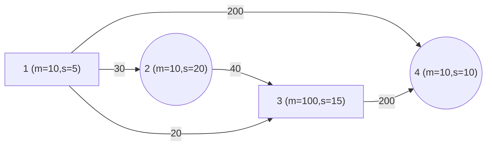
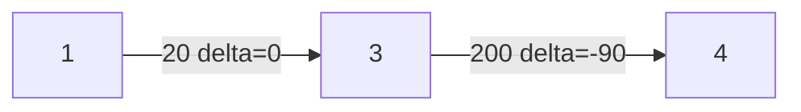

<!--more-->

# Problem 1. 升降梯(Up-Down)

## Description

开启了升降梯的动力之后，探险队员们进入了升降梯运行的那条竖直的隧道，映入眼帘的是一条直通塔顶的轨道、一辆停在轨道底部的电梯、和电梯内一杆控制电梯升降的巨大手柄。 

塔一共有 N 层，升降梯在每层都有一个停靠点。手柄有 M 个控制槽，第 i 个控制槽旁边标着一个数 Ci，满足 C1<C2<C3<……<CM。如果 Ci>0，表示手柄扳动到该槽时，电梯将上升 Ci 层；如果 Ci<0，表示手柄扳动到该槽时，电梯将下降 -Ci 层；并且一定存在一个 Ci=0，手柄最初就位于此槽中。注意升降梯只能在 1~N 层间移动，因此扳动到使升降梯移动到 1 层以下、N 层以上的控制槽是不允许的。 

电梯每移动一层，需要花费 2 秒钟时间，而手柄从一个控制槽扳到相邻的槽，需要花费 1 秒钟时间。探险队员现在在 1 层，并且想尽快到达 N 层，他们想知道从 1 层到 N 层至少需要多长时间？

## Input

第一行两个正整数 N、M。 

第二行 M 个整数 C1、C2„„CM

## Output

输出一个整数表示答案，即至少需要多长时间。若不可能到达输出-1。

## Sample Input

```
6 3
-1 0 2
```

## Sample Output

```
19
```

## Hint

手柄从第二个槽扳到第三个槽（0 扳到 2），用时 1 秒，电梯上升到 3 层，用时 4 秒。 

手柄在第三个槽不动，电梯再上升到 5 层，用时 4 秒。 

手柄扳动到第一个槽（2 扳到-1），用时 2 秒，电梯下降到 4 层，用时 2 秒。手柄扳动到第三个槽（-1 扳倒 2），用时 2 秒，电梯上升到 6 层，用时 4 秒。 

总用时为(1+4)+4+(2+2)+(2+4)=19秒。

## Data Range

对于 30% 的数据，满足 1≤N≤10，2<=M<=5。对于 100% 的数据，满足 1≤N≤1000，2<=M<=20，-N<C1<C2<……<CM<N。

## 分析

思路：把每 N 层楼看作 N 个点，把 M 个对应数字的槽看作特殊的边，遍历 N 层楼建图加边

具体来说：**对于 $\forall i \in [1\;,\;N]$，$\forall j \in[1\;,\;M]$，如果满足 $i+c[j]\geq1\;\;and\;\;i+c[j]\leq N$，说明通过把手柄搬到 j 号位置，能够将电梯从 i 号楼层送到 i+c\[j] 号楼层（至于时间稍后计算），那么连一条有向边，记录两个信息(to，way)，to 表示去往的楼层，way 表示手柄停在的槽的编号**

然后用这个二元组进行 SPFA 即可求出最短路，输出 dist\[n]

## Codes

```cpp
#include <cstdio>
#include <iostream>
#include <cstring>
#include <cmath>
#include <algorithm>
#include <queue>
#include <vector>
#define maxn 1001
#define maxm 21021
using namespace std;
typedef pair<int,int> pr;
vector<pr> g[maxn];
int head[maxn],n,m,c[maxm];
int dist[maxn];int x;
inline void buildG(){
	for(int i=1;i<=n;i++)
		for(int j=1;j<=m;j++){
			if(j==x) continue;
			if(i+c[j]<1 || i+c[j]>n) continue;
			g[i].push_back(make_pair(i+c[j],j));
			// pair<i+c[j],j>
			// i 到 i+c[j] 通过 j 号槽实现  
		}
}
inline int dists(int x,int y,int edg1,int edg2){
	return abs(x-y)*2+abs(edg1-edg2);
} 
inline int shortest(){
	memset(dist,127,sizeof(dist));dist[1]=0;
	// pair < 去往哪个点 , 当前在哪个槽 >  
	queue<pr> q; q.push(make_pair(1,x));pr qhead;
	vector<pr>::iterator iter;
	#define u qhead.first
	#define pos qhead.second
	while(!q.empty()){
		qhead=q.front(); q.pop();
		for(iter=g[u].begin();iter!=g[u].end();iter++){
			if(dist[u]+dists(u,iter->first,pos,iter->second)<dist[iter->first]){
				dist[iter->first]=dist[u]+dists(u,iter->first,pos,iter->second);
				q.push(make_pair(iter->first,iter->second));
			}
		}
	}
	#undef u
	#undef pos
}
int main(){
	#ifndef ONLINE_JUDGE
	freopen("updown.in","r",stdin);
	freopen("updown.out","w",stdout);
	#endif
	cin>>n>>m;
	for(int i=1;i<=m;i++){ 
		cin>>c[i];
		if(c[i]==0) x=i;
	}
	buildG();shortest();
	cout<<(dist[n]==2139062143?-1:dist[n]);
	return 0;
}
```

---


# Problem 2. 虫洞(Holes)

## Description

N个虫洞，M条单向跃迁路径。从一个虫洞沿跃迁路径到另一个虫洞需要消耗一定量的燃料和1单位时间。虫洞有白洞和黑洞之分。设一条跃迁路径两端的虫洞质量差为delta。

1. 从白洞跃迁到黑洞，消耗的燃料值减少delta，若该条路径消耗的燃料值变为负数的话，取为0。

2. 从黑洞跃迁到白洞，消耗的燃料值增加delta。

3. 路径两端均为黑洞或白洞，消耗的燃料值不变化。

作为压轴题，自然不会是如此简单的最短路问题，所以每过1单位时间黑洞变为白洞，白洞变为黑洞。在飞行过程中，可以选择在一个虫洞停留1个单位时间，如果当前为白洞，则不消耗燃料，否则消耗s\[i]的燃料。现在请你求出从虫洞1到N最少的燃料消耗，保证一定存在1到N的路线。

## Input

第1行：2个正整数N,M

第2行：N个整数，第i个为0表示虫洞i开始时为白洞，1表示黑洞。

第3行：N个整数，第i个数表示虫洞i的质量w[i]。

第4行：N个整数，第i个数表示在虫洞i停留消耗的燃料s[i]。

第5..M+4行：每行3个整数，u,v,k，表示在没有影响的情况下，从虫洞u到虫洞v需要消耗燃料k。

## Output

一个整数，表示最少的燃料消耗。

## Sample Input

```
4 5
1 0 1 0
10 10 100 10
5 20 15 10
1 2 30
2 3 40
1 3 20
1 4 200
3 4 200
```

## Sample Output

```
130
```

> **输入数据图示：**
>
> **括号内标注了洞的质量和 s 值，方框表示开始为黑洞，圆框表示为白洞**


## Hint

> **按照`1->3->4`的路线，总消耗：20+200-90=130**



## Data Range

| 数据占比 |         数据范围或数据特征         |
| :------: | :--------------------------------: |
|   30%    |        1<=N<=100，1<=M<=500        |
|   60%    |        1<=N<=100，1<=M<=500        |
|   100%   |      1<=N<=5000，1<=M<=30000       |
| **20%**  |           1<=N<=3000的链           |
| **100%** | 1<=u,v<=N，1<=k，w\[i]，s\[i]<=200 |

## 分析

由于题目中的“停留”这一限制，导致直接对原图使用 SPFA 或者在过程中动态判断当前两个洞的黑白状态会遇到困难（往自己这个点加边会使 SPFA 死循环或者求出错误答案）

**那么我们就把一个洞黑白两个状态分别用两个点记录，记 i 为 i 号点的白洞状态，i+maxn 为 i 号点的黑洞状态，那么对于“停留”这个选择，只需将白点和黑点互相连边即可，然后照常 SPFA，就能得出正确答案**

## Codes

```cpp
#include <cstring>
#include <cstdio>
#include <iostream>
#include <algorithm>
#include <vector>
#include <queue>
#include <stack>
#define maxn 5000
#define maxm 30000
using namespace std;
typedef pair<int,int> pr;
typedef long long ll;
vector<pr> g[maxn*2+1]; int n,m;
int dist[maxn*2+1],dt; bool vis[maxn*2+1];
int s[maxn*2+1],stat[maxn*2+1],qua[maxn*2+1]; // qua 质量  
inline void Eadd(int u,int v,int stu,int stv,int w){
	if(stu==1) u+=maxn;
	if(stv==1) v+=maxn;
	g[u].push_back(make_pair(v,w));
}
inline void Ejump(int u,int v,int w){
	if(stat[u]==stat[v]){
		g[u].push_back(make_pair(v+maxn,w)); 
		g[u+maxn].push_back(make_pair(v,w));
	}else{
		g[u+maxn].push_back(make_pair(v+maxn,w+abs(qua[u]-qua[v])));
		g[u].push_back(make_pair(v,max(w-abs(qua[u]-qua[v]),0)));
	}
}
inline void buildG(){
	// 用 i+maxn 表示 i 点黑洞  
	// 用 i 表示 i 点白洞 
	cin>>n>>m; int x,y,z;
	for(int i=1;i<=n;i++) cin>>stat[i];
	for(int i=1;i<=n;i++) cin>>qua[i];
	for(int i=1;i<=n;i++) cin>>s[i];
	// 到其它点  
	for(int i=1;i<=m;i++){
		cin>>x>>y>>z;Ejump(x,y,z);
	}
	// 停留 
	for(int i=1;i<=n;i++){
		Eadd(i,i,0,1,0); // 白洞停留 1 时间  
		Eadd(i,i,1,0,s[i]); // 黑洞停留 1 时间 
	}
}
void shortest(){
	memset(dist,127,sizeof(dist));
	queue<int> q; int qhead;
	if(stat[1]==0){
		dist[1]=0; vis[1]=true;
		q.push(1);
	}else{
		dist[1+maxn]=0; vis[1+maxn]=true;
		q.push(1+maxn);
	}vector<pr>::iterator iter; 
	while(!q.empty()){
		#define u qhead
		#define v iter->first
		#define w iter->second
		qhead=q.front(); q.pop(); vis[u]=false;
		for(iter=g[u].begin();iter!=g[u].end();iter++){
			if(dist[v]>dist[u]+w){
				dist[v]=dist[u]+w;
				if(!vis[v]){vis[v]=true;q.push(v);} 
			}
		}
		#undef u
		#undef v
		#undef w
	}
}
int main(){
	#ifndef ONLINE_JUDGE
	freopen("holes.in","r",stdin);
	freopen("holes.out","w",stdout);
	#endif
	buildG();shortest();
	cout<<min(dist[n],dist[n+maxn]);
	return 0;
}
```
