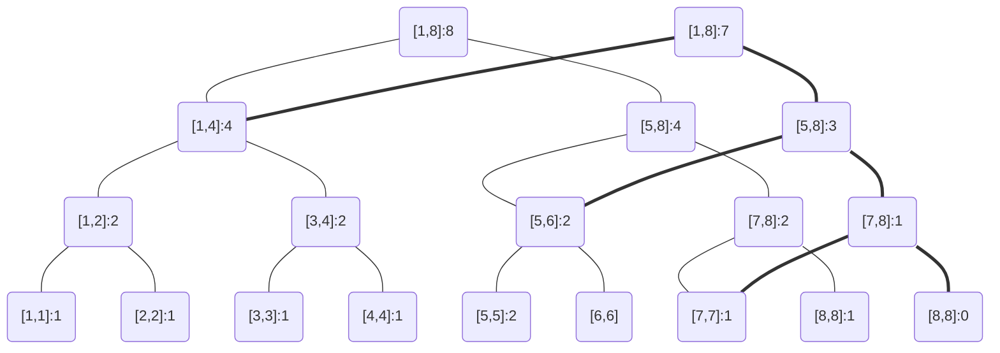

<!--more-->

## 可持久化线段树

可持久化线段树是一种**特殊的线段树**，不同于普通的线段树，他能够维护一些经过修改之后的不同版本的树，并且能在当前树的某个历史版本上进行操作，包括：

- 单点查询

- 单点更新

- 区间查询

- 区间更新

- 创建新的版本

维护不同版本的树，如采用朴素的线段树建新树，时间和空间都会超出限制，但是利用当前版本的线段树和以前版本的线段树的共同结点，我们可以节省很多重复的结点，对旧版本的树进行改造，就能遍历到新的树

### Code(可持久化线段树)

```cpp
struct node{
	int lc,rc,sumv;
	#define lc(x) T[x].lc // x 的左儿子
	#define rc(x) T[x].rc // x 的右儿子
	#define s(x) T[x].sumv // x 的值
	#define pushup(x) (T[x].sumv=T[T[x].lc].sumv+T[T[x].rc].sumv) // 上传 
}T[MAXN];
```

## 建树

可持久化线段树建树和线段树建树没有多大区别，但是为了后面操作的方便，我们不用以前的线段树表示方式（即 $K<<1$ 表示 $K$ 的左儿子，$K<<1+1$ 表示 $K$ 的右儿子），而用 $LC(K)=K+1$ 和 $RC(K)$ 来表示

### Code(集合线段树)

构建一颗空的集合线段树：

```cpp
int build(int L,int R){
	int now=++newp;
	if(L==R) return now;
	lc(now)=build(L,mid);
	rc(now)=build(mid+1,R);
	return now; 
}
```

### Code(普通线段树)

利用给出的 $w$  数组，构建一颗普通线段树

```cpp
int now=++newp;
	if(L==R){
		s(now)=w[L];
		return now;
	}
	lc(now)=build(L,mid);
	rc(now)=build(mid+1,R);
	return now; 
```

## 更新（创建新的版本链）

在更新的同时，创建额外的结点

对于非叶子结点的额外结点，与当前节点共享一个儿子（左儿子或者右儿子），他的另一个儿子是递归创建的新结点，他的权值是经过更新之后的当前结点的权值（当前结点权值保持不动）

对于叶子节点的额外结点，没有左右儿子，他的权值是当前结点的更新后权值

**这里用集合线段树来举一个例子：**

> **对序列：$2\;5\;1\;8\;3\;5\;4\;7$ 创建一颗集合线段树：**
>
> **树中每个结点存了此结点表示的 $[L，R]$ 区间内出现的数字的个数**

 ```mermaid
graph TD
d1("[1,8]:8");d2("[1,4]:4");d3("[1,2]:2");d4("[1,1]:1");
d5("[2,2]:1");d6("[3,4]:2");d7("[3,3]:1");d8("[4,4]:1");
d9("[5,8]:4");d10("[5,6]:2");d11("[5,5]:2");d12("[6,6]")
d13("[7,8]:2");d14("[7,7]:1");d15("[8,8]:1")
d1---d2;d2---d3;d3---d4;d3---d5;d2---d6;
d6---d7;d6---d8;d1---d9;d9---d10;d10---d11;
d10---d12;d9---d13;d13---d14;d13---d15

 ```

>**操作：将数列中的 8 删去，以此创建新的版本 1 ，原来的作为版本 0 不动**
>
>**那么操作之后的图：**



此时我们沿着细线访问就是版本0，沿着粗线访问就是版本1

整个操作只是新建了右边一串的四个点（注意到根结点也被新建了）， 比暴力建新树要节省了巨多的空间，用 $Ver[i]$  表示版本 $i$ 的根结点是哪个就行了

### Code(更新结点+复制版本：集合线段树)

```cpp
void updata(int k,int L,int R,int x,int _v){
	// 更新结点 + 复制版本  
	s(k)+=_v;
	if(L==R) return; // 叶子节点不用复制 ??  
	if(x<=mid){
		T[++newp]=T[lc(k)]; // 这里用结构体直接复制一份 k 的左子节点  
		lc(k)=newp;
		updata(lc(k),L,mid,x,_v);
		return;
	}
	T[++newp]=T[rc(k)];
	rc(k)=newp;
	updata(rc(k),mid+1,R,x,_v);
}
```

### Code(更新结点+复制版本：普通线段树)

```cpp
int updata(int k,int L,int R,int x,int d){
	// 修改 x 位置 为 d 
	// 为了新建的版本节点，需要返回 int  
	int now=++newp;
	if(L==R){
		s(now)=d;
		return now;
	}
	T[now]=T[k]; s(now)=0;
	if(x<=mid) lc(now)=updata(lc(k),L,mid,x,d);
	else rc(now)=updata(rc(k),mid+1,R,x,d);
	return now;
}
```

## 以某个版本为基础进行修改

这种操作通常都伴有要你新建一个版本，这个版本存的是某一个历史版本为基础，修改了上面的某个值之后的结果（历史版本不动）

注意到上面我们的 $updata$ 是 $int$ 类型，那么他返回的其实就是操作完成后的新的根结点的值，因此，在主函数里直接把新的版本根结点赋值即可

### Code(版本修改+创建)

```cpp
int main(){
    ...
    scanf("%d%d%d",&version,&k,&d)
    // 表示把 version 版本的 k 位置改成 d，并创建新的版本
    Ver[++Ver[0]]=updata(Ver[version],1,n,k,d);    
    ...
}
```


## 访问历史版本的某一个结点值

由于之前更新的时候我们已经把版本信息存下来了（在 $Ver$ 数组里面）

于是现在直接从对应的版本根结点开始遍历即可

### Code(访问历史版本)

```cpp
int query(int k,int L,int R,int x){
	// 查询 位置 x 上的值 
	if(L==R) return s(k); // s(k) 的意义见可持久化线段树定义 
	if(x<=mid) return query(lc(k),L,mid,x);
	return query(rc(k),mid+1,R,x); 
}
int main(){
    ...
    scanf("%d%d",&Version,&k); // 表示查询 Version 版本的第 k 位置 
    printf("%d",query(Ver[Version],1,n,k)) // 从 Ver[Version] 的根结点进树
    ...
}
```

## 【应用】求区间第K小

我们在用**集合线段树**求解区间第K大的问题时，注意到集合线段树总有左子树表示的数字总比右子树表示的数字小，所以将区间内的数字统计出来之后，我们对于某个结点的左右子树判断，若左子树包含的数字个数大于等于K，则第K小的树一定在左子树，否则就去右子树找第 $K-sumv(lchi)$ 小的数，可以递归实现

对于区间的第K小，基本思路和上述一致，只不过用到类似区间前缀和相减的知识，即：一个数在 $[L_1，R_1]$ 中出现的次数，等于他在 $[L_1，R_2]$ 中出现的次数加上 $[L_1，R_3]$ 中出现的次数（$R_1=R_2+R_3$），若序列有 $n$ 个元素，就建 $n$ 个版本的线段树，分别保存的是序列只有 $1，2，3……n$ 个元素时候的集合信息，需要区间相减的时候，我们分别从两个版本的根结点进树，遍历时动态相减就能得到目标区间内数字出现的个数

### Code(第K小)

```cpp
int kth(int L,int R,int r1,int r2,int k){
	// 查询区间内第 k 大的数  
	if(L==R) return w[vis[L]];
	int chi=s(lc(r2))-s(lc(r1));
	if(chi>=k) return kth(L,mid,lc(r1),lc(r2),k);
	else return kth(mid+1,R,rc(r1),rc(r2),k-chi);
}
int main(){
    ...
    scanf("%d%d%d",&l,&r,&k); // 查询 [l,r] 内第k小的数
    printf("%d",kth(1,n,Ver[l-1],Ver[r],k));
    ...
}
```

## 【应用】统计区间内的数字个数

设数列 ${a_n}$，需要统计出 $a_x$ 到 $a_y$ 间的所有数字在区间 $[L，R]$ 内的个数

和上面的区间减法思路本质一样，模板是线段树区间查询

### Code(统计数字个数)

```cpp
int cens(int L,int R,int x,int y,int Rx,int Ry){
	// 统计 [x,y] 中的数在 [Rx,Ry] 中的个数 
	// s(x) = tree[x].sumv 
	// lc(x) = tree[x].lchild
	// rc(x) = tree[x].rchild 
	if(L>Ry || R<Rx) return 0;
	if(Rx<=L && Ry>=R) return s(y)-s(x);
	return cens(L,mid,lc(x),lc(y),Rx,Ry)+cens(mid+1,R,rc(x),rc(y),Rx,Ry); 
}
```

