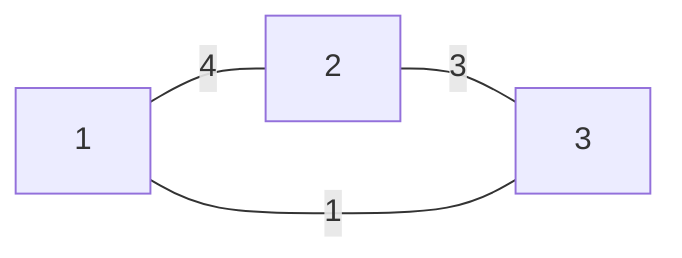
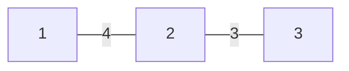

<!--more-->

# T2.货车运输

## Description

A 国有 n 座城市，编号从 1 到 n，城市之间有 m 条双向道路。每一条道路对车辆都有重量限制，简称限重。现在有 q 辆货车在运输货物，司机们想知道每辆车在不超过车辆限重的情况下，最多能运多重的货物。

## Input

第一行有两个用一个空格隔开的整数 n，m，表示 A 国有 n 座城市和 m 条道路。接下来 m 行每行 3 个整数 x、y、z，每两个整数之间用一个空格隔开，表示从x 号城市到 y 号城市有一条限重为 z 的道路。注意：x 不等于 y，两座城市之间可能有多条道路。接下来一行有一个整数 q，表示有 q 辆货车需要运货。接下来 q 行，每行两个整数 x、y，之间用一个空格隔开，表示一辆货车需要从 x 城市运输货物到 y 城市，注意：x 不等于 y

## Output

输出共有 q 行，每行一个整数，表示对于每一辆货车，它的最大载重是多少。如果货车不能到达目的地，输出-1

## Sample Input

```plain
4 3
1 2 4
2 3 3
3 1 1
3
1 3
1 4
1 3
```

## Sample Output

```plain
3
-1
3
```

## Hint

对于 30%的数据，0 < n < 1,000，0 < m < 10,000，0 < q < 1,000；

对于 60%的数据，0 < n < 1,000，0 < m < 50,000，0 < q < 1,000；

对于 100%的数据，0 < n < 10,000，0 < m < 50,000，0 < q < 30,000，0 ≤ z ≤ 100000

> **输入样例图示：**



## 分析

首先注意到题目中并不是给出一颗树，意味着两点之间可能有多条路径，那么载重最大的那条路经应该保留，其余路径可以去掉，**由此我们可以对原图求一个最大生成树（森林）**

对于样例，求出最大生成树（森林）后：



然后在这个树上求 $LCA$ 即可，这里要增加一个数组 $g[i][j]$ 表示 $i$ 点与他向上跳 $2^j$ 步的祖先之间的树链上的权值最小的树边，显然 $g[i][j]=min(g[i][j-1]，g[f[i][j-1]][j-1])$，$f[i][j]$ 即 $i$ 点向上跳 $2^j$ 步达到的祖先结点

**求解 $LCA$ 时，要将跳跃路径上的边权最小值跟最后的 $g[x][0]$ 和 $g[y][0]$ 再进行比较**

## Codes

```cpp
#include <bits/stdc++.h>
#define maxn 100001
#define maxm 500001
#define maxlg 32
#define INF 2147483647
using namespace std;
int to[maxm*2],nxt[maxm*2],w[maxm*2],newp;
int head[maxn],n,m,q,f[maxn],dep[maxn];
int fa[maxn][maxlg],ga[maxn][maxlg],lgN;
bool vis[maxn];
// fa[i][j] i向上 2^j 步的祖先 
// ga[i][j] i与 f[i][j] 中间的最短边  
struct node{
    int S,E,W;
    bool operator <(const node &obj)const{
        return W>obj.W;
    }
}g[maxm];
int Sfind(int x){
    if(f[x]==x) return x;
    else return f[x]=Sfind(f[x]);
}
inline void Eadd(int x,int y,int we){
    nxt[++newp]=head[x]; to[newp]=y;
    w[newp]=we; head[x]=newp;
}
inline void max_kruskal(){
    // 构建最大生成树  
    for(int i=1;i<=n;i++) f[i]=i;
    sort(g+1,g+m+1); int cho=0,fx,fy;
    for(int i=1;i<=m;i++){
        if(cho==n-1) break;
        fx=Sfind(g[i].S);fy=Sfind(g[i].E);
        if(fx!=fy){
            f[fx]=fy; // UNION 
            cho++; Eadd(g[i].S,g[i].E,g[i].W);
            Eadd(g[i].E,g[i].S,g[i].W);
        }
    }
}
template<typename t>inline void fcin(t &x){
    int sign=1; x=0; char op=getchar();
    while(op<'0'||op>'9'){if(op=='-') sign=-1;op=getchar();}
    while(op>='0'&&op<='9'){x=x*10+(op-48);op=getchar();}
    x*=sign;
}
void bfs(int s){
    queue<int> q; int qhead;
    dep[s]=1; q.push(s);
    for(int i=0;i<maxlg;i++) ga[s][i]=INF;
    while(!q.empty()){
        qhead=q.front();q.pop(); vis[qhead]=true;
        for(int i=head[qhead];i;i=nxt[i]){
            if(dep[to[i]]) continue;
            dep[to[i]]=dep[qhead]+1;
            fa[to[i]][0]=qhead;ga[to[i]][0]=w[i];
            for(int j=1;j<=lgN;j++){
                fa[to[i]][j]=fa[fa[to[i]][j-1]][j-1];
                ga[to[i]][j]=min(ga[to[i]][j-1],ga[fa[to[i]][j-1]][j-1]);
            }
            q.push(to[i]);
        }
    }
} 
int LCA(int x,int y){
    if(dep[x]<dep[y]) swap(x,y); int minans=INF;
    int jh=(int)(log(dep[x])/log(2));
    for(int i=jh;i>=0;i--)
        if(dep[fa[x][i]]>=dep[y]){
            minans=min(minans,ga[x][i]);
            x=fa[x][i];
        }
    if(x==y) return minans; jh=(int)(log(dep[x])/log(2));
    for(int i=jh;i>=0;i--)
        if(fa[x][i]!=fa[y][i]){
            minans=min(min(ga[x][i],ga[y][i]),minans);
            x=fa[x][i]; y=fa[y][i];
        }
    return min(minans,min(ga[x][0],ga[y][0]));
}
int main(){
    #ifndef ONLINE_JUDGE
    freopen("t2.in","r",stdin);
    freopen("t2.out","w",stdout);
    #endif
    fcin(n);fcin(m); lgN=(int)(log(n)/log(2));
    for(int i=1;i<=m;i++){
        fcin(g[i].S);fcin(g[i].E);
        fcin(g[i].W);
    } max_kruskal();
    for(int i=1;i<=n;i++)
        if(!vis[i]) bfs(i); 
    fcin(q); int Qx,Qy;
    for(int i=1;i<=q;i++){
        fcin(Qx);fcin(Qy);
        if(Sfind(Qx)!=Sfind(Qy)){
            printf("-1\n"); continue;
        }
        else printf("%d\n",LCA(Qx,Qy));
    }
    return 0;
}
```

---

# T3.HH的项链

## Description

HH 有一串由各种漂亮的贝壳组成的项链。HH 相信不同的贝壳会带来好运，所以每次散步完后，他都会随意取出一段贝壳，思考它们所表达的含义。HH 不断地收集新的贝壳，因此他的项链变得越来越长。有一天，他突然提出了一个问题：某一段贝壳中，包含了多少种不同的贝壳？这个问题很难回答。。。因为项链实在是太长了。于是，他只好求助睿智的你，来解决这个问题。

## Input

第一行：一个整数 N，表示项链的长度。第二行：N 个整数，表示依次表示项链中贝壳的编号（编号为 0 到 1000000 之间的整数）。第三行：一个整数 M，表示 HH 询问的个数。接下来 M 行：每行两个整数，L 和 R（1 ≤ L ≤ R ≤ N），表示询问的区间。N ≤ 50000，M ≤ 200000。

## Output

M 行，每行一个整数，依次表示询问对应的答案。

## Sample Input

```plain
6
1 2 3 4 3 5
3
1 2
3 5
2 6
```

## Sample Output

```plain
2
2
4
```

## Hint

None

## 分析

采用离线算法，先将所有询问按照左端点升序排序，然后记录每个颜色第一次出现的位置 $first[i]$ 和当前位置后的下一次出现的位置 $next[i]$，可以在 $O(n)$ 内处理出来

**对于每个区间，每种颜色仅当它第一次出现时计数，然后当询问的左端点扫过了这个颜色时，它就不会再被统计了，把下一次他出现的位置加入统计，把它移除即可**

由于涉及了单点修改和区间求和，所以用树状数组优化时间复杂度。

## Codes

```cpp
// 正解： 树状数组  
#include <cstdio>
#include <cstring>
#include <algorithm>
#include <queue>
#include <set>
#define maxQ 500001
#define maxV 1000001
#define maxn 500001
using namespace std;
struct node{
	int L,R; int id;
	bool operator <(const node &obj)const{
		return R<obj.R;
	}
}ask[maxQ]; int T[maxQ],ans[maxQ],a[maxQ];
int vis[maxV],n,m;
void updata(int Pos,int Val){ for(int i=Pos;i<=n;i+=i&(-i))T[i]+=Val; }
int sum(int Pos){ int Res=0; for(int i=Pos;i;i-=i&(-i))Res+=T[i]; return Res; }
template<typename t>inline void fcin(t &x){
	int sign=1; x=0; char op=getchar();
	while(op<'0'||op>'9'){if(op=='-') sign=-1;op=getchar();}
	while(op>='0'&&op<='9'){x=x*10+(op-48);op=getchar();}
	x*=sign;
}
int main(){
	#ifndef ONLINE_JUDGE
	freopen("t3.in","r",stdin);
	freopen("t3.out","w",stdout);
	#endif
	fcin(n);
	for(int i=1;i<=n;i++) fcin(a[i]);
	fcin(m);
	for(int i=1;i<=m;i++){
		fcin(ask[i].L);fcin(ask[i].R);
		ask[i].id=i;
	} int now=1;
	sort(ask+1,ask+m+1);
	for(int i=1;i<=n;i++){
		if(vis[a[i]]) updata(vis[a[i]],-1);
		vis[a[i]]=i;updata(i,1); 
		while(ask[now].R==i){
			ans[ask[now].id]=sum(ask[now].R)-sum(ask[now].L-1);
			now++;
		}
	}
	for(int i=1;i<=m;i++) printf("%d\n",ans[i]);
	return 0; 
} 
```

---

# T4.Rmq Problem / mex

## Description


## Input


## Ouput


## Sample Input

```plain
7 5
0 2 1 0 1 3 2
1 3
2 3
1 4
3 6
2 7
```

## Sample Output

```plain
3
0
3
2
4
```

## Hint


## 分析

采用离线算法，先将所有询问按照左端点升序排序，用类似前缀和的思想可以求出 $f[i]$ 表示 $[1,i]$ 的 $mex$ 值，和T3一样，用 $next[i]$ 表示 $a[i]$ 下一次出现的位置

现在假设有两个询问 $[L，R]$ 和 $[L+1，R]$，**如果 $R\geq next[L]$ 那么两个询问的 $mex$ 值相同**

**如果 $R<next[L]$ ，那么在 $[L+1，R]$ 区间内将所有的 $f[i]>a[L]，i\in[L+1，R]$ 改为 $a[L]$ ，然后单点查询 $f[L]$ 即可**

涉及到区间修改和单点查询，用线段树实现

## Codes

```cpp
#include <cstdio>
#include <cstring>
#include <iostream>
#include <queue>
#include <algorithm>
#define maxn 200001
#define INF 2147483647
using namespace std;
struct node{
    int Le,Ri,id;
    bool operator <(const node &obj)const{
        return Le<obj.Le;
    }
}ask[maxn]; int ans[maxn],n,q;
struct Tnode{
    int LC,RC,V;
    #define lc(x) T[x].LC
    #define rc(x) T[x].RC
    #define val(x) T[x].V
    #define mid ((L+R)>>1)
}T[maxn*4]; // 线段树求最小  
int a[maxn],newp;
int f[maxn],nxt[maxn],las[maxn];
// f[n] [1,n]的 mex 值 nxt[n] 出现 a[n] 的下一个位置  
bool vis[maxn];
template<typename t>inline void fcin(t &x){
    int sign=1; x=0; char op=getchar();
    while(op<'0'||op>'9'){if(op=='-') sign=-1;op=getchar();}
    while(op>='0'&&op<='9'){x=x*10+(op-48);op=getchar();}
    x*=sign;
}
inline void pushdown(int k){
    if(val(k)==INF) return;
    val(lc(k))=min(val(lc(k)),val(k));
    val(rc(k))=min(val(rc(k)),val(k));
    val(k)=INF;
}
int build(int L,int R){
    int now=++newp;
    if(L==R){
        val(now)=f[L];
        return now;
    } val(now)=INF;
    lc(now)=build(L,mid);
    rc(now)=build(mid+1,R);
    return now;
}
void updata(int k,int L,int R,int x,int y,int _v){
    // 线段树 区间修改  
    if(L==x && R==y){
        val(k)=min(val(k),_v);
        return;
    } pushdown(k);
    if(mid>=y) updata(lc(k),L,mid,x,y,_v);
    else if(mid+1<=x) updata(rc(k),mid+1,R,x,y,_v);
    else{
        updata(lc(k),L,mid,x,mid,_v);
        updata(rc(k),mid+1,R,mid+1,y,_v);
    } 
}
int res(int k,int L,int R,int x){
    // 线段树单点查询  
    if(L==R) return val(k);
    pushdown(k);
    if(x<=mid) return res(lc(k),L,mid,x);
    else return res(rc(k),mid+1,R,x);
}
int main(){
    #ifndef ONLINE_JUDGE
    freopen("t4.in","r",stdin);
    freopen("t4.out","w",stdout);
    #endif
    fcin(n);fcin(q); int nowmex=0;
    for(int i=1;i<=n;i++) fcin(a[i]);
    for(int i=1;i<=n;i++){ // 求解 f[i]  
        vis[a[i]]=true; while(vis[nowmex]) nowmex++;
        f[i]=nowmex;
    } build(1,n);
    for(int i=n;i>=1;i--){ // nxt[i] 需要倒过来求解  
        nxt[i]=las[a[i]]; las[a[i]]=i;
    }
    for(int i=1;i<=q;i++) fcin(ask[i].Le),fcin(ask[i].Ri),ask[i].id=i;
    sort(ask+1,ask+q+1); int now=1;
    for(int i=1;i<=q;i++){
        while(now<ask[i].Le){
            if(!nxt[now]) nxt[now]=n+1;
            updata(1,1,n,now,nxt[now]-1,a[now]);
            now++;
        }
        ans[ask[i].id]=res(1,1,n,ask[i].Ri);
    }
    for(int i=1;i<=q;i++) printf("%d\n",ans[i]);
    return 0;
}
```

