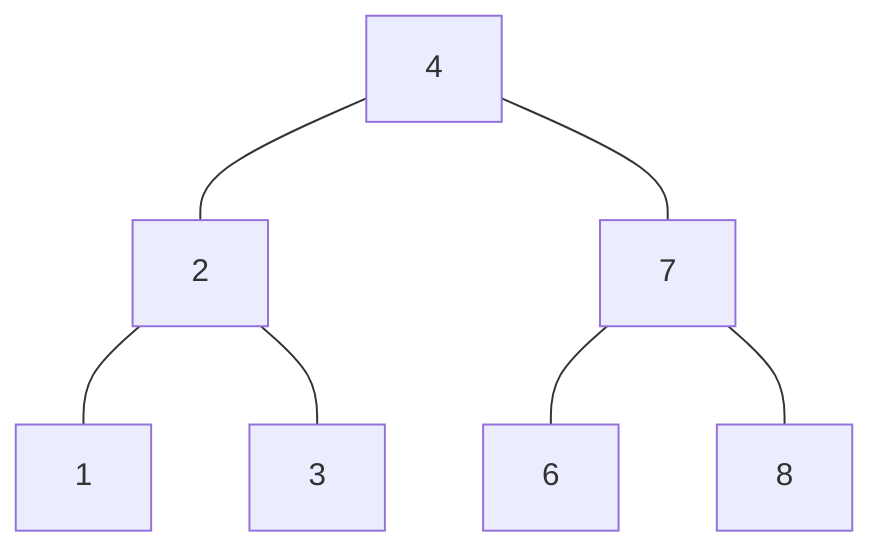
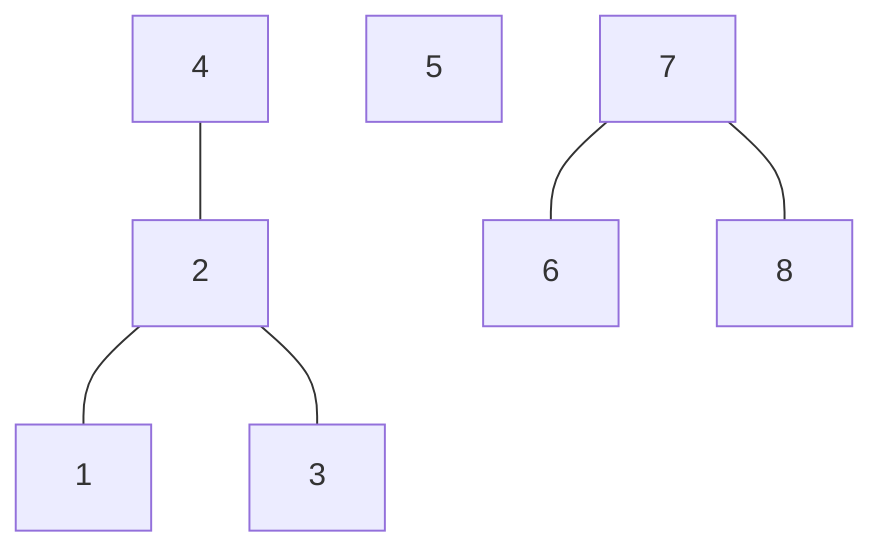
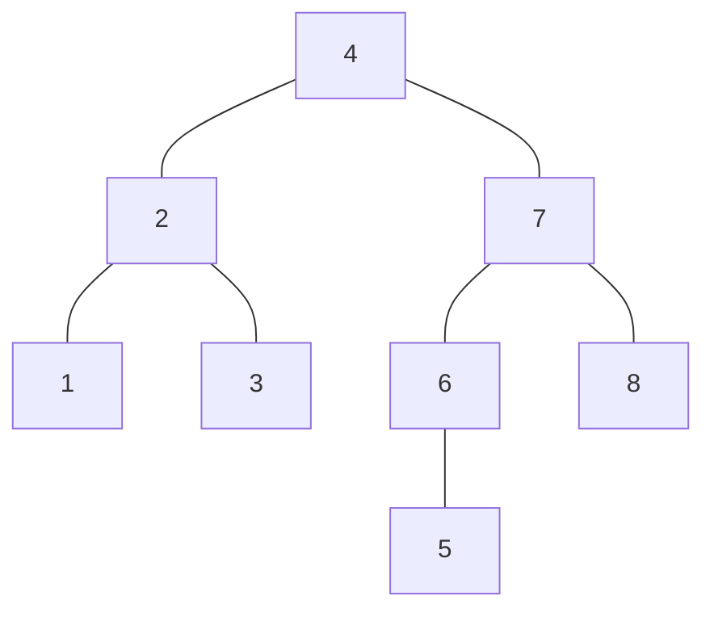

<!--more-->

## FHQTreap：函数式平衡树

**FHQTreap** 是一种特殊的平衡树*（  Invented By FHQ ）*，不同于普通平衡树 **Splay** 的是，它无需旋转操作(Rotate)就可以达到 **Splay** 的速度，而是用两个基本操作实现序列操作：**Merge** 和 **Split**

从名字 **Split** 就可以发现，**它的核心思想是将一颗树分裂，使之两个部分满足堆序，在上面操作之后再合并为一棵树**

**FHQTreap** 的本质还是 **BST** ，所以区间操作和 **Splay** 没有多大区别~~（经过优化后好像还比**Splay**跑得快？）~~

## 基础操作：Split (分裂)

**Split 分裂** 是按照某种规定将当前的树分成两棵子树的操作（当前的树也有可能是分裂之后的树，因此操作具有递归性），分裂操作可以按照给定权值分，也可以按照子树大小分

### 按照权值分裂

将当前树分裂成权值均小于等于 X 的一棵树 A 和权值均大于 X 的一棵树 B

A，B 的意义为分裂后两棵树的根结点，需要实时更新，引用传参

**空树将会被拆分成 2 棵空树，即A=B=0（边界），然后：**

1. 如果正在考虑的点 K 权值比 X 大，说明 K 的右子树的权值均比 X 大，K 的右子树放到 B 中，同时走 K 的左子树，把左子树中所有权值大于 X 的点分到 B 中，剩下的点分到 A 中

2. 如果正在考虑的点 K 权值比 X 小，说明 K 的左子树的权值均比 X 小，K 的左子树放到 A 中，同时走 K 的右子树，把右子树中所有权值小于 X 的点分到 A 中，剩下的点分到 B 中

```cpp
void SplitVal(int k,int tar,int &x,int &y){ // 按权值分裂  
		if(!k){x=y=0; return;}
		if(tar>=val(k)){
			x=k; SplitVal(rc(k),tar,rc(k),y);
		}else{
			y=k; SplitVal(lc(k),tar,x,lc(k));
		} pushup(k);
		return;
	}
```

### 按照排名分裂

基本思想和上面的 **按照权值分裂** 一致，判断条件从权值改为了子树的大小 **Size(K)**

这里注意，如果要走当前点的右子树，目标大小应该减去它左子树大小加上他自身的 1 ，和 **Kth​** 的思想相似

```cpp
void SplitRnk(int k,int tar,int &x,int &y){ // 按排名分裂  
		if(!k){x=y=0; return;}
		if(tar<siz(lc(k))){
			y=k; SplitRnk(lc(k),tar,x,lc(k));
		}else{
			x=k; SplitRnk(rc(k),tar-siz(lc(k))-1,rc(k),y);
             // 和 Kth 的思想相似 
		}
		pushup(k);
		return;
	}
```

**pushup(K) 是更新 K 的子树大小，跟线段树的 pushup 相似**

## 基础操作：Merge (合并)

**Merge 合并** 是把当前分开的两棵子树合并成一颗新的树，函数需要返回合并之后的根结点，合并时需要按照堆序，使得随机值较小的结点作为新树的根，假设合并前有两棵树 A，B，A 中的所有元素都小于B 中的元素，则：

1. 若 A 树的根成为了新树的根，则 B 树不会对 A 树的左子树造成影响，递归合并 A 的右子树和 B 即可
2. 若 B 树的根成为了新树的根，则 A 树不会对 B 树的右子树造成影响，递归合并 B 的左子树和 A 即可

**边界条件：若 A，B 中有空树，那么以不是空树的结点作为新树的根结点，此时无需再往下递归**

```cpp
int merge(int x,int y){
		if(!x || !y) return x|y;
		if(rnd(x)<rnd(y)){
			rc(x)=merge(rc(x),y);
			pushup(x); return x;
		}else{
			lc(y)=merge(x,lc(y));
			pushup(y); return y;
		}
	}
```

实际使用时要用 **root** 来维护当前树的根结点

## 区间操作：插入（Insert）

**Insert 插入** 是把新的值放入当前的 **FHQTreap** 中，依靠 **Split** 和 **Merge** 实现插入操作，我们只需要将当前的树按照插入的权值 **X** 分裂成两棵树，此时左边的 A 树权值均小于等于 **X**，右边的 B 树权值均大于 **X**，把 A，X，B 按顺序合并，插入就完成了，举个例子：

> **插入之前的树，需要插入的值为 5**



> **一次分裂之后：**



> **合并之后：**



```cpp
inline void Insert(int N){
		SplitVal(root,val(N),X,Y);
		rot=merge(merge(X,N),Y);
    	// root 是一个常量，代表树当前的根结点
    	// X,Y 随意取值，原因是他们会在 Split 时被引用赋值，只具有临时意义
	}
```

## 区间操作：第 K 小（Kth）

**Kth 第 K 小** 是寻找当前序列中升序排列后第 K 位的数，这里的第 K 小返回的是这个数的结点编号，与 **Splay** 以及 **BST** 的思路完全一致，就不多说了

```cpp
int kth(int k,int tar){
    	// k 代表当前走到了哪个结点
		while(true){
			if(tar<=siz(lc(k))) k=lc(k);
			else{
				if(tar==siz(lc(k))+1) return k;
				else tar-=(siz(lc(k))+1), k=rc(k);
			}
		}
	}
```

## 区间操作：排名问题（Rank）

**Rank 排名问题** 是指在区间中询问某一个数的升序排列后位置（确保存在），和询问排名为 K 的数（升序排列），通常与 **Kth** 合起来使用，思路同 **BST**

### 查询某数的排名

将原树按照给定数 N 的值减 1 分为 X，Y 两棵树，然后左边的 X 树的大小就是处在 N 前面的数的个数，加上 N 本身，就是他的排名

```cpp
int GetRnk(int N){
			// 取得元素的排名  
			SplitVal(root,N-1,X,Y);
			int ret=siz(X)+1;
			root=merge(X,Y); return ret;
		}
```

### 查询第 K 名的数

直接 **Kth** 解决问题

```cpp
inline int GetRanK(int N){
			// 取得第 K 小的数 
			int ret=kth(root,N);
			if(!ret) return INF;
			else return val(ret);
		}
```

## 元素操作：前驱与后继（Precursor & Successor）

### 元素的前驱（Precursor）

元素的前驱定义为 **小于等于此元素的元素组成的集合中最大的一个**，要求一个元素的前驱，只需将整颗树按照 **N-1** 进行分裂（N是元素的值），然后在左数中找最大值即可

```cpp
int GetPre(int N){
			// 取得元素的前驱  
			SplitVal(root,N-1,X,Y);
			int ret;
			if(!siz(X)) ret=INF;
			else ret=val(kth(X,siz(X)));
			root=merge(X,Y); return ret;
		}
```

### 元素的后继（Successor）

元素的后继定义为 **大于此元素的元素组成的集合中最小的一个**，要求一个元素的后继，只需将整颗树按照 **N** 进行分裂（N是元素的值），然后在右树中找最小值即可

```cpp
int GetSuc(int N){
			// 取得元素的后继  
			SplitVal(root,N,X,Y);
			int ret;
			if(!siz(Y)) ret=INF;
			else ret=val(kth(Y,1));
			root=merge(X,Y); return ret;
		}
```

## 元素操作：元素 N 的出现与计数（Exist & Count）

### 元素 N 是否出现（Exist）

判断给定的元素 **N** 是否存在，按照中序遍历整棵树即可

由于 **FHQTreap** 本质是一颗 **BST** ，符合 **BST** 的特征，所以若 **N** 小于等于当前结点的值，**N** 一定在其左子树，否则 **N** 只能位于其右子树

```cpp
inline bool ExistK(int k,int N){
			// 递归寻找 val=K 的元素  
			if(!k) return false;
			else if(val(k)==N) return true;
			else if(N>=val(k)) return ExistK(rc(k),N);
			else return ExistK(lc(k),N);
		}
```

### 小于等于 N 的数的个数（Count）

这里的 **Count** 与前面的 **Kth** 和 **GetRnk** 不同的是，**N** 可以不是当前序列中的数，按照 **BST** 的性质，如果当前结点 **K** 的值小于等于 **N**， 那么 **K** 的左子树一定全部小于等于 **N** ，把这部分加上后再去其右子树递归寻找，否则只用去 **K** 的左子树递归寻找（**K** 的右子树一定都比 **N** 大）

```cpp
inline int CntK(int k,int N){
			// 数一下有多少个小于 N 的数 
			int ans=0;
			if(!k) return ans;
			if(N>val(k)) ans=siz(lc(k))+1+CntK(rc(k),N);
			else ans=CntK(lc(k),N);
			return ans;
		}
```

---

## 扩展操作：垃圾回收（Recycle）

**Recycle 垃圾回收** 是对那些毒瘤数据，会让平衡树频繁删点和建点设计的优化算法，可以在一定程度上节省一些空间

利用 **DUST** 数组存储已经删除的点，下次新建时优先去 **DUST** 里寻找已经删除的点

```cpp
inline int New(int x){
  		p=(dust[0]?)dust[dust[0]--]:++newp;
    	lc(p)=rc(p)=0; siz(p)=1;
    	val(p)=x; rnd(p)=rand();
		siz(p)=1; return p;
	}
inline void Eliminate(int N){
			// 消除元素  
			SplitVal(root,N,X,Z);
			SplitVal(X,N-1,X,Y);
    		dust[++dust[0]]=Y;
			Y=merge(lc(Y),rc(Y));
			root=merge(merge(X,Y),Z);
		}
```

## 扩展操作：延迟标记（Tag）

**Tag 延迟标记** 和线段树的 **LazyTag 懒标记** 相似，若操作多次能造成结果的周期性变化，在 **Tag**  中保存操作的次数而不用马上进行操作，可以降低时间复杂度，一个例子：

> 定义操作 **SegReverse（L，R）** 表示将区间 **（L，R）** 内的数字全部头尾翻转，给定原序列，输出经过 n 次给定操作后的序列

上面的翻转操作显然具有周期性，**任何区间翻转偶数次之后不会发生变化**，利用延迟标记降低操作的时间复杂度

```cpp
inline void pushdown(int k){
			// 标记下传  
			if(tag(k)){
				swap(lc(k),rc(k));
				tag(lc(k))^=1;tag(rc(k))^=1;
				tag(k)=0;
			}
		}
		inline void SeqReverse(int L,int R){
			// 区间翻转  
			SplitRnk(root,L-1,X,Y);
			SplitRnk(Y,R-L+1,Y,Z);
			tag(Y)^=1;
			root=merge(X,merge(Y,Z));
		}
```

**输出序列时要用到中序遍历**

```cpp
void VisDfs(int k){
			// 中序遍历  
			if(!k) return;
			//pushdown(k);
			VisDfs(lc(k));
			printf("%d ",val(k));
			VisDfs(rc(k));
		}
```

## 扩展操作：启发式合并（Enlightenment Merge）

**Enlightenment Merge 启发式合并** 是并查集里面的一个思想，即：**每次合并时，将元素少的集合合并到元素多的集合**，这样的合并在树中可以减少两棵树合并后对于原树的影响，从某种玄学的角度来说，能降低后面遍历的时间复杂度，对于多根树的合并操作，启发式合并比随机合并能提高后面遍历的效率，核心代码：

```cpp
inline int MultiUnion(int x,int y){
			if(siz(x)>siz(y)) swap(x,y);
			Union(x,y); return y; // Union(x,y) 表示将 x 合并到 y
		}
inline void MultiMerge(int x,int y){
			int fx=Sfind(x),fy=Sfind(y);
			if(fx==fy) return;
			int fz=MultiUnion(fx,fy);
			f[Sfind(x)]=f[Sfind(y)]=fz; f[fz]=fz;
		}
```

---

**下面是一些例题：**

|                             题目                             |                          用到的操作                          |
| :----------------------------------------------------------: | :----------------------------------------------------------: |
|  [【培训题】平衡树[1]](http://newoj.cqyz.cn/problem/P2025)   | Split，Merge，Insert，Precursor，Successor，Exist，Rank，Eliminate |
|  [【培训题】平衡树[2]](http://newoj.cqyz.cn/problem/P2026)   |   Split，Merge，Insert，Kth，Exist，Rank，Count，Eliminate   |
| [【模板】文艺平衡树](https://www.luogu.org/problemnew/show/P3391) |             Split，Merge，Insert，Eliminate，Tag             |
| [HNOI2012 永无乡](https://www.luogu.org/problemnew/show/P3224) |     Split，Merge，Insert，Eliminate，Enlightenment Merge     |

**代码整合：**

```cpp
struct FHQTreap{
	#define INF 2147483647
	#define ll long long
	int X,Y,Z;
	int f[maxn<<2]; // 并查集部分   
	int Sfind(int x){
		if(f[x]==x) return x;
		else return f[x]=Sfind(f[x]);
	}
	FHQTreap(){
		X=Y=Z=0;
	}
	template<typename t>inline void fcin(t &x){
		int sign=1; x=0; char op=getchar();
		while(op<'0'||op>'9'){if(op=='-') sign=-1;op=getchar();}
		while(op>='0'&&op<='9'){x=x*10+(op-48);op=getchar();}
		x*=sign;
	}
	struct FHQTreapNode{
		int LC,RC,RND,SIZ,V,TAG;
		#define lc(x) T[x].LC
		#define rc(x) T[x].RC
		#define rnd(x) T[x].RND
		#define siz(x) T[x].SIZ
		#define val(x) T[x].V
		#define tag(x) T[x].TAG
	}T[maxn<<2]; int newp,root;
	inline void pushup(int k){siz(k)=siz(lc(k))+siz(rc(k))+1;}
	inline int New(int x){
		newp++; val(newp)=x; rnd(newp)=rand();
		siz(newp)=1; return newp;
	}
	int merge(int x,int y){ // 合并两棵树 
		if(!x || !y) return x|y;
		if(rnd(x)<rnd(y)){
			rc(x)=merge(rc(x),y);
			pushup(x); return x;
		}else{
			lc(y)=merge(x,lc(y));
			pushup(y); return y;
		}
	}
	inline void SplitVal(int k,int tar,int &x,int &y){ // 按权值分裂  
		if(!k){x=y=0; return;}
		if(tar>=val(k)){
			x=k; SplitVal(rc(k),tar,rc(k),y);
		}else{
			y=k; SplitVal(lc(k),tar,x,lc(k));
		} pushup(k);
		return;
	}
	inline void SplitRnk(int k,int tar,int &x,int &y){ // 按排名分裂  
		if(!k){x=y=0; return;}
		pushup(k);
		if(tar<=siz(lc(k))){
			y=k; SplitRnk(lc(k),tar,x,lc(k));
		}else{
			x=k; SplitRnk(rc(k),tar-siz(lc(k))-1,rc(k),y);
		}
		pushup(k);
		return;
	}
	int kth(int k,int tar){
		while(true){
			if(tar<=siz(lc(k))) k=lc(k);
			else{
				if(tar==siz(lc(k))+1) return k;
				else tar-=(siz(lc(k))+1), k=rc(k);
			}
		}
	}
	
	// 几种基本操作 
		inline void Insert(int N){
			// 插入元素  
			SplitVal(root,N,X,Y);
			root=merge(merge(X,New(N)),Y);
		}
		inline void Eliminate(int N){
			// 消除元素  
			SplitVal(root,N,X,Z);
			SplitVal(X,N-1,X,Y);
			Y=merge(lc(Y),rc(Y));
			root=merge(merge(X,Y),Z);
		}
		int GetRnk(int N){
			// 取得元素的排名  
			SplitVal(root,N-1,X,Y);
			int ret=siz(X)+1;
			root=merge(X,Y); return ret;
		}
		int GetPre(int N){
			// 取得元素的前驱  
			SplitVal(root,N-1,X,Y);
			int ret;
			if(!siz(X)) ret=INF;
			else ret=val(kth(X,siz(X)));
			root=merge(X,Y); return ret;
		}
		int GetSuc(int N){
			// 取得元素的后继  
			SplitVal(root,N,X,Y);
			int ret;
			if(!siz(Y)) ret=INF;
			else ret=val(kth(Y,1));
			root=merge(X,Y); return ret;
		}
		inline int GetRanK(int N){
			// 取得第 K 小的数 
			int ret=kth(root,N);
			if(!ret) return INF;
			else return val(ret);
		}
		inline bool ExistK(int k,int N){
			// 递归寻找 val=K 的元素  
			if(!k) return false;
			else if(val(k)==N) return true;
			else if(N>=val(k)) return ExistK(rc(k),N);
			else return ExistK(lc(k),N);
		}
		inline int GetMax(){
			if(!siz(root)) return INF;
			else return val(kth(root,siz(root)));
		}
		inline int GetMin(){
			if(!siz(root)) return INF;
			else return val(kth(root,1));
		}
		inline int CntK(int k,int N){
			// 数一下有多少个小于 N 的数 
			int ans=0;
			if(!k) return ans;
			if(N>val(k)) ans=siz(lc(k))+1+CntK(rc(k),N);
			else ans=CntK(lc(k),N);
			return ans;
		}

		// 文艺平衡树部分：区间翻转  
		inline void pushdown(int k){
			// 标记下传  
			if(tag(k)){
				swap(lc(k),rc(k));
				tag(lc(k))^=1;tag(rc(k))^=1;
				tag(k)=0;
			}
		}
		inline void SeqReverse(int L,int R){
			// 区间翻转  
			SplitRnk(root,L-1,X,Y);
			SplitRnk(Y,R-L+1,Y,Z);
			tag(Y)^=1;
			root=merge(X,merge(Y,Z));
		}
		void VisDfs(int k){
			// 中序遍历  
			if(!k) return;
			//pushdown(k);
			VisDfs(lc(k));
			printf("%d ",val(k));
			VisDfs(rc(k));
		}
		// 启发式合并 
		inline void MultiInsert(int &rot,int N){
			SplitVal(rot,val(N),X,Y);
			rot=merge(merge(X,N),Y);
		}
		inline void MultiDfs(int x,int &y){
			if(!x) return;
			MultiDfs(lc(x),y);
			MultiDfs(rc(x),y);
			lc(x)=rc(x)=0;
			MultiInsert(y,x);
		}
		inline int MultiUnion(int x,int y){
			if(siz(x)>siz(y)) swap(x,y);
			MultiDfs(x,y); return y;
		}
		inline void MultiMerge(int x,int y){
			int fx=Sfind(x),fy=Sfind(y);
			if(fx==fy) return;
			int fz=MultiUnion(fx,fy);
			f[Sfind(x)]=f[Sfind(y)]=fz; f[fz]=fz;
		}
};
```

