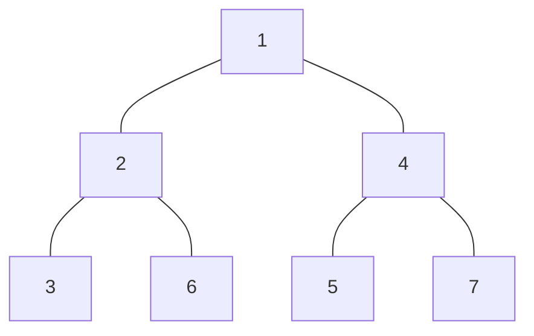
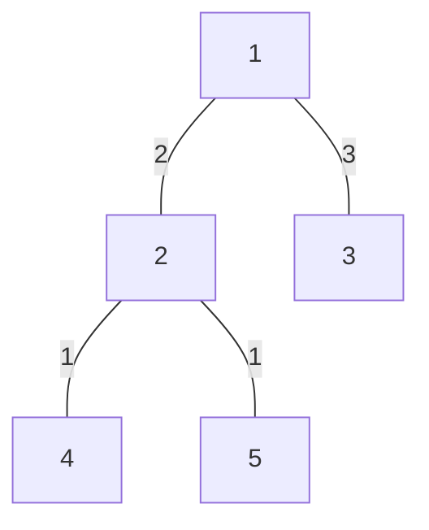

<!--more-->
## 点分治

点分治，是树上的一种分治算法，**是统计树上路径的一种优化算法**

**点分治的核心思想是，对于一棵无根树的一个结点 u ，把题目要求的特征路径分为只在 u 的子树上的路径数，和经过 u 的路径数，而求只在 u 的子树上的路径数可以通过递归求解**

这里的 u 具有递归性质，那么应该考虑一个递归的入口，使得总的递归次数尽量小，也就是 u 连接的结点层数尽量小，符合要求的 u ，称之为：**树的重心**

## 树的重心

求树的重心，对于优化点分治的时间复杂度很重要，而且**求解数的重心的过程也是一个递归的过程，即这个“树”可能是递归时的子树，也就是说要对每一步走到的子树求重心，才能保证每一步都高效的分治求解**

求解树的重心结点是一个树上 DP 的过程，把每个点延伸到的子树大小（这里要加上它自己的 1 个）求出来，取最小的结点即可，但是要注意无根树的性质，如下图：



此时，结点 4 的子树不仅包含 {5，7}，也包含它上面的一串点 {1，2，3，6}，但此时的 size() 里面是 2，那么 4 的另外一个子树大小应该是 N-size() ，N 即是总点数

## Code：求解树的重心

```cpp
void rootdfs(int u,int fu){
	siz[u]=1; f[u]=0;
	for(int i=head[u];i;i=nxt[i])
		if(to[i]!=fu && !vis[to[i]]){
			rootdfs(to[i],u); siz[u]+=siz[to[i]];
			f[u]=max(f[u],siz[to[i]]);
		}
	f[u]=max(f[u],nsize-siz[u]);
	if(maxsize>siz[u]) root=u; // maxsize 初始为 INF
}
```

## 例题1：【模板】点分治1（洛谷P3806）

### Description

给定一棵有n个点的树

询问树上距离为k的点对是否存在。

### Input

n,m 接下来n-1条边a,b,c描述a到b有一条长度为c的路径

接下来m行每行询问一个K

### Output

对于每个K每行输出一个答案，存在输出“AYE”,否则输出”NAY”(不包含引号)

### Sample Input

```text
2 1
1 2 2
2
```

### Sample Output

```text
AYE
```

### Hint

对于30%的数据n<=100

对于60%的数据n<=1000,m<=50

对于100%的数据n<=10000,m<=100,c<=10000,K<=10000000

### 分析

对于两点之间路径长度为 K 的点对数目，可以通过点分治来实现，**即将当前点子树中的点对路径为 K 的点对分成 都在同一棵子树中 和 穿越当前结点，在两棵不同子树中 的两种情况**，又发现对于第一种情况可以递归处理，完美配合点分治的思想

初步实现：先一次 DFS 将以 K 为根结点的子树中的所有点到 K 的距离计算出来，然后用标记数组标记出现的路径长度（之后可以 $O(n)$ 离线处理询问），再按照分治的思想，每次选择当前树的重心结点进入，递归解决即可

但是，我们的目的是统计跨越子树的点对路径长度，对于上面的 DFS 求点到 K 的路径长度再加起来的确行之有效，然而某些处于同一子树中的点对的距离就不会被正确的计算，从而有可能导致多余的统计，如：

>**目标路径长度为 5，根结点为 1**



在上图中会发现，按照前面 DFS 累加的思想，会使得 2 到 4 的路径长度 $Len(2,\;4)$ 被计算为 $Dist(2)+Dist(4)=5$ 从而统计进答案，但是 $Len(2,\;4)=1$ 才是正确答案，而正确的答案应该为$Len(2,\;3)=5$ 只有一组

**解决的方法就是，ans 统计之后，对于当前结点 K 的每个直接子结点（有边的）多统计一次，这次统计与上次统计相反，把标记数组中的路径长度对应的计数器全部减掉，就实现了排错，注意进入递归时，如果时累加（从 K 开始）就不同带初始值，设为 0 就好，但如果是排错（从 K 的某个儿子开始）就要带上初始值，为 K 和这个儿子之间的边权（因为 $Dist$ 统计的是所有子树中的点到 K 的距离）**

### Codes

```cpp
#include <cstdio>
#include <cstring>
#include <queue>
#include <iostream>
#include <vector>
#include <cmath>
#include <algorithm>
#define maxn 40001
#define maxk 10000001
#define maxm maxn*2
#define INF 2139062143
using namespace std;
typedef long long ll;
int to[maxm],nxt[maxm],head[maxn];
int siz[maxn],f[maxn],w[maxm],d[maxn]; bool vis[maxn];
int ex[maxk];
int n,k,m,tot,root,nsize,maxsize;
inline void Eadd(int x,int y,int ww){
	nxt[++tot]=head[x]; w[tot]=ww;
	to[tot]=y; head[x]=tot;
}
void rootdfs(int u,int fu){
	siz[u]=1; f[u]=0;
	for(int i=head[u];i;i=nxt[i])
		if(to[i]!=fu && !vis[to[i]]){
			rootdfs(to[i],u); siz[u]+=siz[to[i]];
			f[u]=max(f[u],siz[to[i]]);
		}
	f[u]=max(f[u],nsize-siz[u]);
	if(maxsize>siz[u]) root=u;
}
int ds;
void pathdfs(int u,int fu,int wu){
	d[++ds]=wu;
	for(int i=head[u];i;i=nxt[i])
		if(to[i]!=fu && !vis[to[i]])
			pathdfs(to[i],u,wu+w[i]);
}
void stat(int u,int val,bool plus){
	ds=0; pathdfs(u,0,val);
	if(plus){
		for(int i=1;i<=ds;i++)
			for(int j=i+1;j<=ds;j++) 
				ex[d[i]+d[j]]++;
	}else{
		for(int i=1;i<=ds;i++)
			for(int j=i+1;j<=ds;j++) 
				ex[d[i]+d[j]]--;
	}
}
void dfs(int u){
	stat(u,0,true); vis[u]=true;
	for(int i=head[u];i;i=nxt[i])
		if(!vis[to[i]]){
			stat(to[i],w[i],false);
			nsize=siz[to[i]]; maxsize=INF;
			rootdfs(to[i],0); dfs(root); 
		}
}
int main(){
	#ifndef ONLINE_JUDGE
	freopen("testin.txt","r",stdin);
	freopen("testout.txt","w",stdout);
	#endif
	scanf("%d%d",&n,&m); int a,b,c;
	for(int i=1;i<=n-1;i++){
		scanf("%d%d%d",&a,&b,&c);
		Eadd(a,b,c);Eadd(b,a,c);
	}
	nsize=n; maxsize=INF;
	rootdfs(1,0); dfs(root);
	for(int i=1;i<=m;i++){
		scanf("%d",&k);
		if(ex[k]) printf("AYE\n");
		else printf("NAY\n");
	}
	return 0;
}
```

## 例题2：洛谷P4178 Tree

### Description

给你一棵TREE,以及这棵树上边的距离.问有多少对点它们两者间的距离小于等于K

### Input

N（n<=40000） 接下来n-1行边描述管道，按照题目中写的输入 接下来是k

### Output

一行，有多少对点之间的距离小于等于k

### Sample Input

```text
7
1 6 13 
6 3 9 
3 5 7 
4 1 3 
2 4 20 
4 7 2 
10
```

### Sample Output

```text
5
```

### Hint

$K\leq 2000$，$\forall w_i\leq 1000$

### 分析

有了**例题 1** 的思路，这道题显然是可以用点分治来解决的，与 例题 1 不同的是，这道题需要统计的是小于等于 K 的路径长度的点对数量

还是采用 整体统计 + 子树排错 的方法做，即先无脑统计 K 所有子树中满足 $Dist(x)+Dist(y)\leq k$ 的点对个数，再后面排错减掉

统计点对数时要用到两个指针 L，R 来优化，具体是：**先将 K 的所有子结点到 K 的长度求出来，将他们排序，此时 R 代表路径最长的点，L 代表路径最短的点，每次判断 $Dist[L]+Dist[R]\leq k$ 成立与否，如果成立，说明 L 与 L+1 到 R 之间的所有点连接的边都小于等于 k（排序之后具有单调性），打答案累加，移动 L，R 就实现了快速统计**

### Codes

```cpp
#include <cstdio>
#include <cstring>
#include <queue>
#include <iostream>
#include <vector>
#include <cmath>
#include <algorithm>
#define maxn 40001
#define maxm maxn*2
#define INF 2139062143
using namespace std;
typedef long long ll;
int to[maxm],nxt[maxm],head[maxn];
int siz[maxn],f[maxn],w[maxm],d[maxn]; bool vis[maxn];
int n,k,tot,root,nsize,maxsize;
inline void Eadd(int x,int y,int ww){
	nxt[++tot]=head[x]; w[tot]=ww;
	to[tot]=y; head[x]=tot;
}
void rootdfs(int u,int fu){
	siz[u]=1; f[u]=0;
	for(int i=head[u];i;i=nxt[i])
		if(to[i]!=fu && !vis[to[i]]){
			rootdfs(to[i],u); siz[u]+=siz[to[i]];
			f[u]=max(f[u],siz[to[i]]);
		}
	f[u]=max(f[u],nsize-siz[u]);
	if(maxsize>siz[u]) root=u;
}
int L,R;
void pathdfs(int u,int fu,int wu){
	d[++R]=wu;
	for(int i=head[u];i;i=nxt[i])
		if(to[i]!=fu && !vis[to[i]])
			pathdfs(to[i],u,wu+w[i]);
}
ll stat(int u,int val){
	R=0; L=1; ll sum=0;
	pathdfs(u,0,val);
	sort(d+1,d+R+1);
	while(L<R){
		if(d[L]+d[R]<=k) sum+=R-L,L++;
		else R--; 
	}
	return sum;
}
ll ans;
void dfs(int u){
	ans+=stat(u,0); vis[u]=true;
	for(int i=head[u];i;i=nxt[i])
		if(!vis[to[i]]){
			ans-=stat(to[i],w[i]);
			nsize=siz[to[i]]; maxsize=INF;
			rootdfs(to[i],0); dfs(root); 
		}
}
int main(){
	#ifndef ONLINE_JUDGE
	freopen("testin.txt","r",stdin);
	freopen("testout.txt","w",stdout);
	#endif
	scanf("%d",&n); int a,b,c;
	for(int i=1;i<=n-1;i++){
		scanf("%d%d%d",&a,&b,&c);
		Eadd(a,b,c);Eadd(b,a,c);
	} scanf("%d",&k);
	maxsize=INF; nsize=n;
	rootdfs(1,0); dfs(root);
	printf("%lld",ans);
	return 0;
}
```

## 例题3：洛谷P2634 聪聪可可

### Description

聪聪和可可是兄弟俩，他们俩经常为了一些琐事打起来，例如家中只剩下最后一根冰棍而两人都想吃、两个人都想玩儿电脑（可是他们家只有一台电脑）……遇到这种问题，一般情况下石头剪刀布就好了，可是他们已经玩儿腻了这种低智商的游戏。

他们的爸爸快被他们的争吵烦死了，所以他发明了一个新游戏：由爸爸在纸上画n个“点”，并用n-1条“边”把这n个“点”恰好连通（其实这就是一棵树）。并且每条“边”上都有一个数。接下来由聪聪和可可分别随即选一个点（当然他们选点时是看不到这棵树的），如果两个点之间所有边上数的和加起来恰好是3的倍数，则判聪聪赢，否则可可赢。

聪聪非常爱思考问题，在每次游戏后都会仔细研究这棵树，希望知道对于这张图自己的获胜概率是多少。现请你帮忙求出这个值以验证聪聪的答案是否正确。

### Input

输入的第1行包含1个正整数n。后面n-1行，每行3个整数x、y、w，表示x号点和y号点之间有一条边，上面的数是w。

### Output

以即约分数形式输出这个概率（即“a/b”的形式，其中a和b必须互质。如果概率为1，输出“1/1”）。

### Sample Input

```text
5
1 2 1
1 3 2
1 4 1
2 5 3
```

### Sample Output

```text
13/25
```

### Hint

【样例说明】

13组点对分别是(1,1) (2,2) (2,3) (2,5) (3,2) (3,3) (3,4) (3,5) (4,3) (4,4) (5,2) (5,3) (5,5)。

【数据规模】

对于100%的数据，n<=20000。

### 分析

首先把所有点之间的边权模 3，这样做了之后对统计答案是没有影响的

**采用点分治时，我们把 K 的子树结点到 K 的距离值的集合分为 3 个部分，为距离值模 3 等于 0 的，等于 1 的，和等于 2 的三种情况，个数分别记作 $sum[0],\;sum[1],\;sum[2]$**

然后组合一下，$sun[0]$ 的边已经满足是三的倍数，可以两两组合，依然是三的倍数，而 $sum[1]$ 和 $sum[2]$ 的边拼接起来，边权就成 3 的倍数了，由于题目没交代顺序，因此 $sum[0]\to sum[1]$ 和 $sum[1]\to sum[0]$ 都要统计，于是就有 $Ans=sum[0]^2+2sum[1]\times sum[2]$

计算概率时，注意路径总数为 $n\times n$ ，输出分数要用 GCD 化简

### Codes

```cpp
#pragma GCC optimize(3)
#include <cstdio>
#include <cstring>
#include <queue>
#include <iostream>
#include <vector>
#include <cmath>
#include <algorithm>
#define maxn 20001
#define maxm maxn*2
#define INF 2139062143
using namespace std;
typedef long long ll;
int to[maxm],nxt[maxm],head[maxn]; ll sum[3];
int siz[maxn],f[maxn],w[maxm],d[maxn]; bool vis[maxn];
int n,k,tot,root,nsize,maxsize;
template<typename t>inline void fcin(t &x){
	int sign=1; x=0; char op=getchar();
	while(op<'0'||op>'9'){if(op=='-') sign=-1;op=getchar();}
	while(op>='0'&&op<='9'){x=x*10+(op-48);op=getchar();}
	x*=sign;
}
inline void Eadd(int x,int y,int ww){
	ww%=3;
	nxt[++tot]=head[x]; w[tot]=ww;
	to[tot]=y; head[x]=tot;
}
void rootdfs(int u,int fu){
	siz[u]=1; f[u]=0;
	for(int i=head[u];i;i=nxt[i])
		if(to[i]!=fu && !vis[to[i]]){
			rootdfs(to[i],u); siz[u]+=siz[to[i]];
			f[u]=max(f[u],siz[to[i]]);
		}
	f[u]=max(f[u],nsize-siz[u]);
	if(maxsize>siz[u]) root=u;
}
void pathdfs(int u,int fu,int wu){
	sum[wu%3]++;
	for(int i=head[u];i;i=nxt[i])
		if(!vis[to[i]] && to[i]!=fu)
			pathdfs(to[i],u,(wu+w[i])%3); 
}
ll stat(int u,int val){
	sum[0]=sum[1]=sum[2]=0;
	pathdfs(u,0,val);
	return sum[0]*sum[0]+sum[1]*sum[2]*2;
}
ll ans;
void dfs(int u){
	ans+=stat(u,0); vis[u]=true;
	for(int i=head[u];i;i=nxt[i])
		if(!vis[to[i]]){
			ans-=stat(to[i],w[i]);
			nsize=siz[to[i]]; maxsize=INF;
			rootdfs(to[i],0); dfs(root); 
		}
}
inline ll gcd(ll a,ll b){
	while(b^=a^=b^=a%=b);
    return a;
}
int main(){
	#ifndef ONLINE_JUDGE
	freopen("testin.txt","r",stdin);
	freopen("testout.txt","w",stdout);
	#endif
	fcin(n); int x,y,z;
	for(int i=1;i<=n-1;i++){
		fcin(x);fcin(y);fcin(z);
		Eadd(x,y,z);Eadd(y,x,z);
	}																	
	nsize=n; maxsize=INF;
	rootdfs(1,0); dfs(root);
	n=n*n; ll gcds=gcd(ans,n);
	printf("%lld/%lld",ans/gcds,n/gcds);
	return 0;
}
```

### 这里要说一个注意事项

之前写找重心的 DFS 的时候，我是直接用一个变量 maxsize 来表示当前子树最小的结点，但是后来发现完全不用这样，只需要表示出根结点 root，每次寻找的时候把 root 改成 0 ，把 siz(0) 改成 n+1 就可以了，而且貌似这样写的话时间复杂度还可以大大降低……

