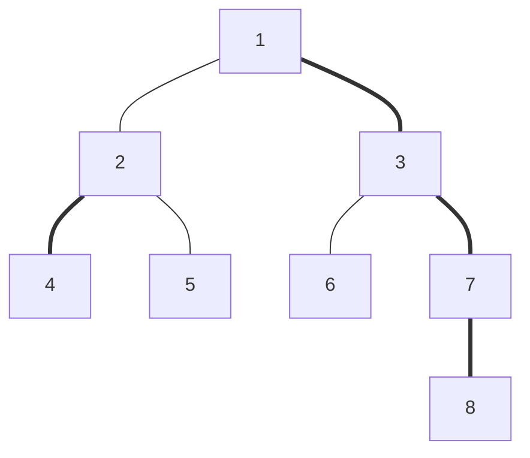
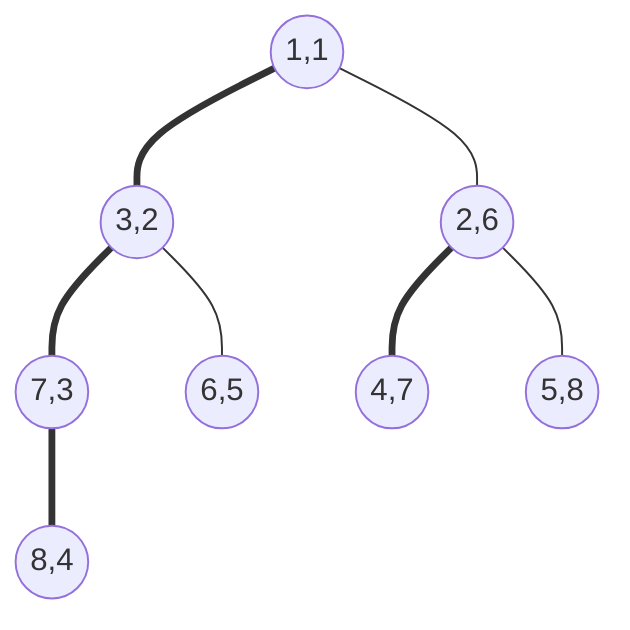

## 树链剖分

**树链剖分解决的主要是树上的区间修改，区间查询问题**，其本质就相当于把线段树的操作从连续的序列移动到了一棵树上，当然操作的区间 $[L,\;R]$ 就变成了树上的点 $(u\,\;v)$ ，以下问题可以用树剖解决：

- 将树上两点 $(u,\;v)$ 之间的所有点权值加上 $\delta$

- 询问 $\sum^{v}_{i=u}w[i]$，表示从 $u$ 到 $v$ 的唯一路径上的所有点权值之和

- 询问 $max\lbrace w[i]\;\;\; i\in\lbrace u,\;v \rbrace \rbrace$，表示询问 $u$ 到 $v$ 的唯一路径上的点权最大（最小亦同）

从上述问题中可以看出，**树链剖分着力于树上的区间问题，常常是点区间问题**（当然你也可以用去单点修改），因此，**树链剖分需要配合线段树使用**

但是普通的区间线段树针对的是连续的序列，**对于一棵静态的树，需要把他的结点编排成有序的序列，使得每棵子树的根结点与他的所有儿子（直接儿子 & 隔代儿子）构成连续的序列关系**，这就是树链剖分的工作所在了 

## 概念

在解剖一棵树前，需要做些准备工作

1. **重儿子**：结点的重儿子定义为结点的直接儿子中，子树大小最大的那一个结点
- 对于儿子们的子树大小相等的情况，随意取一个作为重儿子即可，不会造成影响
2. **轻儿子**：除去重儿子之外的其他直接儿子
3. **重边**：结点与他的重儿子之间的边
4. **轻边**：结点与他的轻儿子之间的边
5. **深度**：根结点到这个结点的结点个数（包括根结点和他自己）

还需要计算的是：

6. **子树大小**（包括子树的根结点）
7. **TOP 值**：记录的是当前结点所在重边的起点（轻儿子的 TOP 值是他自己的编号）

树链剖分其实就是将树上的所有边分成轻边和重边两个集合的过程，需要两次 DFS 来实现

## 计算和预处理

预处理出上面的 7 个值，需要跑两次 DFS，**跑 DFS 时一定要确定根结点**（没有也要乱找一个）

### 第一次 DFS：计算前面 6 个值

轻边和重边其实只是概念，无需存在程序中，这一遍 DFS 求出结点的轻重儿子

```cpp
void DFS(int u){
	siz[u]=1; int maxsize=0;
	for(int i=head[u];i;i=nxt[i])
		if(!dep[to[i]]){
			dep[to[i]]=dep[u]+1; 
			DFS(to[i]); 
			siz[u]+=siz[to[i]]; fa[to[i]]=u;
			if(siz[to[i]]>maxsize){
				maxsize=siz[to[i]];
				Xson[u]=to[i];
			}
		}
}
```

### 第二次 DFS：计算 TOP 值

画个图就很容易发现，每个结点的 TOP 值都等于他父亲结点的 TOP 值，注意重儿子先访问，轻儿子后访问，TOP 值是他自己的编号，这一步可以顺便把每个结点的 DFS 序存下来，这个 DFS 序就是线段树来做区间操作的根据

```cpp
void DFS(int u,int TOP){
	id[u]=++ids;
	top[u]=TOP;
	if(siz[u]==1) return;
	DFS(Xson[u],TOP);// 优先走重儿子  
	for(int i=head[u];i;i=nxt[i])
		if(to[i]!=Xson[u] && fa[u]!=to[i])
			DFS(to[i],to[i]);
}
```

### 与线段树的配合

树链剖分能将树上的点结合线段树来做区间操作，就在于剖分出轻重儿子后，得到的树的 DFS 序将是一个有趣的序列，如下图，加粗的边是重边：



如果沿着**先重边，再轻边**的方式遍历，就会得到这样的 DFS 序：



逗号两边分别是 结点编号 和 DFS序，现在来看，如果想要修改以 3 为根结点的子树，将子树里的结点权值加上 d，那么就相当于在序列中修改了 (2,5) 的连续和，注意到 2 是结点 3 的 DFS序，而 5=2+4-1，于是可以得出，一个子树的根结点 $K$ 和子树代表的连续区间为：$[K,\;K+size(K)-1]$，这样树链剖分就和线段树联系了起来

## 修改操作

树链剖分的修改操作可以分为 **绝对路径点权修改** 和 **子树点权修改**

### 修改 $(u,v)$ 绝对路径上的点权值

经过树链剖分可以发现，**在同一条重链上的点，它们的 TOP 值相同，更重要的是他们的 DFS 序是连续的，深度更深的点的 DFS 序是连续区间的右端点，深度更浅的点的 DFS 序是左端点**，因此如果遇到 $u,\;v$ 的 TOP 值一样了，直接线段树区间修改就完事

如果 $u,\;v$ 的 TOP 值不一样，就要让 $u,\;v$ 向上跳，直到 TOP 值一样，在 $u$ 或 $v$ 向上跳的时候，可以把 $TOP(u)$ 和 $u$ 形成的链进行区间更新，之后再让 $u$ 跳到 $father(TOP(u))$ （ $v$ 也是一样）进行比较，直到 $u,\;v$ 的 TOP 值一样

然而这种方法如果遇到一棵轻重儿子交替出现在一条链上的树时，时间复杂度就将退化到朴素的单点更新，所以说树链剖分本质上还是暴力~~（只不过稍微优雅了一点）~~

```cpp
inline void pathadd(int x,int y,int dt){
	// 将 x->y 最短路径上的点权值都加上 d 
	while(top[x]!=top[y]){
		if(dep[top[x]]<dep[top[y]]) swap(x,y);
		SST.updata(1,1,n,id[top[x]],id[x],dt);
		x=fa[top[x]];
	}
	if(dep[x]<dep[y]) swap(x,y);
	SST.updata(1,1,n,id[y],id[x],dt);
}
```

### 修改 $u$ 的子树的结点权值

经过上面的分析，一经发现 $u$ 和他的子树中的所有结点有着连续的 DFS 序，因此直接线段树区间修改完事

```cpp
updata(1,1,n,id[x],id[x]+siz[x]-1,z);
```

## 询问操作

写完了修改操作，询问操作自然水到渠成

### 询问 $(u,v)$ 绝对路径上的点权值和

SST 在代码中表示用结构体定义的线段树，支持区间修改 & 区间求和

```cpp
long long pathsum(int x,int y){
	// 返回 x-> y 的最短路径上的点权值和 
	long long ret=0;
	while(top[x]!=top[y]){
		if(dep[top[x]]<dep[top[y]]) swap(x,y);
		ret+=SST.SegSum(1,1,n,id[top[x]],id[x]);
		x=fa[top[x]];
	}
	if(dep[x]<dep[y]) swap(x,y);
	ret+=SST.SegSum(1,1,n,id[y],id[x]);
	return ret
}
```

### 修改 $u$ 的子树的结点权值和

SST 在代码中表示用结构体定义的线段树，支持区间修改 & 区间求和（再说一遍）

```cpp
SST.SegSum(1,1,n,id[x],id[x]+siz[x]-1)
```

## 例题1：[**洛谷P3384【模板】树链剖分**](https://www.luogu.org/problemnew/show/P3384)

### Description

已知一棵包含N个结点的树（连通且无环），每个节点上包含一个数值，需要支持以下操作：

操作1： 格式： 1 x y z 表示将树从x到y结点最短路径上所有节点的值都加上z

操作2： 格式： 2 x y 表示求树从x到y结点最短路径上所有节点的值之和

操作3： 格式： 3 x z 表示将以x为根节点的子树内所有节点值都加上z

操作4： 格式： 4 x 表示求以x为根节点的子树内所有节点值之和

### Input

第一行包含4个正整数N、M、R、P，分别表示树的结点个数、操作个数、根节点序号和取模数（**即所有的输出结果均对此取模**）。

接下来一行包含N个非负整数，分别依次表示各个节点上初始的数值。

接下来N-1行每行包含两个整数x、y，表示点x和点y之间连有一条边（保证无环且连通）

接下来M行每行包含若干个正整数，每行表示一个操作，格式如下：

操作1： 1 x y z

操作2： 2 x y

操作3： 3 x z

操作4： 4 x

### Output

输出包含若干行，分别依次表示每个操作2或操作4所得的结果（**对P取模**）

### Sample Input

```text
5 5 2 24
7 3 7 8 0 
1 2
1 5
3 1
4 1
3 4 2
3 2 2
4 5
1 5 1 3
2 1 3
```

### Sample Output

```text
2
21
```

### Hint

时空限制：1s，128M

数据规模：

|  百分比  |      N      |      M      |
| :------: | :---------: | :---------: |
| **30%**  |  $\leq 10$  |  $\leq 10$  |
| **70%**  | $\leq 10^3$ | $\leq 10^3$ |
| **100%** | $\leq 10^5$ | $\leq 10^5$ |

### 分析

板子题，直接套上模板解决即可

**注意取模的时候不能只在线段树外部取模，内部凡是涉及到加法的时候都要取模**

### Codes

```cpp
// 洛谷 P3384 树链剖分 模板  
#include <cstdio>
#include <cstring>
#include <algorithm>
#include <queue>
#include <vector>
#define maxn 100001
#define maxm maxn*2
using namespace std;
int n,m,root,mod,ids;
struct SegSumTree{
	typedef long long ll;
	struct SegSumTreeNode{
		ll V; int LC,RC;
		ll TAG;
		#define val(x) T[x].V
		#define lc(x) T[x].LC
		#define rc(x) T[x].RC
		#define tag(x) T[x].TAG
		#define mid ((L+R)>>1)
	}T[maxn<<2];
	int nodes;
	int Tr[maxn];
	template<typename t>inline void fcin(t &x){
		int sign=1; x=0; char op=getchar();
		while(op<'0'||op>'9'){if(op=='-') sign=-1;op=getchar();}
		while(op>='0'&&op<='9'){x=x*10+(op-48);op=getchar();}
		x*=sign;
	}
	inline void pushup(int k){val(k)=val(lc(k))+val(rc(k));}
	inline void Spr(int k,int L,int R,int d){
		tag(k)+=d; val(k)+=(R-L+1)*(ll)d;
		tag(k)%=mod; val(k)%=mod;
	}
	inline void pushdown(int k,int L,int R){
		if(tag(k)==0) return;
		Spr(lc(k),L,mid,tag(k));
		Spr(rc(k),mid+1,R,tag(k));
		tag(k)=0;
	}
	inline void BuildTree(int N){
		nodes=0;build(1,N);
	}
	int build(int L,int R){
		int now=++nodes;
		if(L==R) {val(now)=Tr[L];return now;}
		lc(now)=build(L,mid);	
		rc(now)=build(mid+1,R);
		pushup(now);
		return now;
	}
	void updata(int k,int L,int R,int x,int y,int d){
		if(x<=L && R<=y) return Spr(k,L,R,d);
		pushdown(k,L,R);
		if(mid>=x) updata(lc(k),L,mid,x,y,d);
		if(mid<y) updata(rc(k),mid+1,R,x,y,d);
		pushup(k);
	}
	ll SegSum(int k,int L,int R,int x,int y){
		if(x<=L && R<=y) return val(k);
		pushdown(k,L,R); ll sum=0;
		if(mid>=x) sum+=SegSum(lc(k),L,mid,x,y),sum%=mod;
		if(mid<y) sum+=SegSum(rc(k),mid+1,R,x,y),sum%=mod;
		return sum;
	}
};
SegSumTree SST;
int to[maxm],nxt[maxm],head[maxn],siz[maxn],id[maxn]; // id 存新编号  
int w[maxn],Xson[maxn],dep[maxn],fa[maxn],top[maxn],tot;// 注意这里是点权值，不是边权值  
void DFS(int u){
	siz[u]=1; int maxsize=0;
	for(int i=head[u];i;i=nxt[i])
		if(!dep[to[i]]){
			dep[to[i]]=dep[u]+1; DFS(to[i]);
			siz[u]+=siz[to[i]]; fa[to[i]]=u;
			if(siz[to[i]]>maxsize){
				maxsize=siz[to[i]];
				Xson[u]=to[i];
			}
		}
}
void DFS(int u,int TOP){
	id[u]=++ids; SST.Tr[ids]=w[u];
	top[u]=TOP;
	if(siz[u]==1) return;
	DFS(Xson[u],TOP);// 优先走重儿子  
	for(int i=head[u];i;i=nxt[i])
		if(to[i]!=Xson[u] && fa[u]!=to[i])
			DFS(to[i],to[i]);
}
inline void Eadd(int u,int v){
	nxt[++tot]=head[u];
	to[tot]=v; head[u]=tot;
}
inline void pathadd(int x,int y,int dt){
	// 将 x->y 最短路径上的点权值都加上 d 
	while(top[x]!=top[y]){
		if(dep[top[x]]<dep[top[y]]) swap(x,y);
		SST.updata(1,1,n,id[top[x]],id[x],dt);
		x=fa[top[x]];
	}
	if(dep[x]<dep[y]) swap(x,y);
	SST.updata(1,1,n,id[y],id[x],dt);
}
long long pathsum(int x,int y){
	// 返回 x-> y 的最短路径上的点权值和 
	long long ret=0;
	while(top[x]!=top[y]){
		if(dep[top[x]]<dep[top[y]]) swap(x,y);
		ret+=SST.SegSum(1,1,n,id[top[x]],id[x]);
		ret%=mod; x=fa[top[x]];
	}
	if(dep[x]<dep[y]) swap(x,y);
	ret+=SST.SegSum(1,1,n,id[y],id[x]);
	return ret%mod;
}
int main(){
	#ifndef ONLINE_JUDGE
	freopen("testin.txt","r",stdin);
	freopen("testout.txt","w",stdout);
	#endif
	SST.fcin(n); SST.fcin(m);
	SST.fcin(root); SST.fcin(mod);
	int x,y,z,op;
	for(int i=1;i<=n;i++) SST.fcin(w[i]);
	for(int i=1;i<=n-1;i++){
		SST.fcin(x);SST.fcin(y);
		Eadd(x,y);Eadd(y,x);
	} dep[root]=1; DFS(root); 
	DFS(root,root); SST.BuildTree(ids);
	for(int i=1;i<=m;i++){
		SST.fcin(op);
		switch(op){
			case 1: SST.fcin(x);SST.fcin(y);SST.fcin(z);
				pathadd(x,y,z);
				break;
			case 2: SST.fcin(x);SST.fcin(y);
				printf("%lld\n",pathsum(x,y));
				break;
			case 3: SST.fcin(x);SST.fcin(z);
				SST.updata(1,1,n,id[x],id[x]+siz[x]-1,z);
				break;
			case 4: SST.fcin(x);
				printf("%lld\n",SST.SegSum(1,1,n,id[x],id[x]+siz[x]-1));
				break;
		}
	}
 	return 0;
} 
```

### Extra

下面 2 道题也是树链剖分的题，而且**是裸题**

~~说实话这难度连模板题都比不上是认真的吗~~

1. [**洛谷P3833 SHOI2012 魔法树**](https://www.luogu.org/problemnew/show/P3833)

2. [**洛谷P2590 ZJOI2008 树的统计**](https://www.luogu.org/problemnew/show/P2590)
3. [**P2590 ZJOI2008 树的统计**](https://www.luogu.org/problemnew/show/P2590)
   - 这个题把区间最大线段树和区间求和线段树 rua 在了一起，但是本质没有变化，按照模板格式直接套进去就完事

## 例题2：[**洛谷P2146 NOI2015软件包管理器**](https://www.luogu.org/problemnew/show/P2146)

### Description

Linux用户和OSX用户一定对软件包管理器不会陌生。通过软件包管理器，你可以通过一行命令安装某一个软件包，然后软件包管理器会帮助你从软件源下载软件包，同时自动解决所有的依赖（即下载安装这个软件包的安装所依赖的其它软件包），完成所有的配置。Debian/Ubuntu使用的apt-get，Fedora/CentOS使用的yum，以及OSX下可用的homebrew都是优秀的软件包管理器。

你决定设计你自己的软件包管理器。不可避免地，你要解决软件包之间的依赖问题。如果软件包A依赖软件包B，那么安装软件包A以前，必须先安装软件包B。同时，如果想要卸载软件包B，则必须卸载软件包A。现在你已经获得了所有的软件包之间的依赖关系。而且，由于你之前的工作，除0号软件包以外，在你的管理器当中的软件包都会依赖一个且仅一个软件包，而0号软件包不依赖任何一个软件包。依赖关系不存在环（若有m(m≥2)个软件包A1,A2,A3,⋯,Am，其中A1依赖A2，A2依赖A3，A3依赖A4，……，A[m-1]依赖Am，而Am依赖A1，则称这m个软件包的依赖关系构成环），当然也不会有一个软件包依赖自己。

现在你要为你的软件包管理器写一个依赖解决程序。根据反馈，用户希望在安装和卸载某个软件包时，快速地知道这个操作实际上会改变多少个软件包的安装状态（即安装操作会安装多少个未安装的软件包，或卸载操作会卸载多少个已安装的软件包），你的任务就是实现这个部分。注意，安装一个已安装的软件包，或卸载一个未安装的软件包，都不会改变任何软件包的安装状态，即在此情况下，改变安装状态的软件包数为0。

### Input

从文件manager.in中读入数据。

输入文件的第1行包含1个整数n，表示软件包的总数。软件包从0开始编号。

随后一行包含n−1个整数，相邻整数之间用单个空格隔开，分别表示1,2,3,⋯,n−2,n−1号软件包依赖的软件包的编号。

接下来一行包含1个整数q，表示询问的总数。之后q行，每行1个询问。询问分为两种：

install x：表示安装软件包x

uninstall x：表示卸载软件包x

你需要维护每个软件包的安装状态，一开始所有的软件包都处于未安装状态。

对于每个操作，你需要输出这步操作会改变多少个软件包的安装状态，随后应用这个操作（即改变你维护的安装状态）。

### Output

输出到文件manager.out中。

输出文件包括q行。

输出文件的第i行输出1个整数，为第i步操作中改变安装状态的软件包数。

### Sample Input

```text
7
0 0 0 1 1 5
5
install 5
install 6
uninstall 1
install 4
uninstall 0
```

### Sample Output

```text
3
1
3
2
3
```

### Hint

【样例说明】


一开始所有的软件包都处于未安装状态。

安装5号软件包，需要安装0,1,5三个软件包。

之后安装6号软件包，只需要安装6号软件包。此时安装了0,1,5,6四个软件包。

卸载1号软件包需要卸载1,5,6三个软件包。此时只有0号软件包还处于安装状态。

之后安装4号软件包，需要安装1,4两个软件包。此时0,1,4处在安装状态。最后，卸载0号软件包会卸载所有的软件包。

【数据范围】


### 分析

首先题目中说明软件包的依赖关系不构成环，那么就一定是一颗树了~~（是不是森林我们先不管）~~

**安装一个软件包 $k$ ，相当于把根结点到 $k$ 的路径上的点的权值全部覆盖为 1，被修改的软件包数就是这条路径上原来的点权值之和和现在的点权值之和的差**

**卸载一个软件包 $k$ ，相当于把 $k$ 的子树中所有结点权值覆盖为 0，被修改的软件包是子树的大小，因为 $k$ 的子树中的软件包一定事先安装完了，所以不用做差**

注意这里的 区间覆盖 和 区间修改 是有区别的，所以线段树要改写

```cpp
#include <cstdio>
#include <cstring>
#include <queue>
#include <iostream>
#include <vector>
#include <cmath>
#include <algorithm>
#define maxn 100001
#define maxm maxn*2
using namespace std;
typedef long long ll;
struct SegCovTree{
	struct SegCovTreeNode{
		int VAL,LC,RC,TAG;
		#define val(x) T[x].VAL
		#define lc(x) T[x].LC
		#define rc(x) T[x].RC
		#define tag(x) T[x].TAG
		#define mid ((L+R)>>1)
	}T[maxn<<1]; int nodes;
	template<typename t>inline void fcin(t &x){
		int sign=1; x=0; char op=getchar();
		while(op<'0'||op>'9'){if(op=='-') sign=-1;op=getchar();}
		while(op>='0'&&op<='9'){x=x*10+(op-48);op=getchar();}
		x*=sign;
	}
	inline void pushup(int k){
		val(k)=val(lc(k))+val(rc(k));
	}
	inline void pushdown(int k,int L,int R){
		if(tag(k)==-1) return;
		val(lc(k))=tag(k)*(mid-L+1);
		val(rc(k))=tag(k)*(R-mid);
		tag(lc(k))=tag(rc(k))=tag(k);
		tag(k)=-1;
	}
	inline void BuildTree(int N){
		nodes=0; build(1,N);
	}
	int build(int L,int R){
		int now=++nodes; tag(now)=-1;
		if(L==R){ val(now)=0;return now; }
		lc(now)=build(L,mid);
		rc(now)=build(mid+1,R);
		pushup(now);
		return now;
	}
	void updata(int k,int L,int R,int x,int y,int d){
		// d 为要覆盖的值  
		if(x<=L && R<=y){
			val(k)=d*(R-L+1); tag(k)=d;
			return;
		} pushdown(k,L,R);
		if(x<=mid) updata(lc(k),L,mid,x,y,d); 
		if(y>mid) updata(rc(k),mid+1,R,x,y,d);
		pushup(k);
	}
	int SegSum(int k,int L,int R,int x,int y){
		if(x<=L && R<=y) return val(k);
		pushdown(k,L,R); int sum=0;
		if(x<=mid) sum+=SegSum(lc(k),L,mid,x,y);
		if(y>mid) sum+=SegSum(rc(k),mid+1,R,x,y);
		return sum;
	}
}; SegCovTree SCT;
int n,q,ids,root;
int to[maxm],nxt[maxm],head[maxn],siz[maxn],id[maxn]; 
int w[maxn],Xson[maxn],dep[maxn],fa[maxn],top[maxn],tot;
inline void Eadd(int u,int v){
	nxt[++tot]=head[u];
	to[tot]=v; head[u]=tot;
}
void DFS(int u){
	siz[u]=1; int maxsize=0;
	for(int i=head[u];i;i=nxt[i])
		if(!dep[to[i]]){
			dep[to[i]]=dep[u]+1; 
			DFS(to[i]); 
			siz[u]+=siz[to[i]]; fa[to[i]]=u;
			if(siz[to[i]]>maxsize){
				maxsize=siz[to[i]];
				Xson[u]=to[i];
			}
		}
}
void DFS(int u,int TOP){
	id[u]=++ids;
	top[u]=TOP;
	if(siz[u]==1) return;
	DFS(Xson[u],TOP);// 优先走重儿子  
	for(int i=head[u];i;i=nxt[i])
		if(to[i]!=Xson[u] && fa[u]!=to[i])
			DFS(to[i],to[i]);
}
inline void pathcov(int x,int y,int dt){
	while(top[x]!=top[y]){
		if(dep[top[x]]<dep[top[y]]) swap(x,y);
		SCT.updata(1,1,n,id[top[x]],id[x],dt);
		x=fa[top[x]];
	}
	if(dep[x]<dep[y]) swap(x,y);
	SCT.updata(1,1,n,id[y],id[x],dt);
}
int pathsum(int x,int y){
	// 返回 x-> y 的最短路径上的点权值和 
	int ret=0;
	while(top[x]!=top[y]){
		if(dep[top[x]]<dep[top[y]]) swap(x,y);
		ret+=SCT.SegSum(1,1,n,id[top[x]],id[x]);
		x=fa[top[x]];
	}
	if(dep[x]<dep[y]) swap(x,y);
	ret+=SCT.SegSum(1,1,n,id[y],id[x]);
	return ret;
}
int main(){
	#ifndef ONLINE_JUDGE
	freopen("testin.txt","r",stdin);
	freopen("testout.txt","w",stdout);
	#endif
	SCT.fcin(n); root=1;
	int a,b; char op[19];
	for(int i=2;i<=n;i++){
		SCT.fcin(a);a++;
		Eadd(i,a);Eadd(a,i);
	} dep[root]=1; int TMP;
	DFS(root);DFS(root,root);
	SCT.BuildTree(n); SCT.fcin(q);
	while(q--){
		scanf("%s",op);
		SCT.fcin(a);a++;
		if(op[0]=='i'){
			TMP=pathsum(root,a);
			pathcov(root,a,1);
			printf("%d\n",pathsum(root,a)-TMP);
		}else{
			printf("%d\n",SCT.SegSum(1,1,n,id[a],id[a]+siz[a]-1));
			SCT.updata(1,1,n,id[a],id[a]+siz[a]-1,0);
		}
	}
	return 0;
}
```

## 感想

树链剖分由于成功结合了类似于 倍增LCA 的跳跳法，和本来就很冗长的区间线段树，使得模板题竟出现 149 行代码量的 ~~惨绝人寰~~ 的现象，因此写树链剖分一定要静下心来认真写，稍微漏掉一个语句编有可能导致程序卡死掉（然而你无论如何也查不出来），分享一句我经常忘记写的代码：

```cpp
dep[root]=1;
```

