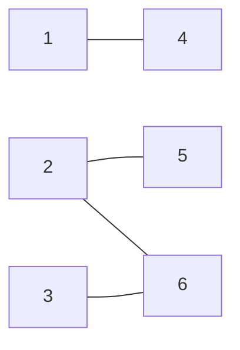

## 二分图的最大匹配

### 回顾

首先，回顾一下什么是二分图：



图中的点能被分成两个集合，使得每一条边两端的点均分属于两个集合，判断二分图可以用 **染色法** 来解决，例如图中就可以取：$\{1,\;4\}\quad\{2,5\}\quad\{3,\;6\}$

### 二分图的最大匹配

二分图的匹配，故名思义，就是寻找二分图中的一些点对，使得这些点对分属于二分图的两个集合，最大匹配，就是寻找最多能选择的点对的数量，**上图中，最大匹配为 3**

解决最大匹配，可以用到 **网络流** 中的 **费用流** ，建立源点 S 和 汇点 T 跑费用流，还有一种著名的算法就是 **匈牙利算法**

## 匈牙利算法

### 算法演示

> **通过数代人的努力，你终于赶上了剩男剩女的大潮，假设你是一位光荣的新世纪媒人，在你的手上有N个剩男，M个剩女，每个人都可能对多名异性有好感（暂时不考虑特殊的性取向），如果一对男女互有好感，那么你就可以把这一对撮合在一起，现在让我们无视掉所有的单相思（好忧伤的感觉），你拥有的大概就是下面这样一张关系图，每一条连线都表示互有好感。**
>
> **本着救人一命，胜造七级浮屠的原则，你想要尽可能地撮合更多的情侣，匈牙利算法的工作模式会教你这样做：**[^摘自CSDN博客：算法讲解：二分图匹配【图论】]


**匈牙利算法的核心就是：发扬谦让精神**

1. 从男一开始，就是（男一，女一）第一组

2. 给男二选择，发现女二没有被选择，（男二，女二）就是第二组

3. 男三想选女一，但是女一已经被男一预定了，这时就需要男一 **发扬谦让精神** 了，把女一让给男三，自己选择女二，但是无奈女二又先被男二看上，男二也 **发扬谦让精神** 选择女三，这样三个男生都选择到了女生，情况变成下图（出现三组匹配）

*黄色边表示男生放弃的选择，蓝色边是当前的选择情况*


4. 最后考虑男四，男四想选女三，但是女三被男二选择，这是如果男二 **发扬谦让精神** 将会落单，男二要守住自己的底线，所以他没有谦让，导致男四最后落单

完成上述四步之后，已经求出了二分图的最大匹配数为 3

### 代码实现

用 $ref$ 数组表示右侧点当前对应的左侧点，用 DFS 递归为左侧点选择组合

$DFS(u)$ 表示第正在考虑点 $u$  的对应点，对于 $u$ 连接的每个点，判断是否已经有对应点，如果没有对应点（$ref=0$）就直接 $ref[to[i]]=u$ 更新，并且返回 true，否则需要递归 $ref[to[i]]$，看看 $ref[to[i]]$ 能不能改变组合，如果能则 $ref[to[i]=u]$ 更新

过程中若有一个点不能完成匹配，应该中止并且返回 false ，在主程序里枚举 $1\to n$ 的每个点，看能否增广，并且更新对应的 $ans$

 ```c++
bool dfs(int u){
	for(int i=head[u];i;i=nxt[i]){
		if(!vis[to[i]]){
			vis[to[i]]=true;
			if(!ref[to[i]] || dfs(ref[to[i]])){
				ref[to[i]]=u;
				return true;
			}
		}
	}
	return false;
}
main(){
    for(int i=1;i<=n;i++){
		memset(vis,false,sizeof(vis));
		if(dfs(i)) ans++;
	}
}
 ```

**还是总结一些例题：**

## [洛谷P2756 飞行员配对方案问题](https://www.luogu.org/problemnew/show/P2756)

### Description

英国皇家空军从沦陷国征募了大量外籍飞行员。由皇家空军派出的每一架飞机都需要配备在航行技能和语言上能互相配合的2 名飞行员，其中1  名是英国飞行员，另1名是外籍飞行员。在众多的飞行员中，每一名外籍飞行员都可以与其他若干名英国飞行员很好地配合。如何选择配对飞行的飞行员才能使一次派出最多的飞机。对于给定的外籍飞行员与英国飞行员的配合情况，试设计一个算法找出最佳飞行员配对方案，使皇家空军一次能派出最多的飞机。

对于给定的外籍飞行员与英国飞行员的配合情况，编程找出一个最佳飞行员配对方案，使皇家空军一次能派出最多的飞机。

### Input

第 1 行有 2 个正整数 m 和 n。n 是皇家空军的飞行员总数(n<100)；m 是外籍飞行员数(m<=n)。外籍飞行员编号为 1~m；英国飞行员编号为 m+1~n。

接下来每行有 2 个正整数 i 和 j，表示外籍飞行员 i 可以和英国飞行员 j 配合。最后以 2个-1 结束。

### Output

第 1 行是最佳飞行员配对方案一次能派出的最多的飞机数 M。接下来 M 行是最佳飞行员配对方案。每行有 2个正整数 i 和 j，表示在最佳飞行员配对方案中，飞行员 i 和飞行员 j 配对。如果所求的最佳飞行员配对方案不存在，则输出‘No Solution!’。

### Sample Input

```text
5 10
1 7
1 8
2 6
2 9
2 10
3 7
3 8
4 7
4 8
5 10
-1 -1
```

### Sample Output

```text
4
1 7
2 9
3 8
5 10 
```

### Hint

No Hint

### 分析

典型的二分图最大匹配判定，图中的左侧点就是编号 $1\to m$ 的点，右侧点就是编号 $(m+1)\to n$ 的点，直接跑一遍匈牙利算法就可以，按照 $ref$ 里面的内容输出方案

### Codes

```cpp
// 匈牙利算法  
#include <cstdio>
#include <cstring>
#include <queue>
#include <iostream>
#include <vector>
#include <cmath>
#include <algorithm>
#define maxn 2019
#define maxm maxn*2
using namespace std;
int n,m,tot;
int to[maxm],nxt[maxm],head[maxn];
int ref[maxn];bool vis[maxn];
template<typename t>inline void fcin(t &x){
	int sign=1; x=0; char op=getchar();
	while(op<'0'||op>'9'){if(op=='-') sign=-1;op=getchar();}
	while(op>='0'&&op<='9'){x=x*10+(op-48);op=getchar();}
	x*=sign;
}
inline void Eadd(int x,int y){
	to[++tot]=y; nxt[tot]=head[x];
	head[x]=tot;
}
bool dfs(int u){
	for(int i=head[u];i;i=nxt[i]){
		if(!vis[to[i]]){
			vis[to[i]]=true;
			if(!ref[to[i]] || dfs(ref[to[i]])){
				ref[to[i]]=u;
				return true;
			}
		}
	}
	return false;
}
int main(){
	#ifndef ONLINE_JUDGE
	freopen("testin.txt","r",stdin);
	freopen("testout.txt","w",stdout);
	#endif
	fcin(m);fcin(n); int x,y;
	fcin(x);fcin(y);
	while(x!=-1 && y!=-1){
		Eadd(x,y);Eadd(y,x);
		fcin(x);fcin(y);
	} int ans=0;
	for(int i=1;i<=m;i++){
		memset(vis,false,sizeof(vis));
		if(dfs(i)) ans++;
	}
	if(!ans) printf("No Solution!");
	else{
		printf("%d\n",ans);
		for(int i=m+1;i<=n;i++)
			if(ref[i]) printf("%d %d\n",ref[i],i);
	}
	return 0;
}
```

## [CQYZOJ_Contest:181_Pro:02 棋盘覆盖](https://newoj.cqyz.cn/contest/181/problem/P02)

### Description

给出一张n\*n (n<=100)的国际象棋棋盘，其中被删除了一些点，问可以使用多少1\*2的多米诺骨牌进行掩盖。

### Input

第一行为n，m（表示有m个删除的格子）

第二行到m+1行为x,y，分别表示删除格子所在的位置

x为第x行，y为第y列

### Output

一个数，即最大覆盖格数

### Sample Input

```text
8 0
```

### Sample Output

```text
32
```

### Hint

No Hint

### 分析

一个格子（x，y）可以与它上下左右的相邻四个格子构成 $1\times 2$ 的形状从而被覆盖，那么对于任意一个格子，就先将其编号之后与上下左右四个相邻格子连一条有向边（被删除的点除外）

接下来如何把二分图匹配的思想和这道题联系起来呢？考虑将棋盘按照黑白相间的方式染色：


可以发现，**一个格子和它四周的四个格子总是分属于黑或白两个集合，但是我们又要将他们连接起来，也就是将黑和白集合里面的元素配对，求最大的配对数量**，一个二分图匹配解决问题的思路就浮出水面了，建图之后直接套模板解决

```cpp
#include <cstdio>
#include <cstring>
#include <queue>
#include <iostream>
#include <vector>
#include <cmath>
#include <algorithm>
#define maxn 400001
#define maxm maxn*2
#define id(x,y) ((x-1)*m+y)
using namespace std;
template<typename t>inline void fcin(t &x){
	int sign=1; x=0; char op=getchar();
	while(op<'0'||op>'9'){if(op=='-') sign=-1;op=getchar();}
	while(op>='0'&&op<='9'){x=x*10+(op-48);op=getchar();}
	x*=sign;
}
int offx[]={0,-1,0,1},offy[]={-1,0,1,0};
int n,m,tot,k; bool del[201][201];
int to[maxm],nxt[maxm],head[maxn];
int ref[maxn]; bool vis[maxn];
inline void Eadd(int x,int y){
	to[++tot]=y; nxt[tot]=head[x];
	head[x]=tot;
}
bool dfs(int u){
	for(int i=head[u];i;i=nxt[i]){
		if(!vis[to[i]]){
			vis[to[i]]=true;
			if(!ref[to[i]] || dfs(ref[to[i]])){
				ref[to[i]]=u;
				return true;
			}
		}
	}
	return false;
}
inline void build(){
	int dx,dy; 
	for(int x=1;x<=n;x++)
		for(int y=1;y<=n;y++){
				if(del[x][y]) continue;
				for(int k=1;k<=n;k++)
					if(!del[k][y] && k!=x) Eadd(id(x,y),id(k,y));
				for(int k=1;k<=m;k++)
					if(!del[x][k] && k!=y) Eadd(id(x,y),id(x,k));
			}
}
int main(){
	#ifndef ONLINE_JUDGE
	freopen("qpfg.in","r",stdin);
	freopen("qpfg.out","w",stdout);
	#endif
	fcin(n);fcin(m);fcin(k); int dx,dy;
	for(int i=1;i<=k;i++){
		fcin(dx);fcin(dy);
		del[dx][dy]=true;
	} build(); int ans=0;
	for(int i=1;i<=n*m;i++){
		memset(vis,false,sizeof(vis));
		if(dfs(i)) ans++;
	} printf("%d",ans/2);
	return 0;
}
```

[^摘自CSDN博客：算法讲解：二分图匹配【图论】]: https://blog.csdn.net/qq_41730082/article/details/81162561

