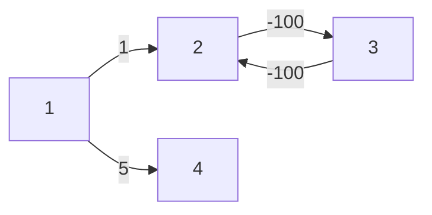
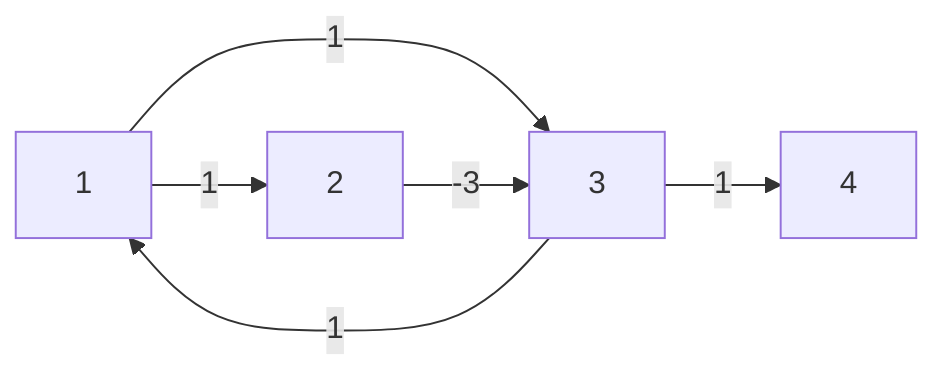
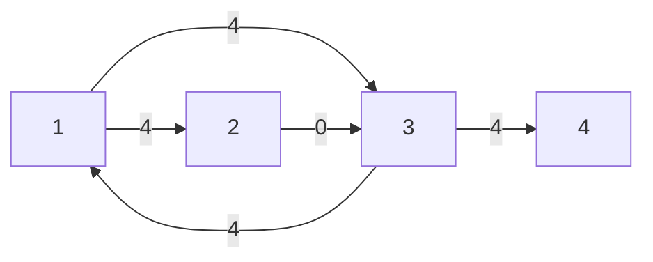

<!--more-->
## 题目限制一览

|   题目    | 时间限制 | 空间限制 |
| :-------: | :------: | :------: |
| 1. agent  | 1000 MS  |  256 MB  |
| 2. earth  | 1000 MS  |  256 MB  |
| 3. aurora | 2000 MS  |  512 MB  |

## 1. 特工（agent.cpp）

### Description

IMF(不可能任务小组)有*N*个Agent，每个Agent的能力值互不相同，现在部长先生想要派出*A*,*B*两队Agent去参加特别任务。但是参加大战的两个队伍要满足两个要求：

*1.* *A*队中能力最大的Agent的能力值要小于*B*队能力最弱的Agent的能力值。

*2.* *A*,*B*两队都要有人参加。

并不是所有的Agent都要去参加的，心急的部长先生想知道有多少种安排Agent的方案。由于答案可能很大，所以只需要你求出答案模 $10^9+7$ 的值就可以了。

### Input

输入仅一行，为一个整数 N

### Output

输出一行一个整数，为方案数模 $10^9+7$ 的值

### Sample Input #1

```text
3
```

### Sample Output #1

```text
5
```

### Sample Input #2

```text
6
```

### Sample Output #2

```text
129
```

### Hint

对于20%的数据 *N*≤10

对于40%的数据 *N*≤1000

对于60%的数据 *N*≤10^5

对于100%的数据 *N*≤10^9

### 分析

超级后悔的一个题，考完试才发现我的式子离正确的式子一步之遥……然而因此 TLE 了 40 分……

这个题设特工能力为 1 到 n，**考虑 A 队中能力值最大的特工为 $x$ ，那么 B 队最多只能选择 $n-x$ 个特工，也就是所有能力值大于 $x$ 的特工**

数据较小时，列出 A 所有可能的选择方案，若能力为 $x$ 的特工有 $cnt$ 次在方案中充当能力最大的特工，那么方案数就应该加上 $cnt \times C_{n-x}^0+C_{n-x}^1+……+C_{n-x}^{n-x}$ ，也就是 $cnt \times (2^{n-x}-1)$

通过总结规律发现，在所有可能的选择方案中，上述的 $cnt$ 与 $x$ 有着 $cnt(x)=2^{x-1}$ 的关系，可列出式子：

$Ans=\sum_{i=1}^{n-1}(2^i-1)\times 2^{n-i-1}$ ，只循环到 $n-1$ 是因为至少留一个特工给 B 队

**然而这样直接暴力算显然是要超时的（N 达到了 $10^9$ 规模），把原式展开：**

$Ans=\sum_{i=1}^{n-1}(2^i-1)\times 2^{n-i-1} = \sum_{i=1}^{n-1}(2^{n-1}-2^{n-i-1})=(n-1)\times 2^{n-1}-\sum_{i=1}^{n-1}2^{n-i-1}$

后面那一坨等比求和：$\sum_{i=1}^{n-1}2^{n-i-1} = 2^{n-2}\times \frac{1-(\frac{1}{2})^{n-1}}{\frac{1}{2}} = 2^{n-1}-1$

所以原式：$Ans=(n-1)\times 2^{n-1}-(2^{n-1}-1)=(n-2)\times 2^{n-1}+1$

到这一步就可以直接快速幂计算了

### Codes

```cpp
#include <cstdio>
#include <cstring>
#include <queue>
#include <iostream>
#include <vector>
#include <cmath>
#include <algorithm>
#define maxn 30000005
using namespace std;
typedef long long ll;
const ll mod=(ll)1e9+7;
int fastpow(ll a,ll b){
	ll res=1;
	while(b>0){
		if(b&1) res=(res*a)%mod;
		a=(a*a)%mod;b>>=1;
	} return res;
} ll n;
int main(){
	#ifndef ONLINE_JUDGE
	freopen("agent.in","r",stdin);
	freopen("agent.out","w",stdout);
	#endif
	scanf("%lld",&n);
	ll tmp=fastpow(2,n-1);
	ll ans=(n-2)*tmp%mod;
	(ans+=1)%=mod;printf("%lld",ans);
	return 0;
}
```

---

## 2. 小奇回地球（earth.cpp）

### Description

开学了，小奇在回地球的路上，遇到了一个棘手的问题。

简单来说，它要从标号为1的星球到标号为n的星球，某一些星球之间有航线。由于超时空隧道的存在，从一个星球到另一个星球时间可能会倒流，而且，从星球a到b耗费的时间和星球b到a耗费的时间不一定相同。

宇宙法规定：“禁止在出发时间前到达目的地。”

每艘飞船上都有速度调节装置，可以调节飞行的时间。其功能可以使得整次航程中所有两星球间的飞行时间增加或减少相同的整数值。你的任务是帮助它调整速度调节器，使得从 1 到 n 的最短时间满足宇宙法规定

### Input

输入文件包含多组数据，第1个数为T，表示数据组数。

对于每组数据，输入第1行为两个正整数n，m，为星球的个数和星球间的路线数。接下来m行，每行三个整数i，j和t，表示由星球i到星球j飞行的时间为t。由i到j最多只会有一条飞行线路。

### Output

输出文件共T行，每组数据输出一行。

如果可以通过调节速度调节器完成任务，则输出一个非负整数，表示由星球1到星球n的最短时间。（注意最短时间要大于或者等于0）。

如果不能由星球1到达星球n，则输出-1。

### Sample Input

```text
1
4 5
1 2 1
1 3 1
2 3 -3
3 1 1
3 4 1
```

### Sample Output

```text
2
```

### Hint

【数据范围】

1，2号测试点，保证所有星球出度不超过1

3，4号测试点，n<=10

5，6号测试点，-100<=t<=100

对于100%的数据T<=10，n<=100，m<=n*(n-1)，-100000<=t<=100000

数据随机和构造结合生成

【样例解释】

把速度控制器的值设为1,相当于每个时间值加1,得到的最短路径为1→2→3→4,所需时间为2+(-2)+2=2。

### 分析

根据题意，是求一个偏移量 $d$，使得原来的所有路径长度加上这个 $d$ 之后存在从 1 到 n 的非负最短路径

不考虑负环的影响，那么这个题明显 **二分+SPFA** 解决

若要考虑负环的问题，则要注意：**并非任意的负环都会对最短路径造成影响，只要图中存在一条不经过负环而能从 1 到达 n 的路径，小奇就可以通过这条路径回到地球，而不是去走负环**

举一个例子：（$n=4$）



图中 2 和 3 形成了负环，然而这并不意味着需要增加偏移量来消除负环，因为小奇可以走 $1\to 5$ 这一条路径回到地球，因此将偏移量设置成 -5，得到的答案是 0，而不是 105

注意到这一点之后，我开始的想法是：**在去掉图中负环（通过偏移量实现）后找到一条 $1\to n$ 的最短路径，并将路径上的点记录，判断负环时，看记录的点是不是在负环上，如果没有在负环上的记录点，就不用增加偏移量**

这个想法看似正确，但是它的致命缺陷在于 **SPFA 求出的最短路径随着各个路径的长度变化是会变化的**，如：



这是样例数据构造出的图，现在它的最短路径为 $1\to 2 \to 3\to 4$，路径长度为 -1，若把路径长度统一偏移 3，则得到新的构造图为：



现在的最短路径不再是 $1\to 2 \to 3\to 4$，而是 $1\to 3\to 4$，而答案采用的路径是前一种

这就意味着：**如果只是为了去掉负环而将原图中的路径长度改变的话，最短路径是会变化的，记录的最短路径有可能与答案采用的路径不同，这时就很难得出正确答案，上述算法也就只能拿到 40 分了**~~（比纯二分的 50 分还低）~~

正确的做法是：**记录原图中与 1 号结点和 n 号都连通的点，无论最短路径如何变化，一定会经过这些点中的某些点，因此，判断负环的时候同时判断负环上的点是不是与 1 号结点和 n 号都连通的点，如果是才增加偏移**

第一个例子说明即使原图存在负环也是可以有最短路径的，但是由于 SPFA 会将所有的边加入队列进行松弛操作，这将可能导致 SPFA 卡死，只需要**让 SPFA 在加边时判断下一个点是不是所谓的连通点即可，因为在之前的负环判断中已经确认所有连通点都不在负环上，所以 SPFA 可以正常运行**

### Codes

```cpp
#include <cstdio>
#include <cstring>
#include <queue>
#include <iostream>
#include <vector>
#include <cmath>
#include <algorithm>
#define maxn 10000005
#define maxPRIME 664588
using namespace std;
typedef long long ll;
ll mod;
template<typename t>inline void fcin(t &x){
	int sign=1; x=0; char op=getchar();
	while(op<'0'||op>'9'){if(op=='-') sign=-1;op=getchar();}
	while(op>='0'&&op<='9'){x=x*10+(op-48);op=getchar();}
	x*=sign;
}
int p[maxPRIME];bool isp[maxn];
int n,m;ll JC[3][maxn];
ll Quickpow(ll b,ll p,ll K){
	ll sol=1;
	while(p>0){
		if(p%2==1) sol=(sol*b)%K;
		b=(b*b)%K;
		p/=2;
	} return sol;
}
void PRIME(){
	int N=max(n,m);
	for(int i=2;i<=maxn;i++){
		if(!isp[i]) p[++p[0]]=i;
		for(int j=1;i*p[j]<=maxn;j++){
			isp[i*p[j]]=true;
			if(i%p[j]==0) break;
		}
	} JC[0][1]=JC[1][1]=JC[2][1]=1;
	for(int i=2;i<=maxn;i++){
		JC[0][i]=JC[0][i-1]*i%mod;
		if(!isp[i]){
			JC[1][i]=JC[1][i-1]*(i-1)%mod;
			JC[2][i]=JC[2][i-1]*i%mod; 
		}else{
			JC[1][i]=JC[1][i-1];
			JC[2][i]=JC[2][i-1];
		} 
	}
}
int main(){
	#ifndef ONLINE_JUDGE
	freopen("puzzled.in","r",stdin);
	freopen("puzzled.out","w",stdout);
	#endif
	int T;fcin(T);fcin(mod);
	PRIME();int x,y;
	while(T--){
		fcin(x);fcin(y);
		printf("%lld\n",(JC[0][x]*JC[1][y])%mod*Quickpow(JC[2][y],mod-2,mod)%mod);
	}
	return 0;
}
```

---

## 3. 极光（aurora.cpp）

### Description

天空中出现了许多的北极光，这些北极光组成了一个长度为n的正整数数列a[i],远古之魔书上记载到：2个位置的graze值为两者位置差与数值差的和：

`graze(x,y)=|x-y|+|a[x]-a[y]|`。

要想破解天罚，就必须支持2种操作（k都是正整数）：

Modify x k：将第x个数的值修改为k。

Query x k：询问有几个i满足graze(x,i)<=k。

由于从前的天罚被圣王lmc破解了，所以rhl改进了她的法术，询问不仅要考虑当前数列，还要考虑任意历史版本，即统计任意位置上**出现过**的任意数值与当前的a[x]的graze值<=k的对数。（**某位置多次修改为同样的数值，按多次统计**）

### Input

第1行两个整数n,q。分别表示数列长度和操作数。

第2行n个正整数，代表初始数列。

第3~q+2行每行一个操作。

N<=40000, 修改操作数<=60000, 询问操作数<=10000, Max{a[i]}(含修改)<=80000

输出若干行，每行一个数，表示每次清点存款时领袖有多少个账房可供他选择

### Output

对于每次询问操作，输出一个非负整数表示答案

### Sample Input

```text
3 5
2 4 3
Query 2 2
Modify 1 3
Query 2 2
Modify 1 2
Query 1 1
```

### Sample Output

```text
2
3
3
```

### Hint

写在了题目中

### 分析

做法：**转换坐标后，CDQ分治的模板**

把序列中的每个元素 $a[x]$ 看做 $(x,\;a[x])$ 的坐标，发现 `graze` 函数就是求两个坐标之间的[曼哈顿距离](https://baike.baidu.com/item/%E6%9B%BC%E5%93%88%E9%A1%BF%E8%B7%9D%E7%A6%BB/743092?fr=aladdin)**，但是要统计曼哈顿距离在某个范围内的点对数量很复杂，考虑转化成另一种距离：[切比雪夫距离](https://baike.baidu.com/item/%E5%88%87%E6%AF%94%E9%9B%AA%E5%A4%AB%E8%B7%9D%E7%A6%BB/8955729?fr=aladdin)**

切比雪夫距离定义为平面两点之间的横纵坐标差值的较大值，也就是 $max(x_1-x_2,\;y_1-y_2)$ ，**在平面中，点的坐标 $(x,\;y)$ 可以通过转换 $(x,\;y)\to (x-y,\;x+y)$ 来让原来的曼哈顿距离变为新坐标系下的切比雪夫距离**

这样做了之后，统计切比雪夫距离在某个范围 $k$ 内的思路就很简单了，设参照点为 $(x,\;y)$，那么满足要求的点就位于坐标 $(x-k,\;y-k)$ 到坐标 $(x+k,\;y+k)$ 围成的矩形之中，到这一步就是一个三维偏序的问题，上 CDQ分治的模板解决

**至于题目中的可持久化，其实就是在修改时将修改后的点再次插入一遍**

本题还要注意的一点就是负数坐标的偏移，由于坐标转换时连续做减法有可能变为很小的负数，因此偏移量要设置大一点

### Codes

```cpp
// pro 3 violence 
#include <cstdio>
#include <cstring>
#include <queue>
#include <iostream>
#include <vector>
#include <cmath>
#include <algorithm>
#define maxn 60005
#define lowbit(x) (x&-x)
#define mid ((L+R)>>1)
using namespace std;
const int offset=300000;
template<typename t>inline void fcin(t &x){
	int sign=1; x=0; char op=getchar();
	while(op<'0'||op>'9'){if(op=='-') sign=-1;op=getchar();}
	while(op>='0'&&op<='9'){x=x*10+(op-48);op=getchar();}
	x*=sign;
}
struct node{
	int px,py,type,val;
	inline void get(int typ,int x,int y,int v){
		type=typ;px=x;py=y;val=v;
	}
	bool operator <(const node &x)const{
		if(px!=x.px) return px<x.px;
		else return type<x.type;
	}
}op[maxn*5],tmp[maxn*5];
int n,m,opn,a[maxn],ans[maxn];
int T[offset*2+5],maxy;
inline void updata(int p,int d){
	p+=offset;
	for(int i=p;i<=500000;i+=lowbit(i))
		T[i]+=d;
}
inline void clear(int p){
	p+=offset;
	for(int i=p;i<=500000;i+=lowbit(i))
		if(T[i]) T[i]=0;
		else break;
}
int res(int p){
	int ans=0;p+=offset;
	for(int i=p;i;i-=lowbit(i))
		 ans+=T[i];
	return ans;
}
inline void AddNode(int posx,int posy){
	int newx=posx+posy;
	int newy=posx-posy;
	maxy=max(maxy,newy);
	op[++opn].get(1,newx,newy,1);
}
inline void AddQuery(int pos,int k){
	#define ox pos
	#define oy a[pos]
	int A=ox+oy-k;
	int B=ox-oy-k; // 左上角 
	int C=ox+oy+k;
	int D=ox-oy+k; // 右下角  
	ans[0]++;
	op[++opn].get(2,A-1,D,ans[0]);
	op[++opn].get(2,C,B-1,ans[0]);
	op[++opn].get(3,C,D,ans[0]);
	op[++opn].get(3,A-1,B-1,ans[0]);
	#undef ox
	#undef oy
}
void cdq(int L,int R){
	if(L==R) return;
	cdq(L,mid);cdq(mid+1,R);
	int u=L,v=mid+1,p=0;
	while(u<=mid && v<=R){
		if(op[u]<op[v]){
			if(op[u].type==1) updata(op[u].py,1);
			tmp[p++]=op[u++];
		}else{
			if(op[v].type==2) ans[op[v].val]-=res(op[v].py);
			else if(op[v].type==3) ans[op[v].val]+=res(op[v].py);
			tmp[p++]=op[v++];
		}
	}while(u<=mid){
		if(op[u].type==1) updata(op[u].py,1);
		tmp[p++]=op[u++];
	}while(v<=R){
		if(op[v].type==2) ans[op[v].val]-=res(op[v].py);
		else if(op[v].type==3) ans[op[v].val]+=res(op[v].py);
		tmp[p++]=op[v++]; 
	}
	for(int i=0;i<p;i++){
		clear(tmp[i].py);
		op[i+L]=tmp[i];
	}
} char in[21];
int main(){
	#ifndef ONLINE_JUDGE
	freopen("aurora.in","r",stdin);
	freopen("aurora.out","w",stdout);
	#endif
	fcin(n);fcin(m);maxy=-2139062143;
	for(int i=1;i<=n;i++){
		fcin(a[i]);AddNode(i,a[i]); 
	} int x,k;
	while(m--){
		scanf("%s",in);
		fcin(x);fcin(k);
		if(in[0]=='M'){
			a[x]=k;
			AddNode(x,a[x]);
		}else{
			AddQuery(x,k);
		} 
	} 
	cdq(1,opn);
	for(int i=1;i<=ans[0];i++) printf("%d\n",ans[i]);
	return 0;
}
```

