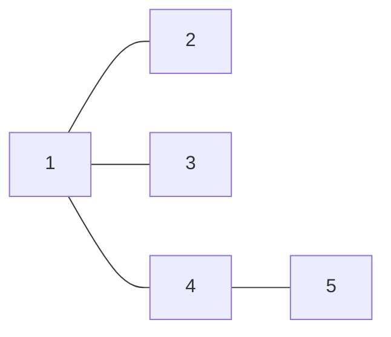

<!--more-->
## 题目限制一览

|  题目   | 时间限制 | 空间限制 |
| :-----: | :------: | :------: |
| 1. math | 1000 MS  |  128 MB  |
| 2. path | 1000 MS  |  128 MB  |
| 3. city | 1000 MS  |  128 MB  |

## 1. 数学题（xorarray.cpp）

### Description

一道数学题，表达式为：(B+E+S+S+I+E)(G+O+E+S)(M+O+O)，该表达式共有7个变量，每个变量最多有500个可能的候选取值，问有多少种方式能使上面的表达式成为7的倍数？

### Input

第一行一个整数N

接下来N行，每行包含一个变量和其可能的一个值。输入数据保证同一个变量可能的取值各不相同，且都在-10^5 到 10^5之间

### Output

一个整数，表示方案数。

### Sample Input

```text
10
B 2
E 5
S 7
I 10
O 16
M 19
B 3
G 1
I 9
M 2
```

### Sample Output

```text
2
```

### Hint

```text
The two possible assignments are

(B,E,S,I,G,O,M) = (2, 5, 7, 9, 1, 16, 19) -> 51,765

                = (2, 5, 7, 9, 1, 16, 2) -> 34,510
```

数据范围

1<=N<=500

### 分析

原表达式 $(B+E+S+S+I+E)(G+O+E+S)(M+O+O)$ 共 7 个变量，它的结果被 7 整除，利用同余可以等效理解为 $B,E,S,I,G,O,M$ 这 7 个变量 $\mod 7$ 的余数带进这个式子被 7 整除

由于$\mod 7$ 的结果只有 0-6 这 7 种情况，直接暴力枚举，时间复杂度 $O(7^7)$ 约为 83 万

### Codes

```cpp
#include <bits/stdc++.h>
#define maxn 505
using namespace std;
typedef long long ll;
template<typename t>inline void fcin(t &x){
	int sign=1; x=0; char op=getchar();
	while(op<'0'||op>'9'){if(op=='-') sign=-1;op=getchar();}
	while(op>='0'&&op<='9'){x=x*10+(op-48);op=getchar();}
	x*=sign;
}
int s[9][maxn];
int v[9];
ll ans=0;int n,times;
ll calc(){
	ll sum=1ll*(v[1]+2*v[2]+2*v[4]+v[3]);
	sum*=1ll*(v[5]+v[4]+v[6]+v[2]);
	sum*=1ll*(2*v[6]+v[7]);
	return (sum%7==0)?sum:0;
}
void dfs(int step){
	if(step>7){
		ll ret=calc();
		if(ret) ans++;
		return;
	}else{
		for(int i=1;i<=s[step][0];i++){
			v[step]=s[step][i];
			dfs(step+1);
			v[step]=0;
		}
	}
}
int main(){
	#ifndef ONLINE_JUDGE
	freopen("math.in","r",stdin);
	freopen("math.out","w",stdout);
	#endif
	// (B+E+S+S+I+E)(G+O+E+S)(M+O+O)
	// (1+4+2+2+3+4)(5+6+4+2)(7+6+6)
	fcin(n);
	char ch;int x;
	for(int i=1;i<=n;i++){
		cin>>ch;fcin(x);
		switch(ch){
			case 'B':s[1][++s[1][0]]=x; break;
			case 'S':s[2][++s[2][0]]=x; break;
			case 'I':s[3][++s[3][0]]=x; break;
			case 'E':s[4][++s[4][0]]=x; break;
			case 'G':s[5][++s[5][0]]=x; break;
			case 'O':s[6][++s[6][0]]=x; break;
			case 'M':s[7][++s[7][0]]=x; break;
		}
	}dfs(1);printf("%lld",ans);
	return 0;
}
```

------


## 2. 回文路径（path.cpp）

### Description

在一个N*N的网格中，规定左上角为起点，每次只能向右或者向下走一格，以右下角为终点，计算有多少种方案，使得走过的线路是回文串？最终输出答案模1,000,000,007的结果。

### Input

第一行一个正整数 *N*。

第二行 *N* 个正整数 *Xi*，表示存在一条有向边 *i* 指向 *Xi*。

### Output

请输出回文路径数量，取模1,000,000,007。

### Sample Input

```text
4
ABCD
BXZX
CDXB
WCBA
```

### Sample Output

```text
12
```

### Hint

【样例解释】

1 “ ABCDCBA”

1 “ ABCWCBA”

6 “ ABXZXBA”

4 “ ABXDXBA”

【数据范围】

1≤N≤500

### 分析

直接看原图可能不好分析，我们把原图按照对角线顺序转换成如下图：

```text
A
BB
CXC
WDZD
CXX
BB
A
```

题目给定的每次往右或者往下移动，在新图里面就是往下或者往右下方移动

这样转换的好处在于：从左上角出发，且在右下角结束的路径上的回文串，其中心字符一定在中间的 `WDZD` 上，而关于中心字符对称的两组字符串分别是从最上面的 `A` 和最下面的 `A`，分别往下和往上移动相同的步数得到的

因此可以设计递推方程： **$f[i1][j1][i2][j2]$ 表示考虑到 $d[i1][i2]$ 位置的字符，其关于某个中心字符对称的字符位于 $d[i2][j2]$ 处的方案数**

转移：$f[i1][j1][i2][j2]\leftarrow \begin{cases} f[i1-1][j1][i2+1][j2]\\\\f[i1-1][j1-1][i2+1][j2]\\\\f[i1-1][j1][i2+1][j2-1]\\\\f[i1-1][j1-1][i2+1][j2-1] \end{cases}$

边界 $f[1][1][2n-1][1]=1$，转移条件为 $d[i1][j1]=d[i2][j2]$ 

直接这样设计肯定会造成 MLE，我们可以利用回文串的关于中心字符对称的两个子串长度相等的性质，发现只要 $i1$ 确定，那么 $i2$ 也就确定了，且 $i1+i2=2n$，于是可以省去一维，又发现 $f[i1]$ 只和 $f[i1-1]$ 有关系，所以滚动优化，最后的空间为 $2\times 500\times 500$，可以过此题

P.S. 实际写代码时，我第一次采用的是分步加法再取模的方法统计的 $f$ 数组，结果有一个测试点直接爆 1.6s，然后改成一次性赋值，在加法表达式里面取模，时间骤缩至 0.4s……，估计是因为每次赋值都要对当前的数组下标寻址花费了时间，以后写代码时能一次性赋值还是尽量一次性赋值吧

### Codes

```cpp
//#pragma GCC optimize(3)
#include <cstdio>
#include <cstring>
#include <queue>
#include <iostream>
#include <vector>
#include <cmath>
#include <ctime>
#include <algorithm>
#include <stack>
#define maxn 505
using namespace std;
typedef long long ll;
int n;
const ll mod=(ll)(1e9+7);
char src[maxn][maxn];
char str[2*maxn-1][maxn];
int cnt[2*maxn-1];
ll f[2][maxn][maxn];
inline void convert(){
	for(int j=1;j<=n;j++)
	for(int i=1;i<=n;i++) str[i+j-1][++cnt[i+j-1]]=src[i][j];
}
inline void dp(){
	// current: at rows i
	// another: at rows tot-i+1;
	#define ii (2*n-i)
	#define NI ((i+1)&1)
	#define I (i&1)
	f[1][1][1]=1;
	for(int i=2;i<=n;i++){
		memset(f[I],0,sizeof(f[I]));
		for(int j=1;j<=i;j++)
		for(int k=1;k<=i;k++)
			if(str[i][j]==str[ii][k]){
				f[I][j][k]=(f[NI][j][k]%mod+f[NI][j][k-1]%mod+f[NI][j-1][k]%mod+f[NI][j-1][k-1]%mod)%mod;
				//(f[I][j][k]+=f[NI][j][k])%=mod;
				//(f[I][j][k]+=f[NI][j-1][k])%=mod;
				//(f[I][j][k]+=f[NI][j][k-1])%=mod;
				//(f[I][j][k]+=f[NI][j-1][k-1])%=mod;
			}
	}
	ll ans=0;
	for(int i=1;i<=n;i++) (ans+=f[n&1][i][i])%=mod;
	printf("%lld",ans);
	#undef ii
	#undef NI
	#undef I
}
int main(){
	#ifndef ONLINE_JUDGE
	freopen("path.in","r",stdin);
	freopen("path.out","w",stdout);
	#endif
	scanf("%d",&n);
	for(int i=1;i<=n;i++) scanf("%s",&src[i][1]);
	convert();
	dp();
	return 0;
}
```


## 3. 大都市（city.cpp）

### Description

在经济全球化浪潮的影响下,习惯于漫步在清晨的乡间小路的邮递员Blue Mary也开始骑着摩托车传递邮件了。不过，她经常回忆起以前在乡间漫步的情景。昔日，乡下有依次编号为1..n的n个小村庄，某些村庄之间有一些双向的土路。从每个村庄都恰好有一条路径到达村庄1（即比特堡）。并且，对于每个村庄，它到比特堡的路径恰好只经过编号比它的编号小的村庄。另外，对于所有道路而言，它们都不在除村庄以外的其他地点相遇。在这个未开化的地方，从来没有过高架桥和地下铁道。随着时间的推移，越来越多的土路被改造成了公路。至今，Blue Mary还清晰地记得最后一条土路被改造为公路的情景。现在，这里已经没有土路了——所有的路都成为了公路，而昔日的村庄已经变成了一个大都市。 Blue Mary想起了在改造期间她送信的经历。她从比特堡出发，需要去某个村庄，并且在两次送信经历的间隔期间,有某些土路被改造成了公路.现在Blue Mary需要你的帮助：计算出每次送信她需要走过的土路数目。（对于公路，她可以骑摩托车；而对于土路，她就只好推车了。）

### Input

第一行是一个数n(1 < = n < = 2 50000).

以下n-1行，每行两个整数a，b（1≤a<b≤n)

以下一行包含一个整数m（1 < = m < = 2 50000），表示Blue Mary曾经在改造期间送过m次信。

以下n+m-1行，每行有两种格式的若干信息，表示按时间先后发生过的n+m-1次事件:

1、若这行为“A a b”（a<b），表示a村和b村之间的乡村道路在该特定时刻转变为高速公路。2、若这行为“W a”，表示Blue Mary从比特堡到a村送信。

### Output

有m行，每行包含一个整数，表示对应的某次送信时经过的土路数目。

### Sample Input

```text
5
1 2
1 3
1 4
4 5
4
W 5
A 1 4
W 5
A 4 5
W 5
W 2
A 1 2
A 1 3
```

### Sample Output

```text
2
1
0
1
```

### Hint



### 分析

可以用树链剖分做，把父结点和子结点间边的权值给子结点，每次给出 `W` 操作就是询问根结点到当前结点的边权和，修路就是选定一对父子结点把他们之间的边改为0，也就是把子结点的权值改为0，因为题目数据太过强大，这样做好像会 TLE 一个点……

常数较小的是与 DFS 序结合的树状数组，我们发现每次询问的都是根结点到当前结点的权值和，每次将一个点的权值变为0，会导致以这个结点为根的子树上的结点的权值和全部减去1，因此用 DFS序处理后可以类似于线段树的区间修改 + 单点查询，维护查分数组即可

### Codes

> **DFS序做法**

```cpp
#include <cstdio>
#include <cstring>
#include <queue>
#include <iostream>
#include <vector>
#include <cmath>
#include <ctime>
#include <algorithm>
#include <stack>
#define lowbit(x) (x&-x)
#define maxn 250005
#define maxm 500005
using namespace std;
template<typename t>inline void fcin(t &x){
	int sign=1; x=0; char op=getchar();
	while(op<'0'||op>'9'){if(op=='-') sign=-1;op=getchar();}
	while(op>='0'&&op<='9'){x=x*10+(op-48);op=getchar();}
	x*=sign;
}
int to[maxm],nxt[maxm],w[maxn];
int l[maxn],r[maxn],head[maxn];
int tot,n,m,dt;
inline void Eadd(int u,int v){
	to[++tot]=v;nxt[tot]=head[u];
	head[u]=tot;
}
void updata(int p,int d){
	for(int i=p;i<=n;i+=lowbit(i))
		w[i]+=d;
}
int sum(int p){
	int ans=0;
	for(int i=p;i;i-=lowbit(i))
		ans+=w[i];
	return ans;
}
void dfs(int u,int fu){
	l[u]=++dt;
	for(int i=head[u];i;i=nxt[i]){
		if(to[i]==fu) continue;
		dfs(to[i],u);
	}r[u]=dt;
}
int main(){
	#ifndef ONLINE_JUDGE
	freopen("city.in","r",stdin);
	freopen("city.out","w",stdout);
	#endif
    fcin(n);
    int x,y;
    for(int i=1;i<n;i++){
    	fcin(x);fcin(y);
    	Eadd(x,y);Eadd(y,x);
	}dfs(1,0);
	for(int i=2;i<=n;i++){
		updata(l[i],1);
		updata(r[i]+1,-1);
	} char ch;
	fcin(m);m=m+n-1;
	while(m--){
		cin>>ch;
		if(ch=='W') fcin(x),printf("%d\n",sum(l[x]));
		else{
			fcin(x),fcin(y);
			updata(l[y],-1);
			updata(r[y]+1,1);
		}
	}
	return 0;
}
```

> **树剖做法**

```cpp
//#pragma GCC optimize(3)
#include <cstdio>
#include <cstring>
#include <queue>
#include <iostream>
#include <vector>
#include <cmath>
#include <ctime>
#include <algorithm>
#include <stack>
#define maxn 250005
#define maxm maxn*2
using namespace std;
template<typename t>inline void fcin(t &x){
	int sign=1; x=0; char op=getchar();
	while(op<'0'||op>'9'){if(op=='-') sign=-1;op=getchar();}
	while(op>='0'&&op<='9'){x=x*10+(op-48);op=getchar();}
	x*=sign;
}
int to[maxm],nxt[maxm];
int head[maxn],n,m,tot,id[maxn];
int dep[maxn],xson[maxn],fa[maxn],top[maxn];
int newp,siz[maxn];
// segment tree 
struct node{
	int LC,RC,VAL,TAG;
	#define lc(x) T[x].LC
	#define rc(x) T[x].RC
	#define val(x) T[x].VAL
	#define tag(x) T[x].TAG
	#define mid ((L+R)>>1)
}T[maxn<<1];
void pushup(int k){val(k)=val(lc(k))+val(rc(k));}
void pushdown(int k,int L,int R){
	if(tag(k)==-1) return;
	// [L,mid] [mid+1,R]
	val(lc(k))=tag(k)*(mid-L+1);
	val(rc(k))=tag(k)*(R-mid);
	tag(lc(k))=tag(rc(k))=tag(k);
	tag(k)=-1;return;
}
int build(int L,int R){
	int p=++newp;tag(p)=-1;
	if(L==R){val(p)=1;return p;}
	lc(p)=build(L,mid);
	rc(p)=build(mid+1,R);
	pushup(p);
	return p;
}
void updata(int k,int L,int R,int x,int y,int d){
	if(x<=L && R<=y){
		val(k)=d*(R-L+1);
		tag(k)=d;return;
	}
	pushdown(k,L,R);
	if(mid>=x) updata(lc(k),L,mid,x,y,d);
	if(mid<y) updata(rc(k),mid+1,R,x,y,d);
	pushup(k);
}
int sum(int k,int L,int R,int x,int y){
	if(x<=L && R<=y) return val(k);
	pushdown(k,L,R);
	int ans=0;
	if(mid>=x) ans+=sum(lc(k),L,mid,x,y);
	if(mid<y) ans+=sum(rc(k),mid+1,R,x,y);
	pushup(k);return ans; 
}
inline void Eadd(int u,int v){
	to[++tot]=v;nxt[tot]=head[u];
	head[u]=tot;
}
void dfs(int u){
	siz[u]=1;int maxsize=0;
	for(int i=head[u];i;i=nxt[i]){
		if(dep[to[i]]) continue;
		dep[to[i]]=dep[u]+1;
		fa[to[i]]=u;dfs(to[i]);
		siz[u]+=siz[to[i]];
		if(siz[to[i]]>maxsize){
			maxsize=siz[to[i]];
			xson[u]=to[i];
		}
	}return;
}
void dfs(int u,int TOP){
	id[u]=++id[0];
	top[u]=TOP;
	if(siz[u]==1) return;
	dfs(xson[u],TOP);
	for(int i=head[u];i;i=nxt[i])
		if(to[i]!=xson[u] && to[i]!=fa[u])
			dfs(to[i],to[i]);
}
void pathadd(int x,int y,int dt){
	while(top[x]!=top[y]){
		if(dep[top[x]]<dep[top[y]]) swap(x,y);
		updata(1,1,n,id[top[x]],id[x],dt);
		x=fa[top[x]];
	}if(dep[x]<dep[y]) swap(x,y);
	updata(1,1,n,id[y],id[x],dt); 
}
int pathsum(int x,int y){
	int ans=0;
	while(top[x]!=top[y]){
		if(dep[top[x]]<dep[top[y]]) swap(x,y);
		ans+=sum(1,1,n,id[top[x]],id[x]);
		x=fa[top[x]];
	}if(dep[x]<dep[y]) swap(x,y);
	ans+=sum(1,1,n,id[y],id[x]);return ans;
}
int main(){
	#ifndef ONLINE_JUDGE
	freopen("city.in","r",stdin);
	freopen("city.out","w",stdout);
	#endif
	fcin(n);int x,y;
	for(int i=1;i<n;i++){
		fcin(x);fcin(y);
		Eadd(x,y);Eadd(y,x);
	}
	dep[1]=1;dfs(1);dfs(1,1);
	build(1,n);
	fcin(m);m=(n+m)-1;
	char op;
	while(m--){
		cin>>op;
		if(op=='W'){
			fcin(x);printf("%d\n",pathsum(1,x)-1);
		}else{
			fcin(x);fcin(y);
			pathadd(y,y,0);
		}
	}
	return 0;
}
```

